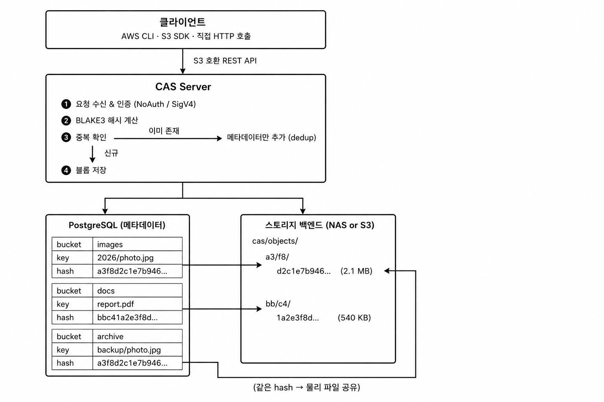

# CAS Server 시스템 기능 명세서

<!-- ## 목차

1. [개요](#1-개요)
2. [스토리지 모델](#2-스토리지-모델)
3. [파일 생명주기](#3-파일-생명주기)
4. [스토리지 백엔드](#4-스토리지-백엔드)
5. [API 사용 가이드](#5-api-사용-가이드)
6. [에러 코드 및 대응](#6-에러-코드-및-대응)
7. [부록: 대용량 파일 업로드 (멀티파트)](#7-부록-대용량-파일-업로드-멀티파트) -->

## 1. 개요

### 1.1 시스템 소개

CAS Server는 **Content-Addressable Storage(내용 기반 주소 지정 스토리지)** 방식의 파일 스토리지 서버입니다.

파일을 이름이 아닌 **내용의 해시값**으로 식별하고, 동일한 파일은 물리적으로 단 한 번만 저장합니다. S3 호환 API를 제공하므로 기존 AWS S3 SDK·CLI를 그대로 사용할 수 있습니다.

### 1.2 핵심 특징

| 특징 | 설명 |
|------|------|
| **자동 중복 제거** | 동일 내용의 파일은 백엔드에 한 번만 저장 — 스토리지 용량 절약 |
| **콘텐츠 무결성 보장** | 업로드 시 BLAKE3 해시로 저장 내용을 검증하고, 응답의 `ETag`로 클라이언트가 대조 |
| **S3 호환 API** | AWS CLI, SDK, 기존 S3 연동 코드 그대로 사용 가능 |
| **다중 백엔드 지원** | 로컬 NAS 또는 S3 호환 오브젝트 스토리지를 백엔드로 사용 |
| **Zero-copy 복사** | 파일 복사 시 물리적 데이터 이동 없이 즉시 완료 |

### 1.3 전체 구성도



### 1.4 용어 정의

| 용어 | 설명 |
|------|------|
| **버킷(Bucket)** | 파일을 담는 논리적 컨테이너. S3의 버킷과 동일한 개념 |
| **오브젝트(Object)** | 버킷 안의 개별 파일 항목. 키(경로 문자열)로 식별 |
| **키(Key)** | 오브젝트의 경로 식별자 (예: `images/2026/photo.jpg`) |
| **해시(Hash)** | 파일 내용을 BLAKE3 알고리즘으로 계산한 64자 16진수 문자열 |
| **블롭(Blob)** | 해시에 대응하는 실제 물리 파일. 백엔드 스토리지에 저장됨 |
| **백엔드(Backend)** | 블롭이 실제로 저장되는 물리 스토리지 (NAS 또는 S3 호환) |
| **GC(Garbage Collection)** | 삭제된 오브젝트의 블롭을 물리적으로 정리하는 주기적 작업 |

---

## 2. 스토리지 모델

### 2.1 콘텐츠 주소 저장 방식 (CAS)

일반적인 파일 스토리지는 경로(버킷 + 키)를 기준으로 파일을 저장합니다. CAS Server는 여기에 더해 **파일 내용 자체를 해시로 식별**합니다.

```
버킷: images
키:   2026/photo.jpg
해시: a3f8d2c1e7b946... (파일 내용의 BLAKE3 해시, 64자)
       └─ 실제 블롭 파일과 1:1 대응
```

- 경로(키)는 논리적 식별자이며, 물리 저장은 해시 단위로 관리됩니다.
- 같은 파일을 서로 다른 키로 올려도 블롭은 하나만 존재합니다.
- 업로드 직후 `ETag` 헤더로 해시값이 반환되므로, 클라이언트에서 무결성을 검증할 수 있습니다.


### 2.2 중복 제거 (Dedup)

동일한 내용의 파일은 물리적으로 **단 한 번만** 저장됩니다.

```
업로드 흐름:
  1. 파일 내용 → BLAKE3 해시 계산
  2. 해당 해시의 블롭이 이미 존재하는지 확인
  3a. 존재하면 → 물리 저장 없이 메타데이터만 추가  (x-cas-already-existed: true)
  3b. 없으면   → 백엔드에 블롭 저장 후 메타데이터 추가 (x-cas-already-existed: false)
```

**효과**:
- 동일 파일이 여러 버킷·키에 등록돼도 스토리지 공간을 추가로 소비하지 않습니다.
- 이미 알려진 해시는 업로드 시 `x-cas-hash` 헤더로 전달하면 물리 전송 자체를 생략할 수 있습니다.

### 2.3 버킷과 오브젝트 구조

버킷·오브젝트·키는 모두 **논리적 식별자**입니다. 실제 파일은 따로 존재하지 않으며, PostgreSQL 메타데이터 DB에 아래와 같은 형태의 레코드로 관리됩니다.

```
[PostgreSQL — 메타데이터 DB]

버킷 (Bucket): "reports"
 └─ 오브젝트 (Object)
     ├─ 키: "2026/q1.pdf"          ← 논리 경로 (이름)
     ├─ 해시: "a3f8d2..."          ← 블롭 참조 포인터 (내용 식별자)
     ├─ Content-Type, 크기, 날짜
     └─ 버전 이력 (버저닝 활성화 시)
```

해시는 파일 내용 자체가 아니라 **스토리지 백엔드에 저장된 블롭 파일을 가리키는 포인터**입니다. 서로 다른 키(이름)라도 해시가 같으면 물리 파일은 하나만 존재합니다(dedup).

```
메타데이터 DB                     스토리지 백엔드
─────────────────────────         ─────────────────────────
reports / 2026/q1.pdf             cas/objects/
  해시 = a3f8d2... ───────────▶     a3/f8/d2c1... (실제 파일)
                                              ▲
backup / old/q1.pdf                           │
  해시 = a3f8d2... ───────────────────────────┘
  (이름은 다르지만 같은 블롭 참조)
```

- 버킷은 생성·삭제·목록 조회가 가능합니다.
- 키에 `/` 구분자를 사용하면 S3의 "폴더" 구조처럼 계층적으로 관리할 수 있습니다.
- 버저닝을 활성화하면 동일 키에 파일을 덮어쓸 때 이전 버전이 보존됩니다.

### 2.4 삭제 처리 및 GC

오브젝트 삭제는 즉시 물리 삭제가 아닌 **소프트 삭제** 방식으로 동작합니다.

```
삭제 요청
  → 오브젝트에 삭제 마커 기록 (즉시 접근 불가)
  → 해당 블롭을 참조하는 오브젝트가 0개가 된 경우
      → GC 실행 시 물리 파일 삭제
```

- 삭제 후에도 다른 오브젝트가 같은 블롭을 참조하고 있으면 물리 파일은 유지됩니다.
- GC는 주기적으로 실행되며, 참조가 없는 블롭만 안전하게 삭제합니다.

GC 는 세 단계로 구성되며 비용이 크게 다릅니다.

| 단계 | 하는 일 | 비용의 성질 |
|------|---------|-------------|
| `multipart` | 만료된 미완료 멀티파트 업로드의 파트 회수 | 대상 테이블이 작아 규모를 타지 않습니다 |
| `orphan` | 참조가 사라진 블롭의 물리 삭제 | **블롭 테이블 전체를 훑습니다.** 데이터가 늘어나는 만큼 실행 시간이 함께 늘어납니다 |
| `purge` | 보존 기간이 지난 삭제 레코드 정리 | 전용 인덱스가 덮어 규모를 타지 않습니다 |

`orphan` 만 규모에 비례하므로, 실행 시간이 문제가 되면 이 단계만 낮은 빈도로 분리할 수
있습니다(`gc.phases` · `gc.fullSweep`, 이미지 `0.1.20` 이상). 미루면 회수가 늦어질 뿐 데이터가 사라지지는
않습니다 — 회수 대상 블롭은 다음 실행까지 디스크에 남아 있습니다.

---

## 3. 파일 생명주기

### 3.1 업로드

```
PUT /{버킷}/{키}
```

- `Content-Type` 헤더로 MIME 타입을 지정합니다.
- 응답에 `x-cas-hash`(BLAKE3 해시), `x-cas-already-existed`(중복 여부) 헤더가 포함됩니다.
- 해시를 미리 알고 있다면 `x-cas-hash` 요청 헤더로 전달해 검증 및 중복 건너뛰기를 활용할 수 있습니다.

**응답 예시**:
```
HTTP/1.1 200 OK
ETag: "a3f8d2c1e7b946..."
x-cas-hash: a3f8d2c1e7b946...
x-cas-already-existed: false
```

### 3.2 다운로드

```
GET /{버킷}/{키}
```

- 파일 내용을 스트리밍으로 반환합니다.
- `Range` 헤더를 사용한 부분 다운로드를 지원합니다.
- `HEAD /{버킷}/{키}` 로 파일 존재 여부·메타데이터만 확인할 수 있습니다.

**Presigned URL**:

서명된 임시 URL을 발급하면, 별도 인증 없이 제한된 시간 동안 작업을 수행할 수 있습니다. 유효 시간은 초 단위로 지정합니다.

| 용도 | 메서드 | 설명 |
|------|--------|------|
| 다운로드 링크 공유 | `GET` | AWS CLI `aws s3 presign`으로 생성 가능 |
| 클라이언트 직접 업로드 | `PUT` | SDK의 `generate_presigned_url("put_object")`로 생성 |
| 오브젝트 삭제 위임 | `DELETE` | SDK의 `generate_presigned_url("delete_object")`로 생성 |

서명에는 발급 시 지정한 메서드·경로·유효기간이 포함됩니다. 만료된 URL 은 `403 AccessDenied`,
메서드나 경로가 다른 요청은 `403 SignatureDoesNotMatch` 입니다.

### 3.3 복사

```
PUT /{대상-버킷}/{대상-키}
x-amz-copy-source: /{원본-버킷}/{원본-키}
```

- 물리 데이터 이동 없이 메타데이터만 추가하는 **Zero-copy** 방식으로 즉시 완료됩니다.
- 원본과 사본은 동일한 블롭을 공유하며, 어느 쪽을 삭제해도 다른 쪽에 영향을 주지 않습니다.

### 3.4 삭제

```
DELETE /{버킷}/{키}
```

- 즉시 접근 불가 상태로 전환되며, 물리 삭제는 GC가 처리합니다.
- 버저닝이 활성화된 버킷에서는 삭제 마커(Delete Marker)가 추가되고 이전 버전은 보존됩니다.

---

## 4. 스토리지 백엔드

### 4.1 로컬 NAS 백엔드

NAS(Network Attached Storage)의 마운트 경로를 직접 사용하는 방식입니다.

- 블롭 파일은 해시 앞 4자를 디렉터리 계층으로 분산 저장합니다 (`ab/cd/...`).
- 파일시스템 수준의 원자적 저장으로 부분 쓰기 없이 안전하게 처리됩니다.
- NAS 연결이 끊기면 해당 백엔드를 사용하는 요청은 `503 ServiceUnavailable` 로 응답합니다.

### 4.2 S3 호환 백엔드

MinIO, Ceph RGW 등 S3 호환 오브젝트 스토리지를 백엔드로 사용합니다.

- 내부 TLS 없는 환경(내부망)에서는 HTTP 접속(`allow_http: true`)을 설정할 수 있습니다.
- 키 프리픽스(`key_prefix`)를 지정하면 하나의 S3 버킷 안에서 네임스페이스를 분리할 수 있습니다.

### 4.3 다중 백엔드 운용

같은 타입(NAS 또는 S3)의 백엔드를 여러 대 동시에 운용할 수 있습니다. NAS와 S3 혼합은 지원하지 않습니다.

**NAS 다중 구성** — 가용 공간 기준 자동 배정:
```
NAS-A  [가용 공간: 80%]  ←── 신규 업로드 우선 배정
NAS-B  [가용 공간: 45%]
NAS-C  [가용 공간: 20%]
```

**S3 다중 구성** — 엔드포인트(버킷) 단위로 등록, 요청마다 순서대로 순환(round-robin) 배정:
```
S3-main  (objectstorage-1.internal / bucket-a)  ←── 1번째 업로드
S3-sub   (objectstorage-2.internal / bucket-b)  ←── 2번째 업로드
S3-main  ...                                     ←── 3번째 업로드
```

> **S3 모드의 한계 두 가지.** ⑴ 잔여 용량을 읽을 수단이 없어 `/_api/backends` 의 용량
> 필드가 `null` 입니다 — 용량 감시는 오브젝트 스토리지 쪽 지표로 하십시오. ⑵
> `/_internal/health` 의 백엔드 검사가 S3 에 대해서는 **항상 통과합니다.** 오브젝트
> 스토리지가 죽어도 파드는 Ready 로 남고, 요청 실패로만 드러납니다.

### 4.4 백엔드 장애 시 동작

| 상황 | 동작 |
|------|------|
| 특정 NAS 연결 끊김 | 해당 NAS 관련 요청만 `503 ServiceUnavailable` 반환, 나머지 백엔드는 정상 동작 |
| 해당 NAS에만 있는 블롭 다운로드 요청 | `503 ServiceUnavailable` 반환 |
| S3 백엔드 응답 불가 | **`500 InternalError` 입니다.** 오브젝트 스토리지가 돌려준 오류는 `ServiceUnavailable` 로 갈라지지 않습니다. 다른 S3 백엔드는 정상 동작합니다 |
| 신규 업로드 | **NAS**: 정상 백엔드 중 가용 공간 최대인 곳. **S3**: 등록 순서 round-robin. 버킷이 특정 백엔드에 핀돼 있으면 그쪽 |

---

## 5. API 사용 가이드

CAS Server는 **AWS S3 호환 REST API**를 제공합니다. 요청 단위의 사용 예시(AWS CLI·boto3·
관리 API)는 같은 차트의 `docs/usage.md` 에 있습니다.

### 5.1 연동 방법

기존 AWS S3 클라이언트를 그대로 사용합니다. `endpoint-url`만 CAS Server 주소로 지정하면 됩니다.

**AWS CLI**:
```bash
# 파일 업로드
aws s3 cp ./report.pdf s3://documents/2026/report.pdf \
  --endpoint-url http://cas.internal:8080

# 파일 목록 조회
aws s3 ls s3://documents/ --endpoint-url http://cas.internal:8080

# Presigned URL 발급 (5분 유효)
aws s3 presign s3://documents/2026/report.pdf \
  --endpoint-url http://cas.internal:8080 --expires-in 300
```

### 5.2 인증

| 모드 | 설명 |
|------|------|
| **NoAuth** | 인증 없음, 내부망 전용 운용 시 사용 |
| **SigV4** | AWS 표준 서명(AWS4-HMAC-SHA256). Access Key + Secret Key 필요 |

SigV4 사용 시 region 은 아무 값이나 됩니다 — 서버가 클라이언트의 선언 값으로 서명 키를
유도하므로, 지정하지 않아 SDK 기본값(boto3 는 `us-east-1`)이 들어가도 동작합니다.
아래 예시의 `cas-default` 는 관례입니다. `service` 는 `s3` 여야 합니다.

```bash
aws configure set aws_access_key_id     <발급된-키-ID>
aws configure set aws_secret_access_key <발급된-시크릿>
aws configure set region                cas-default
```

**`auth.anonymousGet: true` 인 배포에서는 `GET`·`HEAD /{버킷}/{키}` 가 서명 검증에 닿지
않습니다.** 익명 분기가 인증보다 먼저 돌기 때문입니다. 서명을 실은 요청도 그 분기로 통과하므로
서명이 틀려도 `200` 입니다. 통과한 읽기는 `cas_anonymous_get_total{reason}` 으로 세며
`reason` 은 `unsigned` · `signed_valid` · `signed_invalid` 입니다 — `anonymousGet` 을 끄면
앞뒤 둘이 `403` 이 되므로, 끄기 전에 이 지표로 깨질 소비자를 세십시오.
목록(`ListObjects`·`ListBuckets`)·쓰기·삭제는 이 배포에서도 서명을 요구합니다.

#### 정책 액션

정책에 쓸 수 있는 이름은 **열다섯 개와 `"*"` 가 전부**이고, 목록 밖의 문자열은 `400` 으로
거절합니다. 전체 목록, 어떤 API 가 어느 액션으로 판정되는지, `bucket`·`prefix` 가 걸리는
깊이는 `docs/usage.md` 의 "액션 목록" 절에 있습니다. 그중 정책을 좁힐 때 어긋나는 자리 둘은
`ListBuckets`(`bucket: "*"` 여야 열림)와 `ListObjects`(`prefix` 를 보지 않아 버킷 전체를
나열)입니다.

관리 API(`/_admin/*`)는 SigV4 로만 열립니다. 액세스 키에 관리 정책을 붙여 사람마다 하나씩
주면, 조작마다 그 키가 로그에 남고 회수는 그 키만 폐기하면 됩니다.

| 액션 | 대상 |
|------|------|
| `cas:ReadAccessKeys` | 키·정책 목록 조회 |
| `cas:ManageAccessKeys` | 키 발급·폐기, 정책 추가·삭제 + 목록 조회 |
| `cas:ReadGc` | GC 조회(`GET /_api/gc/*`) |
| `cas:RunGc` | GC 실행(`POST /_internal/gc`) + GC 조회 |

GC 경로는 `/_admin/*` 과 **별도 라우터**입니다. 위 두 GC 액션 외에 `secrets.gcToken`(Bearer)
으로도 열리므로, GC CronJob 에는 그 토큰을 줍니다 — 키 발급·폐기 권한은 함께 넘어가지
않습니다. CronJob 은 그 토큰만 싣고, 없으면 인증 헤더를 붙이지 않습니다.

**root 키는 관리 평면 전권입니다** — 정책 없이 위 넷을 모두 통과합니다. 그리고 auth 를 켜면
(`secrets.secretMasterKey` 설정) root 키가 **필수**입니다. 없으면 서버가 기동을 거부합니다.

목록 조회 라우트는 `cas:ReadAccessKeys`·`cas:ManageAccessKeys` 중 하나로 열립니다 — 위 표의
"+ 목록 조회" 가 그것이고, `GET /_api/whoami` 도 같은 기준으로 답합니다(Manage 만 가진 키도
`read_access_keys` 가 `true`). 인가기 자체에는 계층이 없고, 그 포함 관계는 라우트가 어느
액션들로 열리는지에서 나옵니다.

정책의 `"*"` 는 데이터 평면 액션에만 걸립니다. 관리 권한은 이름을 명시적으로 적은 정책에만
붙으므로, `"*"` 로 발급된 키에는 위 넷이 붙지 않습니다.

**메트릭(`GET /_internal/metrics`)은 `auth.metricsToken` 하나로만 열립니다.** 이 경로에는
SigV4 분기가 없어 root 키로도 `401` 이고, 토큰이 비면 auth 를 켠 배포에서는 `401` 입니다.

`adminToken` 은 **폐기됐습니다.** 어느 경로도 열지 않으며 `/_admin/*`·GC·메트릭 모두
`401` 입니다. 설정 필드는 남아 있어 값이 있어도 렌더·기동은 되고, 서버가 무시했다고 기동
로그에 남깁니다. 기본 설치는 Secret 키 `auth-admin-token` 을 만들지 않습니다 — 이미 들고
있으면 지우셔도 됩니다(deployment 가 `optional` 로 참조합니다).

**콘솔은 토큰을 쓰지 않습니다.** 관리 화면도 로그인한 액세스 키의 SigV4 서명으로 열리므로
콘솔에서 한 조작은 그 사람의 `key_id` 로 기록됩니다.

관리 평면의 SigV4 인가에는 이미지 `0.1.21` 이상이 필요합니다.

SigV4 를 켜면 데이터 API 뿐 아니라 **관리 콘솔이 쓰는 조회 API(`/_api/*`)도 같은 서명을
요구합니다.** 자격증명 없이 호출하면 `403` 입니다.

예외 둘은 의도적으로 열려 있습니다. `/_api/auth-mode` 는 콘솔이 로그인 화면을 띄울지
판단하는 입구라 서명할 자격증명이 아직 없는 시점에 호출되며, 응답은 인증 활성 여부
하나뿐입니다. `/_ui` 는 페이지 골격이고 그 안의 데이터는 모두 위 서명 요청으로 받아옵니다.

### 5.3 CAS 전용 응답 헤더

S3 표준에 없는 CAS 전용 헤더가 업로드 응답에 추가됩니다.

| 헤더 | 설명 | 예시 |
|------|------|------|
| `x-cas-hash` | 저장된 파일의 BLAKE3 해시 (64자 hex) | `a3f8d2c1e7b946...` |
| `x-cas-already-existed` | 중복 블롭 여부 — `true`면 물리 저장 건너뜀 | `true` / `false` |

`x-cas-hash`를 저장해 두면, 다음 업로드 시 `x-cas-hash` **요청** 헤더로 전달해 서버가 물리 전송 없이 즉시 등록하도록 할 수 있습니다.

### 5.4 지원 API 범위

**지원**:
- 버킷: `ListBuckets`, `CreateBucket`, `DeleteBucket`, `ListObjects(V2)`, `ListObjectVersions`, `PutBucketVersioning`
- 오브젝트: `PutObject`, `GetObject`, `HeadObject`, `DeleteObject`, `CopyObject`
- 멀티파트: `CreateMultipartUpload`, `UploadPart`, `CompleteMultipartUpload`, `AbortMultipartUpload`, `ListMultipartUploads`
- Presigned URL: `GET`, `PUT`, `DELETE` 방식

### 5.5 웹 관리 UI

`http://<서버 주소>/_ui` 에서 브라우저 기반 관리 콘솔에 접근할 수 있습니다.

| 메뉴 | 제공 기능 |
|------|-----------|
| **대시보드** | 전체 오브젝트 수·버킷 수·총 용량 요약. Last GC 결과는 `cas:ReadGc` 또는 `cas:RunGc` 일 때 표시 |
| **버킷 / 오브젝트** | 버킷 목록, 오브젝트 탐색, 버전 이력 조회, 블롭 상세(해시·크기·참조 수) 확인 |
| **백엔드** | 각 스토리지 백엔드의 디스크 사용량·블롭 수 현황 |
| **GC** | `cas:ReadGc` 또는 `cas:RunGc` 로 열림. 고아 블롭 수 조회, 실행 이력 확인. 수동 실행·Dry-run 버튼은 `cas:RunGc` |
| **액세스 키** | `cas:ReadAccessKeys` 또는 `cas:ManageAccessKeys` 로 열림. 발급·비활성화·정책 관리 버튼은 `cas:ManageAccessKeys` |

> 화면은 로그인한 키의 정책으로 열리고, 권한이 없는 화면은 탭이 표시되지 않습니다. root 키는
> 전부 열립니다. 액세스 키 탭은 SigV4 인증이 활성화된 경우에만 표시됩니다. 판정은
> `GET /_api/whoami` 한 번으로 하며, 자격증명 종류는 5.2 를 보십시오.

SigV4 가 활성화된 배포에서는 콘솔 진입 시 액세스 키·시크릿 로그인 화면이 먼저 표시되며,
이후 모든 조회 요청은 브라우저에서 그 자격증명으로 서명됩니다. 별도의 인증 수단을 설정할
필요는 없습니다.

콘솔을 쓰지 않는 배포에서는 `config.consoleEnabled: false` 로 `/_ui` 와 콘솔용 `/_api/*`
(`auth-mode` · `whoami` 포함)가 응답하지 않게 할 수 있습니다. 인증을 거는 것보다 표면
자체를 없애는 편이 확실합니다. 이때도 `/_api/gc/*` 와 `/_internal/*` 는 남으므로 GC
CronJob 은 그대로 동작합니다.

---

## 6. 에러 코드 및 대응

데이터 평면과 `/_api/*` 의 에러는 S3 표준 XML 형식으로 반환됩니다. Bearer 토큰으로 여는
경로(`/_internal/metrics`, GC 의 토큰 경로)의 `401` 만 예외로, 본문이 XML 이 아니라
`Unauthorized` 문자열입니다.

```xml
<?xml version="1.0" encoding="UTF-8"?>
<Error>
  <Code>NoSuchKey</Code>
  <Message>object not found: documents/2026/report.pdf</Message>
</Error>
```

| HTTP 상태 | 에러 코드 | 원인 및 대응 |
|-----------|-----------|--------------|
| 400 | `InvalidArgument` | 요청 파라미터 오류 |
| 400 | `InvalidDigest` | `x-cas-hash` 로 넘긴 해시와 실제 본문이 다름 |
| 400 | `InvalidPart` | 멀티파트 파트 번호·구성 오류 |
| 400 | `AuthorizationHeaderMalformed` | Authorization 헤더/presigned 쿼리 형식 오류 — 서명을 계산할 수조차 없음. `service` 가 `s3` 가 아닌 경우도 여기입니다 |
| 401 | — | 관리 평면(`/_admin/*`·GC·`/_internal/metrics`)에 Bearer 로 접근했는데 그 경로가 받는 토큰이 설정되지 않았거나 값이 다름. 본문은 `Unauthorized` 문자열입니다 |
| 403 | `AccessDenied` | 자격증명이 없거나, 해당 작업 권한이 없거나, presigned URL 이 만료됨 |
| 403 | `InvalidAccessKeyId` | 그런 액세스 키가 없음 (비활성·유효기간 만료 포함) |
| 403 | `SignatureDoesNotMatch` | 서명 불일치 — 시크릿 값을 확인 |
| 403 | `RequestTimeTooSkewed` | 요청 시각이 서버 시각과 15분 이상 차이 (헤더 인증 경로에만 해당) |
| 404 | `NoSuchBucket` | 버킷 없음 |
| 404 | `NoSuchKey` | 오브젝트 없음. 인증을 통과한 요청이 등록되지 않은 `/_api/*` 경로를 부른 경우도 이 코드입니다 |
| 404 | `NoSuchUpload` | 멀티파트 업로드 ID 없음 |
| 405 | `MethodNotAllowed` | 삭제 마커인 버전을 GET/HEAD |
| 408 | — | `config.requestTimeoutSecs`(기본 120초) 초과. **이 시점에도 DB 쪽 쿼리는 계속 돕니다** |
| 409 | `BucketNotEmpty` | 비어 있지 않은 버킷 삭제 시도 |
| 409 | `GcAlreadyRunning` | GC 가 이미 실행 중 |
| 412 | `PreconditionFailed` | `If-None-Match: *` 인데 객체가 이미 있음 |
| 413 | `EntityTooLarge` | `config.maxUploadSizeBytes` 초과 |
| 500 | `InternalError` | 서버 내부 오류 (DB 오류 포함) |
| 501 | `NotImplemented` | 지원하지 않는 파라미터 조합 (예: ListObjectVersions + delimiter) |
| 503 | `ServiceUnavailable` | 스토리지 백엔드 접근 불가 — 운영팀 확인 필요 (내부 오류 타입명은 `BackendUnavailable`) |
| 503 | `SlowDown` | 업로드 상한(건수 또는 바이트 예산) 초과. `Retry-After` 동반 |
| 503 | `SlowDown` | DB 커넥션 풀 획득 타임아웃 (이미지 `0.1.18` 이상. 그 이하는 `500`) |

`503` 은 세 가지 뜻을 갖습니다. 구분은 지표로 합니다 — 업로드 상한은
`cas_upload_rejected_total`, 풀 고갈은 `cas_db_pool_acquire_timeouts_total` 이 오릅니다.
`BackendUnavailable` 은 둘 다 오르지 않습니다.

#### 인증 실패의 진단

와이어에서 합쳐지는 사유도 **서버 로그에서는 갈라집니다.** 인증 실패는 `reason` 필드를
달고 나가며, 그 값은 알림 규칙을 걸 수 있도록 고정돼 있습니다.

```
WARN cas_server::auth::middleware: authn fail path=/ reason="signature_mismatch" key_id="CASK..."
```

| `reason` | 뜻 | 운영자가 할 일 |
|---|---|---|
| `no_credentials` | 자격증명이 아예 없음 | 클라이언트 설정 확인 |
| `malformed_header` | 헤더/쿼리 형식 오류 | 클라이언트 SDK 버전 확인 |
| `unknown_key` | 그런 키가 없음 | 키 발급 여부 확인 |
| `key_inactive` | 키가 비활성 | 키 재활성화 |
| `key_expired` | 키 유효기간 만료 | 키 재발급 |
| `secret_undecryptable` | 저장된 시크릿 복호화 실패 | **서버 문제** — 마스터 키(`secrets.secretMasterKey`)가 바뀌었는지 확인 |
| `clock_skew` | 요청 시각 차이 초과 | 클라이언트 시각 동기화 |
| `presigned_expired` | presigned URL 만료 | URL 재발급 |
| `signature_mismatch` | 서명 불일치 | 시크릿 값 확인 |
| `other` | 인증 처리 자체가 실패 (예: 인증 조회 중 DB 오류) | **서버 문제** — 이 값이 보이면 응답도 `500` 입니다 |

`key_id` 는 요청이 **주장한** 값이고 검증된 것이 아닙니다. 어느 자격증명이 실패했는지
좁히는 용도입니다.

**region 불일치는 이 목록에 없습니다** — 검사하지 않기 때문입니다(5.2 참고). 서명이
region 때문에 거절되는 일은 없습니다.

Bearer 토큰 경로의 실패는 이 표가 아니라 `reason="wrong-token"` · `"missing-token"` 으로
남습니다.

---

## 7. 부록: 대용량 파일 업로드 (멀티파트)

AWS S3 표준 멀티파트 업로드 프로토콜을 지원합니다. AWS CLI·SDK의 기본 멀티파트 임계값(통상 8 MiB)에 따라 자동으로 분할 전송됩니다.

```bash
# AWS CLI — 임계값을 넘는 파일은 자동으로 멀티파트 전송
aws s3 cp ./large-file.bin s3://archives/large-file.bin \
  --endpoint-url http://cas.internal:8080
```

**흐름 요약**:
1. `CreateMultipartUpload` — Upload ID 발급
2. `UploadPart` — 파트별 전송 (각 파트 최소 5 MiB, 마지막 파트 제외)
3. `CompleteMultipartUpload` — 파트 조합 및 블롭 등록
4. 미완료 업로드는 `AbortMultipartUpload` 로 정리

업로드 중단 시 파트 파일이 백엔드에 남을 수 있으므로, 재시도 실패 후에는 명시적으로 Abort 호출을 권장합니다.