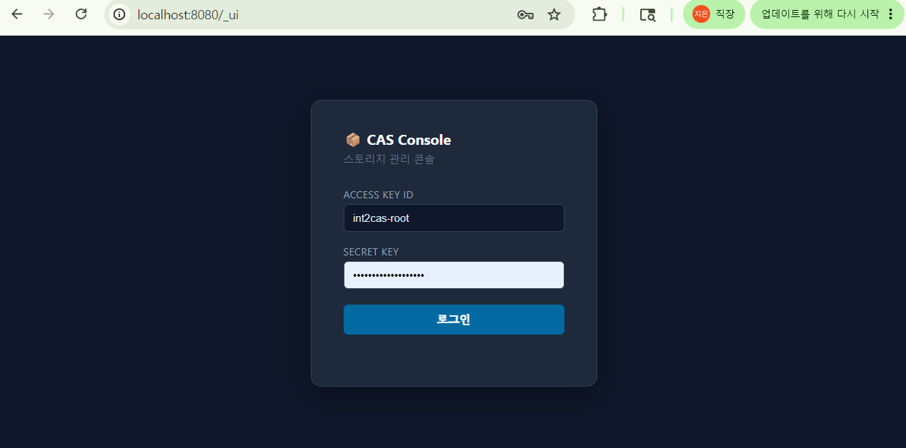
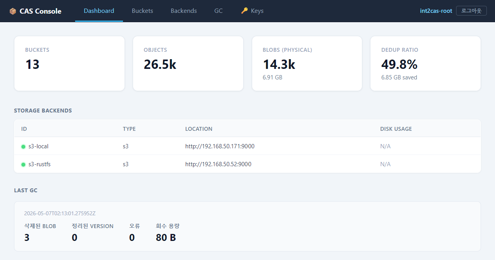
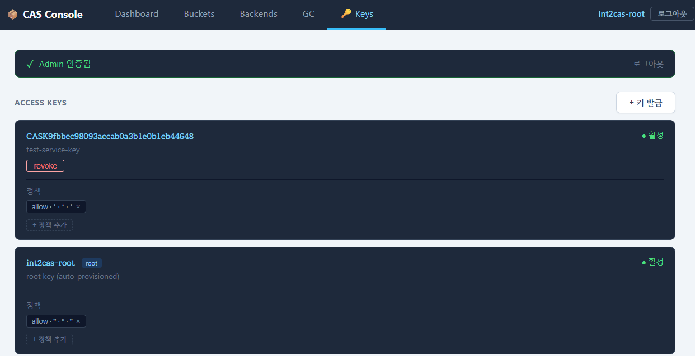
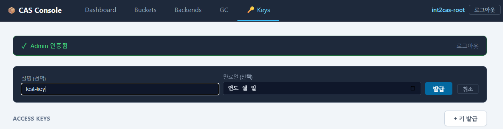
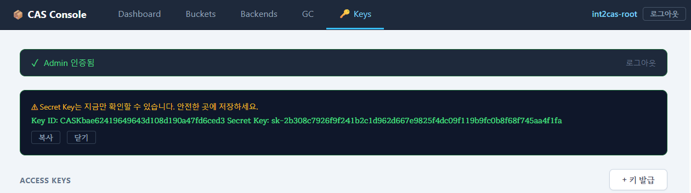
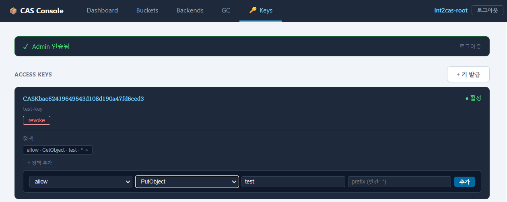

# CAS 시스템 사용 예시

---

## 설치 및 배포 (Kubernetes / Helm)
cas-server 는 helm 차트를 통해 k8s 환경에 배포할 수 있습니다. 

### 1. Helm 레포 추가
cas-server 레포지토리를 등록하고 업데이트합니다.

```bash
helm repo add int2nexus https://int2nexus.github.io/cas-server
helm repo update
```

### 2. values-prod.yaml 작성
운영 환경에 맞는 설정 값을 YAML 파일로 생성하여 기본 차트 설정을 오버라이드합니다.

```yaml
# values-prod.yaml

# 백엔드 오브젝트 스토리지 정보
storage:
  mode: "s3"
  s3:
    endpoint: "http://objectStorage.internal:9000"
    bucket: "cas-objects"
    region: "local"
    keyPrefix: "cas/"
    allowHttp: true # 내부망 등 TLS가 없는 오브젝트 스토리지 환경인 경우 true

# 메타데이터 관리를 위한 PostgreSQL 정보 (운영 환경에서는 외부 관리형 DB 권장)
externalDatabase:
  host: "postgres.internal"
  port: 5432
  username: "cas"
  database: "cas_metadata"

# 자격증명. useExternalSecret: false 로 두면 차트가 Secret 을 직접 만든다.
# 기본값은 true 이고, 그 경우 클러스터에 미리 만들어 둔 Secret(sealed-secret 등)을
# 참조하며 아래 값들은 읽히지 않는다 — 그 방식은 README 의 "시크릿" 절을 따를 것.
secrets:
  useExternalSecret: false

  dbPassword: "DB_PASSWORD" # PostgreSQL 접근 비밀번호
  s3AccessKeyId: "ACCESS_KEY"  # 백엔드 오브젝트 스토리지의 Access Key
  s3SecretAccessKey: "SECRET_KEY" # 백엔드 오브젝트 스토리지의 Secret Key

  # DB 내부 시크릿 암호화용 마스터 키. 비우면 인증이 꺼진 NoAuth 모드로 뜬다.
  secretMasterKey: "<openssl rand -hex 32 의 출력(64자 Hex)>"
  adminToken: "<Admin API 인증용 Bearer 토큰>" # 비우면 Admin API 가 무인증으로 열린다
  rootAccessKeyId: "int2cas-root"             # 최고 관리자(Superuser) Access Key ID
  rootSecretKey: "<최고 관리자 Secret Key>"

# CAS 서버 인증 동작 설정. auth.adminToken 은 **불리언 게이트이고 토큰 값이 아니다**
# (기본 true) — 토큰 문자열은 위 secrets.adminToken 에 넣는다.
auth:
  anonymousGet: true # GET/HEAD 를 인증 없이 허용. 신뢰 네트워크가 아니면 false
```

### 3. Helm 차트 설치
작성한 values-prod.yaml 파일을 적용하여 지정한 네임스페이스에 서버를 배포합니다.
```bash
# 네임스페이스가 없는 경우 생성: kubectl create namespace <namespace>
helm install cas-server int2nexus/cas-server -n <namespace> -f values-prod.yaml
```

### 4. 차트 업그레이드
설정을 변경하거나 새로운 버전의 차트로 업데이트할 때 실행합니다.

```bash
helm repo update
helm upgrade cas-server int2nexus/cas-server -n <namespace> -f values-prod.yaml
```

### 5. 리소스 제거
배포된 CAS 서버와 관련 리소스를 완전히 삭제합니다.

```bash
# Helm 릴리스 삭제
helm uninstall cas-server -n <namespace>
# (선택 사항) 네임스페이스 전체 삭제 시
kubectl delete namespace <namespace>
```

---

## 웹 UI로 키 관리 (`/_ui`)

API 호출 없이 브라우저에서 액세스 키를 발급하고 정책을 관리할 수 있습니다.

### 1. UI 접속

`/_ui` 에 rootkey로 로그인하여 접속하면 Dashboard 화면이 표시됩니다.

브라우저에서 열려면 접근 경로를 하나 만들어야 합니다.

> **먼저 읽으십시오.** `/_ui` 와 `/_api/*` 는 `/_api/gc/*` 셋을 뺀 전부가 **무인증**이고
> 끄는 설정 키가 없습니다(이미지 `0.1.18` 기준). Service 기본값 `NodePort` 는 표면을
> **클러스터의 모든 노드 x 30080** 으로 만들고, 파드가 없는 노드 IP 에서도 응답합니다.
> 그 표면에는 `/_api/stats` 집계가 함께 있습니다.
> **신뢰 네트워크 밖이라면 `service.type: ClusterIP` 로 두고 포트포워드나 인증 프록시를
> 쓰십시오.** 차트 README 의 "노출 주의" 절에 자세히 적었습니다.

포트포워드가 가장 안전합니다. `NodePort` 를 그대로 쓰는 경우에는
`http://<노드IP>:30080/_ui` 입니다.

```bash
kubectl port-forward -n <namespace> svc/cas-server 8080:http
# http://localhost:8080/_ui
```

`ingress.enabled: true` 로 두셨다면 `https://<ingress.host>/_ui` 입니다.




<!-- 이미지: Dashboard 탭 전체 화면 -->


### 2. Admin token 입력

상단 입력창에 `secrets.adminToken` 값을 입력하고 확인하면 **GC 탭**과 **Keys 탭**이 활성화됩니다. Dashboard의 **Last GC** 섹션도 Admin Token이 있어야 표시됩니다.

<!-- 이미지: admin token 입력창 및 확인 버튼 -->


### 3. 새 키 발급

Keys 탭에서 설명(description)과 선택적 만료일을 입력하고 발급 버튼을 클릭합니다. 만료일 설정이 없는 경우 영구 유효합니다.

<!-- 이미지: 키 발급 폼 (description 입력, 만료일 선택, 발급 버튼) -->


발급 직후 `key_id`와 `secret_key`가 표시됩니다. **이 화면에서만 확인할 수 있으므로 반드시 복사해 두세요.**

<!-- 이미지: 발급 결과 (key_id, secret_key 표시) -->


### 4. 정책 추가

키 목록에서 해당 키의 정책 추가 폼에 effect / action / bucket / prefix 를 입력하고 추가합니다.

<!-- 이미지: 정책 추가 폼 및 적용된 정책 태그 목록 -->


---

## AWS CLI / boto3 사용법

### 사전 설정

서버 설정의 `root_access_key_id` / `root_secret_key`로 지정한 값을 사용합니다.

```bash
aws configure set aws_access_key_id     <root_access_key_id>
aws configure set aws_secret_access_key <root_secret_key>
aws configure set region                cas-default

CAS="http://cas-server:80" 
```

> region 은 아무 값이나 됩니다. 서버가 클라이언트의 선언 값으로 서명 키를 유도하므로,
> 지정하지 않아 SDK 기본값(boto3 는 `us-east-1`)이 들어가도 그대로 동작합니다.
> 예시의 `cas-default` 는 관례일 뿐입니다.
>
> 이미지 `0.1.18` 이하는 `cas-default` 만 받았고, 다른 값이면
> `403 InvalidAccessKeyId` 로 거부했습니다.

### boto3

```python
import boto3

s3 = boto3.client(
    "s3",
    endpoint_url="http://cas-server:80",
    aws_access_key_id="<root_access_key_id>",
    aws_secret_access_key="<root_secret_key>",
    region_name="cas-default",   # 임의 값 가능. 생략하면 boto3 기본값이 쓰이고 그것도 동작합니다
)
```

---

## Admin API로 키 관리

웹 UI 대신 curl로 직접 발급할 수도 있습니다. 모든 Admin API 요청에는 `Authorization: Bearer <admin_token>` 헤더가 필요합니다.

```bash
ADMIN_TOKEN="values-prod.yaml의 secrets.adminToken 값"
CAS="http://cas-server:80"

# 키 발급
curl -s -X POST $CAS/_admin/access-keys \
  -H "Authorization: Bearer $ADMIN_TOKEN" \
  -H "Content-Type: application/json" \
  -d '{"description": "my-service-key"}'
```

```json
{
  "key_id": "CASKa1b2c3...",
  "secret_key": "sk-deadbeef...",
  "created_at": "2026-05-18T00:00:00Z"
}
```

> `secret_key`는 생성 시점인 이 응답에서 단 한 번만 평문으로 노출되며, 이후 DB에는 AES-256-GCM으로 안전하게 암호화되어 저장되므로 다시 조회할 수 없습니다. 반드시 안전한 곳에 즉시 저장해 두세요.

---

## 버킷

### 버킷 목록 조회

```bash
aws s3api list-buckets --endpoint-url $CAS
```

```python
resp = s3.list_buckets()
for b in resp["Buckets"]:
    print(b["Name"], b["CreationDate"])
```

### 버킷 생성

```bash
aws s3api create-bucket --bucket my-bucket --endpoint-url $CAS
```

```python
s3.create_bucket(Bucket="my-bucket")
```

### 버킷 삭제

```bash
aws s3api delete-bucket --bucket my-bucket --endpoint-url $CAS
```

```python
s3.delete_bucket(Bucket="my-bucket")
```

### 오브젝트 목록 조회

```bash
aws s3api list-objects-v2 --bucket my-bucket --endpoint-url $CAS

# 접두사 필터
aws s3api list-objects-v2 --bucket my-bucket --prefix logs/ --endpoint-url $CAS
```

```python
resp = s3.list_objects_v2(Bucket="my-bucket", Prefix="logs/")
for obj in resp.get("Contents", []):
    print(obj["Key"], obj["Size"])
```

---

## 오브젝트

### 업로드

```bash
aws s3api put-object \
    --bucket my-bucket \
    --key path/to/file.bin \
    --body ./file.bin \
    --endpoint-url $CAS

# aws s3 cp 도 동일하게 동작
aws s3 cp ./file.bin s3://my-bucket/path/to/file.bin --endpoint-url $CAS
```

```python
# 파일 업로드
s3.upload_file("file.bin", "my-bucket", "path/to/file.bin")

# 바이트 직접 업로드
s3.put_object(
    Bucket="my-bucket",
    Key="path/to/file.bin",
    Body=b"hello world",
    ContentType="text/plain",
)
```

dedup 여부는 응답 헤더 `x-cas-already-existed`로 확인할 수 있습니다.

```python
resp = s3.put_object(
    Bucket="my-bucket",
    Key="path/to/file.bin",
    Body=open("file.bin", "rb"),
)
print(resp["ResponseMetadata"]["HTTPHeaders"].get("x-cas-already-existed"))
# "true"  → 동일 파일이 이미 존재 (디스크 저장 생략됨)
# "false" → 신규 저장
```

### 업로드 최적화 — x-cas-hash 헤더

파일의 BLAKE3 hash를 미리 알고 있는 경우 `x-cas-hash` 헤더로 전달하면,
중복 파일일 때 body를 전송하지 않고 즉시 완료됩니다.

```bash
HASH=$(b3sum --no-names file.bin)
curl -X PUT "$CAS/my-bucket/path/to/file.bin" \
  -H "x-cas-hash: $HASH" \
  --data-binary @file.bin
```

boto3는 임의 커스텀 헤더를 지원하지 않으므로 (`Metadata`는 `x-amz-meta-*`로 변환됨) `requests`로 직접 전송합니다.

```python
import blake3
import requests

with open("file.bin", "rb") as f:
    data = f.read()

file_hash = blake3.blake3(data).hexdigest()

resp = requests.put(
    f"{CAS}/my-bucket/path/to/file.bin",
    data=data,
    headers={"x-cas-hash": file_hash},
)
```

### 다운로드

```bash
aws s3api get-object \
    --bucket my-bucket \
    --key path/to/file.bin \
    output.bin \
    --endpoint-url $CAS

# aws s3 cp 도 동일하게 동작
aws s3 cp s3://my-bucket/path/to/file.bin ./output.bin --endpoint-url $CAS
```

```python
# 파일로 저장
s3.download_file("my-bucket", "path/to/file.bin", "output.bin")

# 메모리로 읽기
resp = s3.get_object(Bucket="my-bucket", Key="path/to/file.bin")
data = resp["Body"].read()
```

### Range 다운로드 (부분 다운로드)

```bash
aws s3api get-object \
    --bucket my-bucket \
    --key path/to/file.bin \
    --range "bytes=0-1023" \
    output_part.bin \
    --endpoint-url $CAS
```

```python
resp = s3.get_object(
    Bucket="my-bucket",
    Key="path/to/file.bin",
    Range="bytes=0-1023",
)
chunk = resp["Body"].read()  # 1024 bytes
```

### 메타데이터 조회

```bash
aws s3api head-object \
    --bucket my-bucket \
    --key path/to/file.bin \
    --endpoint-url $CAS
```

```python
resp = s3.head_object(Bucket="my-bucket", Key="path/to/file.bin")
print(resp["ContentLength"])
print(resp["ETag"])          # BLAKE3 hash (double-quoted)
```

### 복사 (zero-copy)

blob 파일 이동 없이 메타데이터만 추가됩니다.

```bash
aws s3api copy-object \
    --bucket dst-bucket \
    --key new/path/file.bin \
    --copy-source my-bucket/path/to/file.bin \
    --endpoint-url $CAS
```

```python
s3.copy_object(
    Bucket="dst-bucket",
    Key="new/path/file.bin",
    CopySource={"Bucket": "my-bucket", "Key": "path/to/file.bin"},
)
```

### 삭제

```bash
aws s3api delete-object \
    --bucket my-bucket \
    --key path/to/file.bin \
    --endpoint-url $CAS
```

```python
s3.delete_object(Bucket="my-bucket", Key="path/to/file.bin")
```

> 삭제는 소프트 삭제(soft-delete)입니다. 물리 파일은 GC 실행 시 제거됩니다.

---

## Presigned URL

인증 없이 일시적으로 접근 가능한 URL을 생성합니다.

```bash
# 기본값 3600초, --expires-in으로 조정 가능
aws s3 presign s3://my-bucket/path/to/file.bin \
    --endpoint-url $CAS \
    --expires-in 300
```

```python
url = s3.generate_presigned_url(
    "get_object",
    Params={"Bucket": "my-bucket", "Key": "path/to/file.bin"},
    ExpiresIn=300,
)
print(url)

# 생성된 URL은 인증 없이 접근 가능
import requests
resp = requests.get(url)
```

---

## 멀티파트 업로드

boto3는 `upload_file` / `upload_fileobj`가 파일 크기에 따라 자동으로 멀티파트를 사용합니다 (기본 임계값 8 MiB).

```python
from boto3.s3.transfer import TransferConfig

config = TransferConfig(
    multipart_threshold=8 * 1024 * 1024,   # 8 MiB 이상이면 멀티파트
    multipart_chunksize=8 * 1024 * 1024,   # 파트 크기
)

s3.upload_file(
    "large_file.bin",
    "my-bucket",
    "large_file.bin",
    Config=config,
)
```

수동으로 제어할 경우:

```python
# 1. 시작
resp = s3.create_multipart_upload(Bucket="my-bucket", Key="large.bin")
upload_id = resp["UploadId"]

parts = []
try:
    # 2. 파트 업로드
    for i, chunk in enumerate(read_chunks("large.bin"), start=1):
        part = s3.upload_part(
            Bucket="my-bucket",
            Key="large.bin",
            UploadId=upload_id,
            PartNumber=i,
            Body=chunk,
        )
        parts.append({"PartNumber": i, "ETag": part["ETag"]})

    # 3. 완료
    s3.complete_multipart_upload(
        Bucket="my-bucket",
        Key="large.bin",
        UploadId=upload_id,
        MultipartUpload={"Parts": parts},
    )
except Exception:
    # 4. 실패 시 취소
    s3.abort_multipart_upload(
        Bucket="my-bucket", Key="large.bin", UploadId=upload_id
    )
    raise
```

```python
def read_chunks(path, size=8 * 1024 * 1024):
    with open(path, "rb") as f:
        while chunk := f.read(size):
            yield chunk
```

---

## aws s3 sync

```bash
# 로컬 디렉토리 → 버킷 동기화
aws s3 sync ./data s3://my-bucket/data/ --endpoint-url $CAS

# 버킷 → 로컬 디렉토리
aws s3 sync s3://my-bucket/data/ ./data --endpoint-url $CAS
```

---

## 내부 API

### 헬스체크

인증 없이 접근 가능합니다.

```bash
curl http://localhost:8080/_internal/health
```

### GC 수동 트리거

```bash
curl -s -X POST http://localhost:8080/_internal/gc \
  -H "Authorization: Bearer $ADMIN_TOKEN"

# dry_run: 실제 삭제 없이 대상만 집계
curl -s -X POST "http://localhost:8080/_internal/gc?dry_run=true" \
  -H "Authorization: Bearer $ADMIN_TOKEN"
```

GC가 이미 실행 중이면 `409 GcAlreadyRunning`이 반환됩니다.

#### 단계를 나눠 실행하기

GC는 세 단계로 나뉘며 비용이 크게 다릅니다. 실측(blobs 200만 / object_versions 358만):

| 단계 | 하는 일 | 매 실행 소요 |
|---|---|---|
| `multipart` | 만료된 미완료 멀티파트 업로드의 파트 회수 | 무시할 수준 |
| `orphan` | 참조가 사라진 blob 물리 삭제 | **4,605 ms** |
| `purge` | 보존 기간이 지난 soft-delete 레코드 삭제 | **0.26 ms** |

`orphan`만 blob 테이블 전체를 훑기 때문에 데이터가 늘어나는 만큼 실행 시간이 함께
늘어납니다. 나머지 두 단계는 인덱스로 처리되어 규모의 영향을 받지 않습니다.

`phases` 파라미터로 이번 실행에서 돌 단계를 고를 수 있습니다. 생략하면 세 단계 모두
실행합니다.

```bash
# 주간 작업: 저렴한 단계만
curl -s -X POST "http://localhost:8080/_internal/gc?phases=multipart,purge" \
  -H "Authorization: Bearer $ADMIN_TOKEN"

# 월간 작업: 전체
curl -s -X POST http://localhost:8080/_internal/gc \
  -H "Authorization: Bearer $ADMIN_TOKEN"
```

`orphan`을 미루면 회수가 그만큼 늦어질 뿐 데이터가 사라지지는 않습니다. 회수 대상 blob은
다음 스캔까지 디스크에 남아 있으므로, 주기를 늘린 만큼 용량 여유를 두고 잡으십시오.

##### 주기를 정하는 기준

**스캔 비용은 회수 대상 개수와 무관합니다.** 회수할 blob이 0건이어도 4건이어도 테이블
전체를 훑는 시간은 같습니다. 그래서 주기는 데이터 크기가 아니라 **회수 대상이 쌓이는
속도**로 정하는 것이 맞습니다.

회수 대상 blob은 마지막 참조가 사라질 때 생깁니다 — 객체 삭제, 그리고 같은 키를 다른
내용으로 덮어쓰는 경우입니다. **삭제와 덮어쓰기가 드문 환경이라면 자주 훑을 이유가
없습니다.** 매주 몇 분을 들여 몇 건을 회수하는 것보다, 한 달에 한 번 같은 시간을 들여
같은 몇 건을 회수하는 편이 낫습니다.

과거 실행 이력으로 판단하십시오.

```bash
curl -s "http://localhost:8080/_api/gc/history"   -H "Authorization: Bearer $ADMIN_TOKEN"
```

`deleted_blobs`가 매번 한 자릿수라면 전수 스캔을 그 빈도로 돌릴 이유가 없습니다. 월 1회
또는 분기 1회로 늦추십시오. 반대로 매번 수천 건씩 회수되고 있다면 지금 주기를 유지하는
편이 낫습니다 — 미룬 만큼 디스크에 남습니다.

미루는 비용은 이렇게 어림합니다.

```
남아 있을 용량 = (한 주기당 평균 deleted_blobs) x (평균 blob 크기) x (늘린 배수)
```

주당 4건, blob 하나가 5 MB, 주 1회를 월 1회로 늦춘다면 약 80 MB가 더 남아 있게 됩니다.
이 값이 용량 여유에 비해 작다면 늦추는 편이 이득입니다.

> `dry_run=true`로 회수 대상 수를 먼저 확인하는 방법은 이 판단에 쓰지 마십시오.
> 그 조회도 같은 전수 스캔을 돕니다 — 알아보려고 비용을 그대로 치르게 됩니다.
> 이미 지나간 실행 이력을 보는 편이 공짜입니다.

정의되지 않은 단계 이름은 `400`으로 거절합니다. 조용히 무시하면 오타 하나로 의도한
단계가 빠진 채 성공한 것처럼 보이기 때문입니다.

실행된 단계는 완료 로그의 `phases` 필드에 남습니다. `deleted_blobs=0`이 회수할 대상이
없어서인지 해당 단계를 돌리지 않아서인지 이 필드로 구분할 수 있습니다.

### GC 이력 조회

```bash
# 마지막 GC 결과
curl -s http://localhost:8080/_api/gc/last-result \
  -H "Authorization: Bearer $ADMIN_TOKEN"

# 최근 20건 이력
curl -s "http://localhost:8080/_api/gc/history?limit=20" \
  -H "Authorization: Bearer $ADMIN_TOKEN"

# 고아 블롭 수
curl -s http://localhost:8080/_api/gc/orphan-count \
  -H "Authorization: Bearer $ADMIN_TOKEN"
```

### 메트릭 (Prometheus)

```bash
curl -s http://localhost:8080/_internal/metrics \
  -H "Authorization: Bearer $METRICS_TOKEN"
```

**모니터링 스택에는 `auth.metricsToken`을 쓰세요** (cas-server 이미지 `0.1.18` 이상).
`ADMIN_TOKEN`도 이 엔드포인트를 열지만, 그 토큰은 `POST /_internal/gc`(blob 물리 삭제)와
`/_admin/*`(액세스 키 관리)까지 여는 자격증명입니다 — 스크레이프 용도로 배포하면
삭제 권한을 함께 넘기게 됩니다. `metricsToken`은 이 엔드포인트에서만 통합니다.

`metricsToken`을 설정하지 않으면 서버가 `ADMIN_TOKEN`으로 폴백하므로, 위 명령을
`$ADMIN_TOKEN`으로 바꿔도 동작합니다(기존 배포 동작 유지).

**노출되는 지표는 `cas_*` 12종입니다.** 타입·단위와 각 값이 무엇을 보는지(특히 `cas_db_pool_*`
가 어느 풀을 보고하는지)는 차트 README 의 "메트릭 스크레이프" 절에 표로 정리했습니다.
같은 엔드포인트에 `axum_http_*` 3종이 함께 나오고 이쪽은 라벨을 답니다.

먼저 볼 값 셋만 여기 적습니다.

| 지표 | 정상 | 어긋나면 |
|---|---|---|
| `cas_blob_lock_map_entries` | **유휴 시 `0`** | 0으로 안 떨어지면 항목 회수가 동작하지 않는 것입니다 |
| `cas_db_pool_idle_connections` | 부하 중에도 `0` 이 지속되지 않음 | `connections` 가 max 인데 `idle` 이 0 으로 지속되면 풀 포화입니다 |
| `cas_db_pool_acquire_timeouts_total` | 증가하지 않음 | 증가하면 포화가 실제 실패로 이어진 것입니다(`503`) |

### 스크레이프 배선

**Prometheus Operator 가 있으면** `ServiceMonitor` 를, **없으면** `scrape_configs` 를 직접
씁니다. `ServiceMonitor` 오브젝트는 Operator 가 없으면 CRD 가 있어도 아무 일도 하지 않습니다.
양쪽 예시와 토큰 파일 마운트 방법은 차트 README 의 "메트릭 스크레이프" 절에 있습니다.

배선할 때 틀리기 쉬운 값 셋입니다.

- 포트는 **이름이 `http`** 입니다(`metrics` 가 아니고, 숫자 `8080` 도 아닙니다).
- 경로는 `/_internal/metrics` 입니다.
- Secret 은 네임스페이스 자원이라 **Prometheus 쪽 네임스페이스에 복사본이 필요합니다.**
  키 이름은 `auth-metrics-token` 입니다.

### 블롭 dedup 사전 확인

업로드 전 BLAKE3 해시를 미리 확인하여 이미 존재하는 blob이면 물리 전송을 생략할 수 있습니다.

```bash
HASH=$(b3sum --no-names file.bin)

# 200 OK → 이미 존재 (업로드 생략 가능)
# 404    → 신규 업로드 필요
curl -sI http://localhost:8080/_api/blobs/$HASH
```