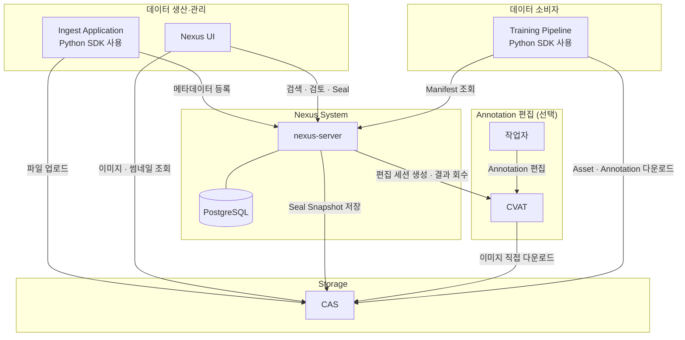
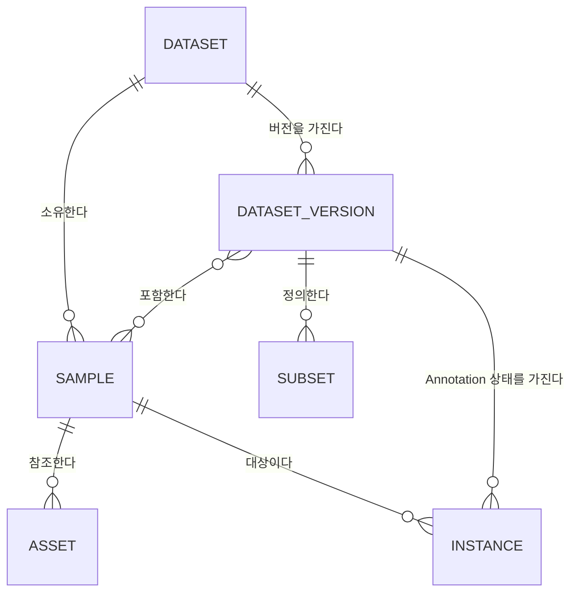
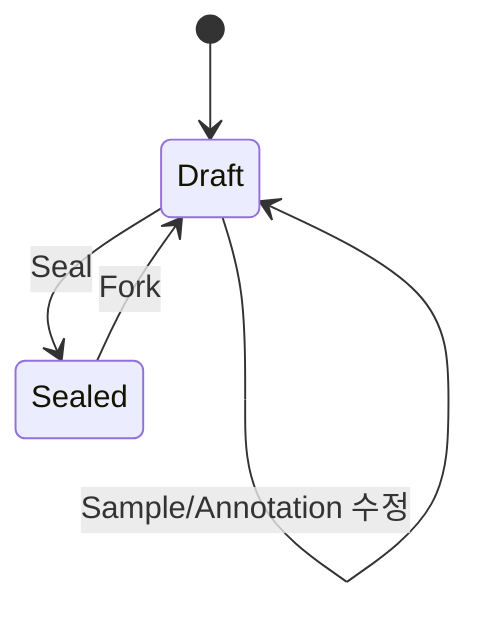
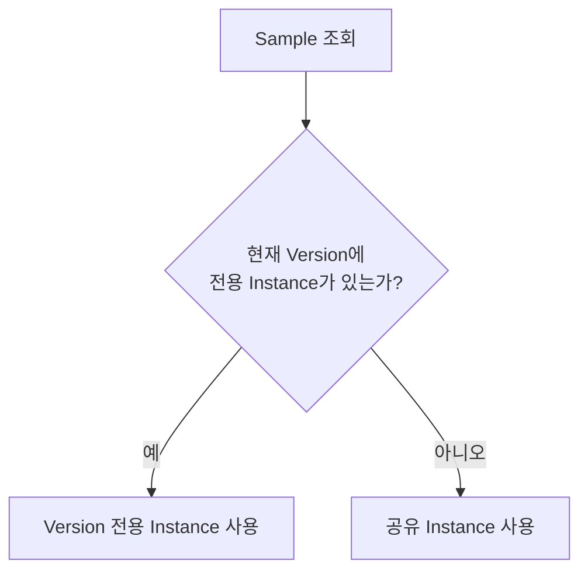
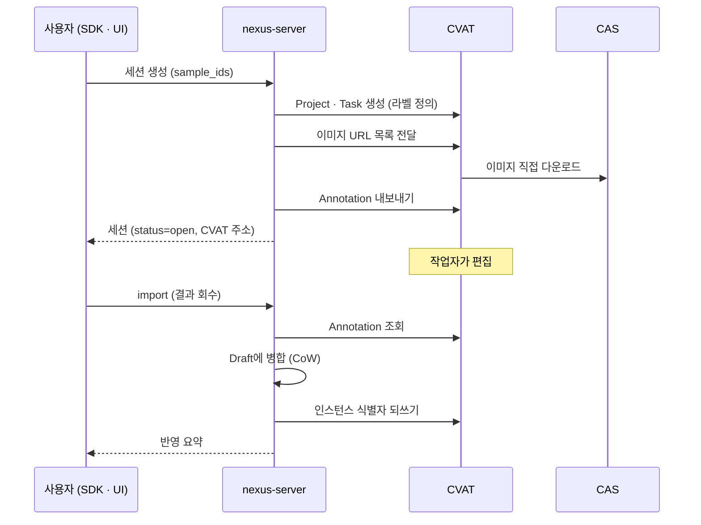
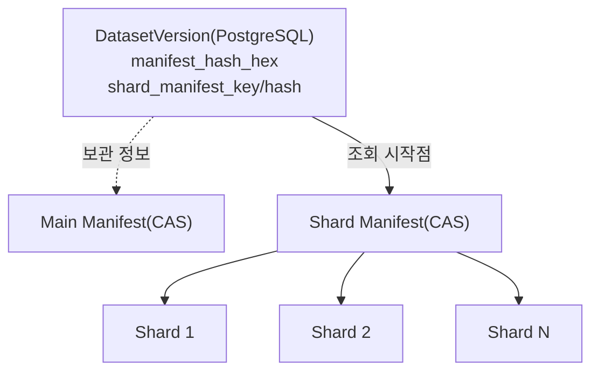
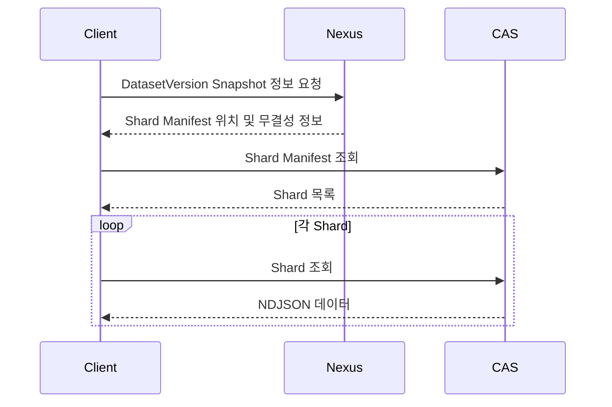
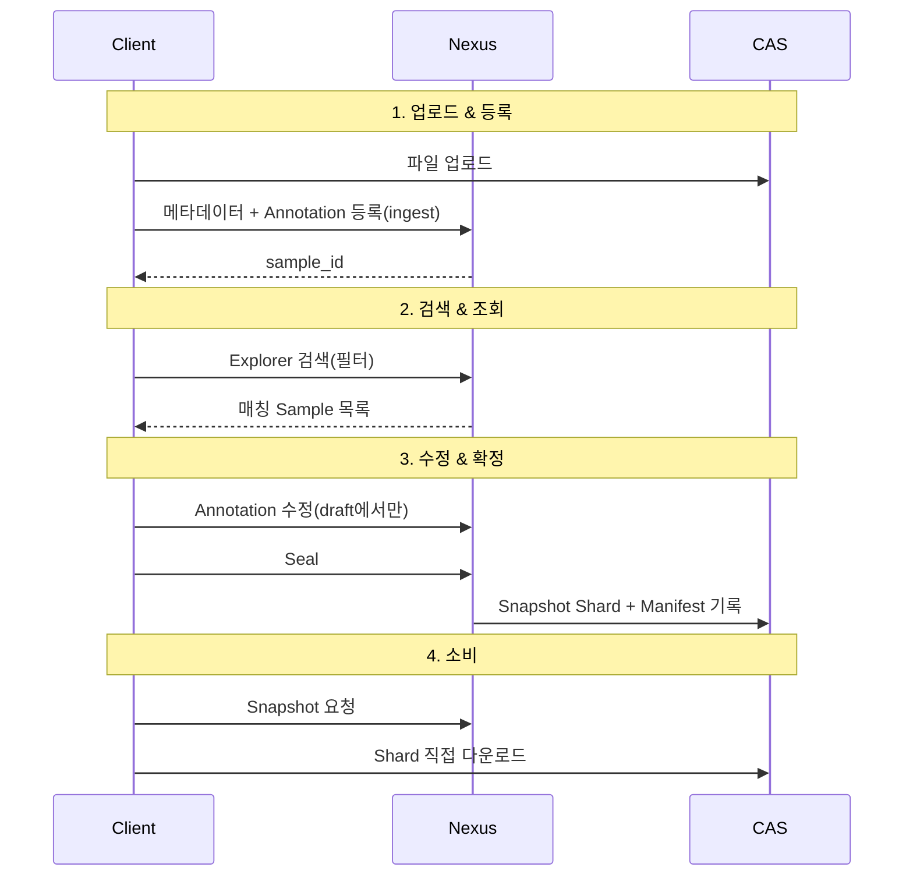

# Nexus Architecture Design
## 1. 개요
### 1.1 문제 정의
ML 학습 데이터의 규모가 증가하면서 이미지와 Annotation 파일을 디렉터리 단위로 관리하는 방식에는 다음과 같은 한계가 있다.  
- 동일한 원본 파일을 여러 데이터셋에서 사용하기 위해 데이터를 반복해서 복사해야 한다.
- Annotation 수정이나 데이터 정제 시 새로운 버전을 만들기 위해 데이터셋 전체를 다시 복사해야 한다.
- 실제 학습에 사용된 데이터셋을 추적하거나 동일한 학습 환경을 재현하기 어렵다.
- 원본 파일 관리와 데이터셋 관리가 혼재되어 저장소와 메타데이터의 책임이 명확하지 않다.  

이러한 문제는 파일 저장과 데이터셋 관리를 하나의 계층에서 처리하기 때문에 발생한다.  

Nexus는 원본 파일 저장과 데이터셋 관리를 분리하고, Dataset과 Version을 관리하는 Catalog Layer를 제공한다.

### 1.2 목표
Nexus의 목표는 다음과 같다.
- ML 학습 데이터를 Dataset과 DatasetVersion 단위로 관리한다.
- 원본 파일과 메타데이터를 분리하여 저장 공간을 효율적으로 사용한다.
- Dataset의 변경 이력을 관리하고, 동일한 학습 환경을 재현할 수 있도록 한다.
- 대규모 데이터셋을 효율적으로 탐색하고 관리할 수 있는 구조를 제공한다.
- 데이터 적재, 검색, 버전 관리를 일관된 API와 SDK로 제공한다.

### 1.3 Out of Scope
다음 기능은 Nexus의 범위에 포함되지 않는다.
- 원본 파일 저장 및 전송
- 미디어 처리(Thumbnail 생성, 이미지 변환 등) 
- 모델 학습, 평가, 추론과 같은 ML Pipeline 실행  

Nexus는 대규모 ML 데이터셋을 체계적으로 관리하기 위한 Catalog를 제공한다.  
Python SDK는 Ingest 과정을 단순화하기 위해 CAS 업로드 및 Thumbnail 생성 등의 보조 기능을 제공한다. 이는 클라이언트 측 편의 기능이며, Nexus 서버는 파일 저장이나 미디어 처리를 담당하지 않는다.

## 2. 시스템 구성
### 2.1 구성 요소
전체 시스템은 다음과 같은 구성 요소로 이루어진다.  
| 컴포넌트 |	역할 |
|---|---|
| nexus-server |	ML Dataset Catalog Server. Dataset과 Dataset Version, Sample, Annotation 등 메타데이터를 관리한다. |
| PostgreSQL |	nexus-server의 메타데이터 저장소 |
| cas-server(CAS) |	콘텐츠 주소 기반 파일 저장소. 원본 파일과 Seal된 스냅샷(NDJSON)을 저장한다. |
| Python SDK(nexus) |	Nexus와 CAS를 사용하는 공식 클라이언트 라이브러리 |
| nexus-client |	데이터 탐색, 검색 및 검토를 위한 사용자 UI인터페이스. |
| CVAT |	Annotation 편집기. Nexus가 편집 세션 단위로 연동하며, 이미지는 CAS에서 직접 받는다. 선택 구성 요소이다. |
| 학습 파이프라인 |	Seal된 DatasetVersion을 이용하여 학습, 평가를 수행하는 외부 시스템 |

각 구성 요소는 파일 저장, 메타데이터 관리, 사용자 인터페이스 및 학습 실행을 각각 담당하며, 서로 독립적으로 동작한다.

### 2.2 동작 흐름



Python SDK는 CAS와 Nexus를 사용하는 통합 인터페이스를 제공한다.  
원본 파일은 SDK를 통해 CAS에 업로드 되며, 메타데이터는 Nexus에 등록된다.  
데이터 검색은 Nexus에서 수행하고, 검색 결과로 반환된 파일 참조 정보를 이용하여 SDK가 CAS에서 실제 파일을 조회한다.  
이 과정에서 파일 데이터는 nexus-server를 통과하지 않는다. 따라서 대용량 파일 전송과 메타데이터 처리를 독립적으로 확장할 수 있으며, Nexus는 Dataset Catalog의 역할에 집중할 수 있다.

## 3. 도메인 모델
### 3.1 개요
Nexus는 ML 데이터셋을 Dataset, DatasetVersion, Sample, Asset, Annotation(Instance), Subset의 여섯 가지 핵심 도메인으로 관리한다.  
각 도메인은 서로 다른 책임을 가지며, 이들의 관계를 통해 하나의 ML 데이터셋과 그 버전 이력을 표현한다.


Dataset은 데이터셋의 관리 범위를 정의하며, Sample과 Dataset Version을 포함한다.  
Dataset Version은 특정 시점의 Dataset 상태를 표현하며, 여러 Sample을 포함할 수 있다.  
Sample은 하나 이상의 Asset을 가지며, Asset은 CAS에 저장된 실제 파일을 참조한다.  
Annotation Instance는 Sample에 속하며, Dataset Version별 상태로 관리된다.

### 3.2 Dataset
Dataset은 하나의 ML 프로젝트를 구성하는 최상위 관리 단위이다.  
Dataset은 Sample과 Dataset Version을 포함하며, 접근 권한과 관리 범위를 정의한다.  
하나의 Sample은 정확히 하나의 Dataset에만 속한다.

### 3.3 DatasetVersion
Dataset Version은 특정 시점의 Dataset 상태를 나타내는 논리적 스냅샷이다.  
Version에는 여러 Sample이 포함될 수 있으며, 하나의 Sample은 여러 Version에서 재사용될 수 있다.  
Version은 Draft 상태에서 수정할 수 있으며, Seal되면 불변(Immutable)이 된다.  
Version의 생성과 상태 변화는 다음 장에서 자세히 설명한다.

### 3.4 Sample
Sample은 학습 데이터의 기본 단위이다.  
Sample은 하나 이상의 Asset과 Annotation을 가지며, 하나의 이미지, 비디오, Point Cloud 등 하나의 학습 대상을 표현한다.  
Sample 자체는 논리적 객체이며 실제 파일은 직접 저장하지 않는다.

### 3.5 Asset
Asset은 Sample이 참조하는 실제 파일이다.  
원본 파일은 모두 CAS에 저장되며, Nexus는 CAS의 Bucket, Key, Hash 등 파일 참조 정보만 관리한다.  
하나의 Sample은 여러 개의 Asset을 가질 수 있으며, 서로 다른 역할(RGB Image, Depth Image, Point Cloud 등)을 가질 수 있다.

### 3.6 Annotation(Instance)
Annotation은 Sample에 대한 Ground Truth(GT) 정보를 표현한다.  
Nexus는 미리 정의된 GT 스키마를 기반으로 Annotation을 관리하며, Instance를 Annotation의 최소 저장 단위로 사용한다.  
하나의 Instance는 id와 label 등의 공통 정보를 가지며, 하나 이상의 Annotation Component(keypoint_2d, bounding_box, cuboid_3d, polygon, polyline 등)를 포함할 수 있다.  
Annotation은 Dataset Version별 변경 사항을 효율적으로 관리하기 위해 Copy-on-Write(CoW) 방식을 사용한다. 자세한 Version 관리 방식은 5장에서 설명한다.

### 3.7 Subset
Subset은 Dataset Version에 저장되는 필터 조건이다.  
Train, Validation, Test와 같은 데이터 분할뿐 아니라 특정 조건으로 검색한 결과를 재사용하기 위한 논리적 집합을 표현한다.  
Subset은 Sample을 별도로 복사하지 않으며, 저장된 필터를 통해 필요한 Sample 집합을 재구성한다.

## 4. Dataset Version Lifecycle
### 4.1 개요
Dataset Version은 Dataset의 특정 시점을 나타내는 논리적 스냅샷이다.  
Version은 Draft 상태에서 생성되어 자유롭게 수정할 수 있으며, Seal되면 불변(Immutable)이 된다. Seal된 Version은 이후의 학습, 평가 및 재현에 사용된다.  
Version의 상태는 다음과 같은 생명주기를 따른다.


### 4.2 Draft Version
자유롭게 수정 가능한 작업 중 상태.  
- Sample 추가 및 제거
- Annotation 수정
- 다른 Version의 Sample 연결(Link)
- 다른 Dataset으로부터 Sample 가져오기(Import)  

등 모든 편집 작업이 가능하다.

### 4.3 Seal
Seal은 Draft를 변경 불가능한 DatasetVersion으로 확정하는 과정이다.  
Seal이 완료되면
- Version 내용은 변경되지 않는다.
- Snapshot(Manifest)이 생성된다.
- 이후 학습과 평가의 기준이 된다.  

Seal 과정에서 생성되는 Snapshot 구조는 7장에서 설명한다.

### 4.4 Fork
Sealed Version은 직접 수정할 수 없다.  
기존 Version을 변경하려면 새로운 Draft Version을 생성(Fork)하여 작업한다.  
새 Draft는 부모 Version의 Sample 구성을 그대로 이어받으며, 이후 필요한 Sample과 Annotation만 변경한다.  
이를 통해 이전 Version은 그대로 유지되며 새로운 Version만 변경된다.
 
### 4.5 버전 불변성
Seal된 Version은 변경되지 않는다.  
- 동일 Version 은 언제나 동일한 데이터셋을 의미하며,
- 언제든 동일한 학습 환경을 재현할 수 있다.  

새로운 데이터셋을 만들기 위해서는 기존 Version을 수정하는 대신 새로운 Draft Version을 생성한다.

### 4.6 삭제와 저장소 정리
Draft Version 은 언제든 삭제할 수 있다.  
마지막 Draft Version 이 삭제되고, 해당 Dataset에 남은 Version 이 없다면 Dataset 도 함께 삭제된다.  
이때 삭제 요청에 `delete_cas=true`를 명시적으로 지정한 경우에만, 더 이상 어디에서도 참조되지 않는 원본 파일에 대해 CAS에 삭제 요청을 보내 CAS 내부 GC 로직에 의해 정리될 수 있도록 한다. `delete_cas`는 기본값이 `false`(보존)이므로, 별도로 지정하지 않으면 CAS 객체는 그대로 남는다.

## 5. Annotation Versioning
### 5.1 개요
Nexus는 Sample과 Annotation을 서로 다른 방식으로 Version 관리한다.  
Sample은 Version 간에 공유되며, Annotation만 Version 별로 독립적으로 관리한다. 이를 위해 Annotation에는 Copy-on-Write(CoW) 방식을 적용하여, 변경이 발생한 Annotation만 새로운 Version에 저장한다.  
이러한 구조를 통해 Version 간 중복 저장을 최소화하면서도, 각 Version의 독립성과 재현성을 유지한다.

### 5.2 Copy-on-Write
새 Draft Version은 부모 Version의 Annotation을 그대로 참조하며, 실제 수정이 발생하는 순간 해당 Sample의 새로운 Annotation을 생성한다.  
변경되지 않은 Annotation은 부모 Version과 공유되고, 수정된 Annotation만 새로운 Version에 저장된다.

```
Version A

Sample 1
 └── Annotation
      ├── Car
      ├── Person
      └── Road

           Fork

Version B

Sample 1
 └── Annotation' (modified)
      ├── Car
      ├── Person 
      └── Road
```

### 5.3 버전별 조회
Annotation을 조회할 때는 현재 Version의 Annotation을 우선 사용하고 존재하지 않으면 공유 Annotation을 조회한다.  
이 과정에서 변경되지 않은 Annotation은 여러Version에서 공유하면서도, 각 Version은 독립적인 Annotation 상태를 유지할 수 있다.



### 5.4 Sample은 CoW를 사용하지 않는다
Copy-on-Write는 Annotation에만 적용된다.  
Fork 시 새로운 Version의 Sample 멤버십이 생성되며, 각 멤버십은 동일한 Sample을 참조한다.   
이러한 구조를 통해 특정 Version에 어떤 Sample이 포함되어 있는지를 단순한 조회만으로 확인할 수 있으며 Version별 Sample 구성도 독립적으로 관리할 수 있다.  
이는 저장 공간의 일부 증가를 감수하더라도, Version 조회 성능과 데이터 모델의 단순성을 우선한 설계이다.

### 5.5 Annotation 편집 — CVAT 연동
Nexus는 Annotation을 직접 편집하는 도구를 제공하지 않고, 편집이 필요한 경우 외부 편집기인 CVAT과 **편집 세션(Annotation Session)** 단위로 연동한다.
세션은 Draft Version의 Sample 집합을 CVAT으로 내보내고, 작업자가 편집한 결과를 다시 Draft에 병합하는 왕복 과정을 하나의 단위로 묶은 것이다.

세션 1개는 CVAT의 Project 1개와 Task 1개에 대응한다.
Sealed Version은 편집 대상이 될 수 없으며, 세션 생성 요청은 거부된다.

#### 5.5.1 데이터 흐름
이미지 파일은 Nexus를 통과하지 않는다. Nexus는 CAS Object의 URL 목록만 CVAT에 전달하고, CVAT이 CAS에서 직접 이미지를 내려받는다.
Nexus가 주고받는 것은 Annotation과 라벨 정의뿐이다.



세션 생성은 비동기로 처리된다. CVAT이 이미지를 모두 내려받아야 편집을 시작할 수 있고 그 시간이 Sample 수에 비례하므로, Nexus는 세션을 먼저 반환하고 준비는 백그라운드에서 진행한다.
클라이언트는 세션 상태가 `open`이 될 때까지 조회한다.

| 상태 | 의미 |
|---|---|
| `creating` | CVAT Project·Task 준비 중. 아직 편집할 수 없다 |
| `open` | 편집 가능 |
| `closed` | 작업 종료. Sample 잠금이 해제된 상태 |
| `failed` | 준비 실패. 사유가 함께 기록된다 |

#### 5.5.2 편집 범위
CVAT은 2D 이미지 편집기이므로, 왕복이 무손실인 컴포넌트만 내보낸다.

| 구분 | 컴포넌트 | 처리 |
|---|---|---|
| 편집 대상 | `bounding_box`, `polygon`, `polyline`, `keypoint_2d` | CVAT으로 내보내고 편집 결과를 병합한다 |
| 편집 제외 | `cuboid_3d`, `keypoint_3d`, classification, scalar, vector | 내보내지 않으며 **원본이 그대로 보존된다** |

편집 대상이 아닌 컴포넌트는 병합 과정에서 변경되지 않는다. 3D 정보나 분류 값을 가진 인스턴스의 2D 박스만 수정하는 경우에도 나머지 정보는 유지된다.

#### 5.5.3 인스턴스 식별
왕복 과정에서 Nexus 인스턴스와 CVAT Shape를 연결하기 위해, Nexus는 인스턴스 식별자를 CVAT Shape의 속성(attribute)으로 함께 내보낸다.
편집 결과를 회수할 때 이 값으로 원본 인스턴스를 찾아 병합한다.

다만 CVAT은 Shape의 라벨을 변경하면 속성 값을 초기화한다. 이 경우 식별자가 사라져 원본 인스턴스를 찾을 수 없게 되므로, Nexus는 세션마다 **CVAT Shape ID와 인스턴스 식별자의 매핑을 함께 보관**한다.
CVAT Shape ID는 라벨 변경 후에도 유지되므로, 속성이 비어 있는 Shape는 이 매핑으로 신원을 복구한다.

#### 5.5.4 삭제 판정
편집 결과에 존재하지 않는 컴포넌트를 삭제로 판정할 때는, **실제로 CVAT에 내보낸 것만을 근거로 삼는다.**
형식 오류로 내보내지 못한 컴포넌트나 편집 대상이 아닌 컴포넌트는 애초에 CVAT에 존재한 적이 없으므로 삭제 대상이 될 수 없다.
이 원칙이 없으면 편집하지 않은 데이터가 회수 과정에서 소실된다.

#### 5.5.5 Sample 잠금
하나의 Sample은 동시에 하나의 활성 세션에만 속할 수 있다.
두 세션이 같은 Sample을 편집하면 나중에 회수한 결과가 앞의 결과를 덮어쓰기 때문이다.
이미 다른 활성 세션이 점유한 Sample로 세션을 생성하면 요청이 거부되며, 어느 세션이 점유 중인지 함께 반환된다.

잠금은 세션을 종료(`close`)하거나 삭제할 때 해제된다.

| 동작 | Sample 잠금 | CVAT Project | 수행 가능한 사용자 | 용도 |
|---|---|---|---|---|
| `close` | 해제 | **보존** | 세션 생성자 또는 Dataset 소유자 | 작업 종료. 결과물은 CVAT에 남긴다 |
| `delete` | 해제 | **삭제** | Dataset 소유자 | 세션 자체를 정리. 회수하지 않은 편집도 함께 사라진다 |

종료 수단이 삭제뿐이면 결과물 소실이 우려되어 아무도 세션을 정리하지 않게 되고, Sample이 영구히 잠긴다. 두 가지를 분리한 이유이다.

#### 5.5.6 회수 시점
세션 상태는 생명주기만을 나타내며, 편집 결과의 회수 여부는 상태로 표현하지 않는다.
회수한 이후에도 작업자가 CVAT에서 계속 편집할 수 있으므로, 상태 하나로는 실제 상황을 표현할 수 없기 때문이다.
대신 CVAT Job의 최종 수정 시각과 마지막 회수 시각을 비교하여 **미반영 변경 여부**를 별도로 계산한다.

회수(`import`)는 여러 번 호출해도 안전하다. 편집이 없으면 아무것도 변경되지 않는다.

## 6. 스냅샷과 Manifest 구조
Seal은 Draft 상태의 DatasetVersion을 변경할 수 없는 Snapshot으로 확정하는 과정이다.  
Snapshot은 Seal 시점의 Sample과 Annotation 상태를 고정하며, 이후에는 Annotation의 변경 이력이나 Copy-on-Write 구조를 다시 해석하지 않고도 동일한 데이터셋을 재현할 수 있도록 한다.  
Nexus는 Snapshot을 여러 개의 Shard와 이를 연결하는 Manifest로 구성하여 CAS에 저장한다.

### 6.1 Annotation Snapshot
Seal이 수행되면 Nexus는 해당 DatasetVersion에서 유효한 Annotation을 계산하여 하나의 완전한 상태로 확정한다.  
확정된 Annotation은 NDJSON 형식의 Snapshot으로 생성되며, 대규모 Dataset을 효율적으로 처리할 수 있도록 여러 개의 Shard로 분할하여 저장한다.  
Snapshot은 DatasetVersion의 논리적 상태를 외부 저장소에 고정한 결과물이다.  
따라서 Seal 이후에는 PostgreSQL의 Annotation 관계를 다시 해석하지 않고도 해당 Version의 데이터를 독립적으로 읽을 수 있다.

### 6.2 Shard 기반 저장
각 Shard는 독립적인 NDJSON 객체로 CAS에 저장된다.  
Snapshot Shard는 시스템 내부에서만 사용하는 불변 객체이므로, 편의를 위한 논리적인 이름 대신 내용의 BLAKE3 해시를 객체 이름으로 사용한다.  
이 구조를 통해 Seal 과정에서 동일한 Shard가 이미 CAS에 존재하는지 업로드 전에 확인할 수 있으며, 존재하는 경우에는 업로드를 생략하고 기존 객체를 그대로 재사용한다. 결과적으로 CAS의 Deduplication을 통한 저장 공간 절약뿐 아니라, 불필요한 네트워크 전송도 함께 줄일 수 있다.

### 6.3 Manifest 구조
Snapshot이 여러 개의 Shard로 나뉘면, 하나의 DatasetVersion이 어떤 Shard들로 구성되는지를 관리하는 정보가 필요하다.  
이를 위해 Nexus는 다음 두 종류의 Manifest를 사용한다.

| 구성 요소 | 역할 |
|---|---|
|Shard Manifest|Snapshot을 구성하는 Shard 목록을 관리한다|
|Main Manifest|DatasetVersion과 Snapshot 전체를 대표하는 메타데이터를 보존한다|



Main Manifest는 Seal 시 CAS에 저장되며, Snapshot의 구성과 출처를 추적할 수 있도록 한다.  
일반적인 조회에서는 Main Manifest를 매번 읽지 않는다. PostgreSQL의 DatasetVersion에는 Snapshot 조회에 필요한 시작점이 함께 저장되며, Nexus는 이를 기준으로 클라이언트에 조회 정보를 제공한다.  
즉, Database는 Snapshot 데이터를 직접 저장하지 않고,  CAS에 저장된 Snapshot을 찾아가기 위한 메타데이터만 관리한다.

### 6.4 Snapshot 조회
Snapshot 조회 시 Nexus는 DatasetVersion에 연결된 Snapshot 정보를 클라이언트에 반환한다.  
클라이언트는 반환된 정보를 이용하여 CAS에서 Shard Manifest를 읽고, Manifest에 포함된 각 Annotation Shard를 직접 조회한다.



Nexus는 Snapshot의 위치와 메타데이터만 관리하며, 실제 Annotation 데이터는 CAS와 클라이언트 사이에서 직접 전송된다.  
이를 통해 Nexus는 대용량 데이터 전송 경로에서 제외되고, Dataset과 Version을 관리하는 Catalog 역할에 집중한다.

## 7. Data Flow
이 장에서는 하나의 Sample이 등록되고 활용되기까지의 전체 흐름을 따라가며, 앞에서 설명한 설계 요소들이 실제 시스템에서 어떻게 연결되는지 살펴본다.



### 7.1 등록 (Upload & Ingest)
원본 Asset은 클라이언트가 CAS에 직접 업로드하며, Nexus에는 Asset 참조 정보와 메타데이터, Annotation만 등록된다.  
Ingest가 완료되면 Sample은 DatasetVersion에 포함되고 이후 검색과 Version 관리의 대상이 된다.

### 7.2 검색 
등록된 Sample은 Explorer를 통해 검색하고 조회할 수 있다.  
조회 결과는 요청한 DatasetVersion을 기준으로 구성되며, Version에 해당하는 Annotation 상태가 함께 제공된다.

### 7.3 수정 
Annotation 수정은 Draft Version에서만 가능하다.  
수정된 Annotation은 Copy-on-Write 방식으로 관리되므로, 기존 Version에는 영향을 주지 않고 현재 Draft에만 변경 사항이 반영된다.

### 7.4 Seal
Seal은 Draft Version을 변경할 수 없는 Snapshot으로 확정하는 과정이다.  
현재 Version의 Annotation 상태를 Snapshot으로 생성하여 CAS에 저장하고, DatasetVersion은 해당 Snapshot을 참조하도록 갱신된다.

### 7.5 Consume
Snapshot을 사용할 때 Nexus는 Snapshot의 위치와 메타데이터만 제공한다.  
클라이언트는 CAS에서 Snapshot을 직접 조회하며, Nexus는 대용량 Annotation 데이터의 전송 경로에 포함되지 않는다.

### 전체 흐름
즉, 하나의 Sample은
```
Upload → Ingest → Explore → Modify → Seal → Consume
```
의 생명주기를 가지며,  
이 과정에서 CAS는 파일과 Snapshot을 저장하고, Nexus는 Dataset과 Version을 관리하는 Catalog 역할을 담당한다.

## 8. PostgreSQL 스키마 설계
Nexus는 Dataset, Version, Sample, Annotation과 같은 메타데이터를 PostgreSQL에 저장한다.  
CAS가 원본 Asset과 Snapshot을 저장하는 반면, PostgreSQL은 데이터 간의 관계와 Version 정보를 관리하며, Explorer와 DatasetVersion 관리의 기반이 된다.  

```
Dataset
   │
   ├────────────┐
   ▼            ▼
DatasetVersion  Sample
   │   ┊         │
   │   ┊         ├──── Asset
   │   ┊         │
   │   └╌╌╌╌╌╌╌╌╌┴──── Instance
   │
   └──── DatasetVersionSample
```

### 8.1 핵심 테이블
|테이블|역할|
|---|---|
|datasets|Dataset의 논리적 정체성|
|dataset_versions|Version 상태와 Snapshot 정보|
|samples|Sample 메타데이터|
|sample_assets|Sample과 CAS Asset 연결|
|instances|Annotation 데이터|
|dataset_version_samples|Version별 Sample 구성|
|dataset_schema_*|Dataset에서 관측된 Annotation Schema|
|subsets|저장된 검색 조건(View)|
|dataset_favorites|사용자 즐겨찾기|
|users|사용자 계정|

### 8.2 Annotation Versioning
Annotation은 instances 테이블에서 관리된다.  
공유 Annotation과 Version별 Annotation을 하나의 데이터 모델로 관리하며, 이를 통해 Copy-on-Write 구조를 구현한다. 각 DatasetVersion은 자신의 Annotation을 우선 사용하고, 변경되지 않은 Annotation은 부모 Version과 공유한다.

### 8.3 Annotation Schema
Explorer에서 사용하는 Annotation Schema는 별도의 관측 테이블에 관리된다.  
Dataset에 새로운 Label이나 Annotation Component가 추가되면 Schema를 함께 갱신하며, 이를 통해 Dataset 전체의 Annotation 구조를 빠르게 조회할 수 있다.

## 9. API, SDK 계층 구조
Nexus는 비즈니스 규칙, 저장소 접근, 외부 인터페이스를 계층별로 분리하여 설계하였다.  
이를 통해 비즈니스 로직을 API나 저장소 구현으로부터 독립시키고, 서버와 SDK가 동일한 규칙을 일관되게 사용할 수 있도록 한다.

### 9.1 서버 계층 구조
nexus-server는 세 개의 계층으로 구성된다.

```
API 계층 (HTTP 요청/응답)
   │
Catalog 계층 (비즈니스 로직)
   │
Store 계층 (PostgreSQL 쿼리 / CAS 클라이언트)
```

각 계층은 바로 아래 계층에만 의존하며 역할은 다음과 같다.
- API 계층은 HTTP 요청과 응답을 처리
- Catalog 계층은 Dataset, Version, Annotation 등 핵심 비즈니스 규칙을 관리
- Store 계층은 PostgreSQL과 CAS에 대한 데이터 입출력 담당  

이를 통해 비즈니스 규칙은 API나 저장소 구현에 종속되지 않고 독립적으로 유지된다.

### 9.2 SDK 계층 구조
Python SDK는 두 단계의 계층 구조를 따른다.
- Low-level Client - REST API를 직접 호출하기 위한 인터페이스 제공
- High-level SDK - Dataset, Subset 등 도메인 객체를 중심으로 일반적인 워크플로우를 추상화  

High-level SDK는 내부적으로 Low-level Client를 사용하며, Low-level Client는 세밀한 제어가 필요한 경우를 위한 확장 지점으로 제공된다.

CVAT 편집 세션도 같은 구조를 따른다. Low-level Client가 세션 API를 그대로 노출하고, High-level SDK가 세션 객체로 감싸 준비 완료까지의 대기와 결과 회수를 추상화한다.
세션 생성이 비동기이므로, 상태를 직접 조회하는 반복 처리를 SDK가 대신한다.

```
Application
      │
      ▼
Python SDK
      │
      ▼
REST API
      │
      ▼
Catalog Layer
      │
      ▼
Store Layer
      │
      ▼
PostgreSQL / CAS
```

### 9.3 API 설계 원칙
API는 다음과 같은 원칙을 따른다.
- Batch 중심  
대량 데이터 처리를 위해 Batch API를 제공하며, 각 요청은 독립적으로 처리되어 일부 실패가 전체 작업에 영향을 주지 않도록 한다.
- 전면 인증  
조회를 포함한 모든 엔드포인트가 인증을 요구한다. 예외는 회원 가입·로그인·헬스체크·OpenAPI 문서뿐이다. 데이터 변경 권한은 인증 위에 Dataset 소유권 정책을 더해 결정한다.
- 일관된 오류 모델  
HTTP 상태 코드와 함께 구체적인 오류 정보를 제공한다.

## 10. 권한과 불변성 정책
Nexus는 신뢰 환경에서의 협업을 전제로 설계되었다.  
복잡한 권한 체계 대신 Dataset 소유권과 Version 불변성을 조합하여 데이터의 안정성과 재현성을 보장한다.

### 10.1 인증
Nexus는 자체 발급하는 JWT(HS256) 기반 인증을 사용한다.  
사용자는 로그인 후 Access Token을 발급받으며, 이후의 요청은 JWT를 통해 사용자 신원을 확인한다. 현재는 자체 인증을 제공하지만, 인증 방식은 Catalog 계층과 분리되어 있어 향후 OAuth2나 OpenID Connect와 같은 외부 인증 시스템으로도 확장할 수 있다.  
**조회를 포함한 모든 엔드포인트가 토큰을 요구한다.** 예외는 회원 가입, 로그인, 헬스체크, OpenAPI 문서(`/api-docs/openapi.json`), 그리고 Swagger UI 정적 셸(`/swagger-ui`, `/swagger-ui/`) 여섯 가지뿐이다. 토큰이 없거나 만료되었으면 401을 반환한다.  
세분화된 Role 기반 권한 모델은 현재 제공하지 않는다. 권한은 Dataset 소유권이라는 단일 축으로 결정되며, 이는 신뢰 환경에서의 협업을 단순하게 유지하기 위한 설계이다.

Token은 발급 후 만료까지 무효화할 수 없다. 만료 시점은 배포마다 `jwt.ttlHours` 값(기본 24시간, 허용 범위 1~8760시간 — [설치 가이드](usage.md#인증-관련-설정-차트-030) 참조)으로 정해진다. 서버가 요청마다 토큰을 검증할 때 DB를 조회하지 않기 때문이며, 이는 대량 적재 시 커넥션 경합을 피하기 위한 선택이다. 따라서 비밀번호를 변경하거나 계정을 삭제해도 이미 발급된 토큰은 그 만료 시점까지 유효하다.

### 10.2 Dataset 소유권
Dataset을 생성한 사용자는 해당 Dataset의 소유자가 된다.  
**Dataset의 상태를 바꾸는 모든 작업은 소유자만 수행할 수 있다.** Dataset 이름 변경과 Version 삭제 같은 관리 작업뿐 아니라 Ingest, Sample 추가·삭제, Annotation 수정, Seal, Subset 조작이 모두 여기 해당한다. 소유자가 아닌 사용자가 시도하면 403을 반환한다.  
조회는 인증만 통과하면 소유자가 아니어도 가능하다. 즉 소유권은 **쓰기**에만 적용된다.  
Sample은 정확히 하나의 Dataset에 속하므로, 경로에 Dataset이 드러나지 않는 Sample 단위 요청도 Sample에서 Dataset을 역추적해 같은 검사를 적용한다.  
다른 사용자가 독립적으로 작업해야 하는 경우에는 기존 Dataset을 Clone하여 새로운 Dataset을 생성하고, 생성자가 해당 Dataset의 소유자가 된다.  
Dataset 소유권은 변경의 주체를 제한하기 위한 정책이며, DatasetVersion의 변경 가능 여부를 결정하는 불변성 정책과는 별도로 적용된다.

**소유자가 지정되지 않은(NULL) Dataset은 인증된 사용자 누구나 변경하고 삭제할 수 있다.** 마지막 Version을 삭제하면 Dataset도 함께 사라지므로, 사실상 누구나 그 카탈로그를 없앨 수 있다는 뜻이다. CAS에 있는 원본 객체는 삭제 요청에 `delete_cas`를 지정한 경우에만 CAS로 삭제 요청이 가고, 그때도 실제 정리는 CAS 내부 GC가 수행한다.

소유자가 없는 상태는 두 경로로 생긴다.

|경로|설명|
|---|---|
|소유권 도입 이전에 만들어진 Dataset|당시에는 소유자 개념이 없었고 소급 지정도 하지 않았다|
|소유자 계정의 삭제|계정을 지우면 그 사용자가 소유하던 Dataset은 삭제되지 않고 **소유자만 해제된다**. 삭제 응답의 `released_datasets`가 그 개수다|

즉 소유자 없는 상태는 과거의 잔재만이 아니라 **운영 중에도 계속 생긴다.** 계정 삭제 시 Dataset을 함께 지우지 않는 것은 의도된 선택이다 — 한 사람의 탈퇴로 팀이 쓰던 학습 데이터가 사라지는 편이 더 위험하기 때문이다. 대신 그 Dataset은 보호되지 않은 상태로 남는다.

운영 데이터라면 소유자를 지정해야 한다. 다만 지정하는 순간 그 Dataset은 해당 계정 전용이 되므로, 여러 사람이 함께 적재하던 Dataset이라면 나머지 인원이 모두 막힌다. 지정 여부는 이 트레이드오프를 보고 판단한다.

**현재 소유권을 옮기는 API는 없다.** 소유자는 Dataset 생성 시점에 생성자로 한 번 정해지고, 이후 값이 바뀌는 경로는 위 두 가지로 NULL이 되는 것뿐이다. 다른 사용자에게 넘기거나 주인 없는 Dataset을 인수하려면 현재로서는 운영자가 데이터베이스를 직접 수정해야 한다.

이는 최종 형태가 아니라 소유권 도입 1단계에서 범위를 줄인 결과다. 양도(현 소유자가 다른 사용자에게 넘김)와 인수(주인 없는 Dataset을 가져감)는 성격이 다르다 — 양도는 주체가 명확하지만, 인수는 "누구나 쓸 수 있던" 상태를 한 사람 전용으로 바꾸는 것이라 나머지 사용자의 권한을 회수하는 결과가 된다. 후자는 관리자 역할을 어떻게 둘지가 먼저 정해져야 한다.

### 10.3 Version 불변성
DatasetVersion의 변경 가능 여부는 권한과 별개로 Version 상태에 의해 결정된다.  
Draft 상태에서는 Sample과 Annotation을 수정할 수 있지만, Seal 이후에는 모든 변경이 차단된다.  
즉, Dataset 소유권은 누가 변경할 수 있는지를 결정하고, Version 상태는 변경이 가능한지를 결정한다. 두 정책은 서로 독립적으로 동작한다.

**Seal이 고정하는 것은 Version의 구성과 Annotation이다.** Sample의 `meta`는 그 대상이 아니다 — Seal은 Instance를 NDJSON 스냅샷으로 CAS에 박제하고 해시로 고정하지만 `samples.meta`는 스냅샷에 포함되지 않으며, Sealed Version의 `meta` 조회는 언제나 살아 있는 행을 읽는다. `meta`가 Sample 단위로 하나뿐이고 Version별로 분기되지 않기 때문이다(Annotation만 CoW로 격리된다).

이 성질을 이용하는 경로가 하나 있다. **이미지 크기 보정(`PATCH /samples/dimensions`)은 Sealed Version에 속한 Sample에도 적용된다.** 다만 이 경로는 **빈칸을 채우는 것만 가능하다** — 축별로 값이 없거나 `null`이거나 0 이하일 때만 쓰고, 이미 기록된 값은 거부한다. 숫자가 아닌 값이 들어 있으면 정체를 알 수 없는 값으로 보아 건드리지 않는다. 정보를 지우는 경로가 없으므로 재현성이 깨지지 않고, 그래서 Seal 여부를 검사하지 않는다. 보정 대상인 `0`은 측정된 값이 아니라 구 SDK가 크기를 모를 때 자리를 채우려고 넣은 값이며, 그것을 얼려두는 것은 재현성을 지키는 일이 아니라 결함을 보존하는 일이다.

Annotation 편집 세션에도 같은 정책이 적용된다. Sealed Version은 편집 세션의 대상이 될 수 없으며, 세션이 열려 있는 동안 대상 Version이 Seal되면 이후 결과 회수가 차단된다.

**편집 세션의 모든 작업은 Dataset 소유자에게 열려 있다.** 세션 생성 자체가 소유자 전용이므로, 정상적으로 만들어진 세션에서는 세션 생성자와 Dataset 소유자가 동일한 계정이다.

|작업|수행 가능한 사용자|이유|
|---|---|---|
|생성|Dataset 소유자|Draft Version의 Sample을 잠그는 쓰기 작업이다|
|종료(close), 결과 회수(import)|Dataset 소유자, 그리고 세션 생성자|아래 설명 참조|
|삭제(delete)|Dataset 소유자|CVAT의 상태까지 함께 제거하고 회수하지 않은 작업 결과를 소실시킨다|

종료와 결과 회수에 "세션 생성자"가 포함된 것은 **소유자가 없던 Dataset에서 만들어진 세션**을 위한 것이다. 그런 세션은 소유자가 아닌 사용자가 만들 수 있었고, 이후 Dataset에 소유자가 지정되면 세션을 만든 사람이 자기 세션을 정리하지 못하게 된다. 정상 경로로 만들어진 세션에서는 두 조건이 같은 계정을 가리키므로 차이가 없다.

결과 회수는 여기서 한 번 더 걸린다. Annotation을 실제로 Draft에 쓰는 단계가 Dataset 소유권을 다시 검사하므로, 소유자가 아닌 세션 생성자는 회수를 시작할 수는 있어도 반영은 되지 않는다.

종료와 삭제를 구분하는 것이 핵심이다. 종료는 잠금만 풀고 CVAT project를 보존하므로, 결과물 소실을 걱정하지 않고 잠금을 해제할 수 있다. 종료 수단이 삭제뿐이라면 아무도 세션을 정리하지 못해 Sample이 영구히 잠긴다.

### 10.4 데이터 무결성
Nexus는 저장된 데이터가 변경되지 않았음을 검증할 수 있는 구조를 제공한다.  
Asset과 Snapshot은 모두 내용 기반 식별 정보를 함께 관리하며, 이를 통해 저장 이후 데이터의 무결성을 확인할 수 있다.  
기본적으로 Nexus는 클라이언트가 등록한 Asset 정보를 신뢰한다. 필요에 따라 CAS를 이용한 추가 검증을 수행할 수 있지만, 기본 동작에서는 처리 성능을 우선한다.  
따라서 Nexus가 보장하는 무결성은 저장 이후 데이터가 변경되지 않았음에 초점을 두며, 클라이언트가 최초에 올바른 데이터를 등록했는지까지는 기본적으로 보장하지 않는다.

## 11. 배포 구조
Nexus는 서버, Helm Chart, Python SDK를 서로 독립적인 배포 단위로 관리한다.  
각 구성 요소는 서로 다른 역할과 생명주기를 가지므로, 독립적으로 버전 관리하고 릴리스할 수 있다.

### 11.1 서버
nexus-server는 컨테이너 이미지 형태로 배포되며, Nexus의 API와 비즈니스 로직을 제공한다.

### 11.2 Helm Chart
Helm Chart는 Kubernetes 환경에서 Nexus를 배포하기 위한 패키지이다.  
Chart는 서버 이미지와 독립적으로 버전 관리되며, 운영 환경에서는 원하는 서버 이미지 버전을 명시적으로 선택하여 사용할 수 있다.

### 11.3 Python SDK
Python SDK는 Nexus API를 사용하는 클라이언트 라이브러리로, 서버와 별도의 릴리스 주기를 가진다.  
SDK는 서버와 독립적으로 업그레이드하거나 유지할 수 있다.

## 12. Design Decisions
Nexus는 단순한 기능 구현보다 일관된 데이터 모델과 운영 단순성을 우선하도록 설계하였다.  
이 장에서는 주요 설계 선택과 그 이유를 간략히 정리한다.

|설계 결정 | 고려한 대안 | 선택 이유 |
|---|---|---|
|CAS와 Nexus를 분리	| 파일 저장까지 포함한 단일 서비스 |	저장소와 메타데이터를 독립적으로 확장하기 위해 |
|Sample은 하나의 Dataset에만 속함	|여러 Dataset에서 Sample 공유|	데이터 소유권과 수정 책임을 단순하게 유지하기 위해|
|Sample 멤버십은 CoW를 적용하지 않음	|멤버십도 CoW 적용	|저장 공간보다 조회 단순성과 예측 가능성을 우선하기 위해|
|Annotation은 Sample 단위로 교체|	Annotation Group 단위 수정|	조회, Version 비교, Snapshot 생성을 일관된 방식으로 유지하기 위해|
|Seal은 되돌릴 수 없는 단방향 작업|Rollback 및 삭제 허용|	데이터 재현성을 최우선으로 보장하기 위해|
|Snapshot 조회는 Database 정보를 우선 사용|	CAS Manifest를 매번 조회	|조회 경로를 단순하게 유지하고 불필요한 CAS 접근을 줄이기 위해|
|Asset 정보는 기본적으로 신뢰	|모든 Asset을 즉시 검증	|대량 Ingest 처리량을 우선하고, 필요한 경우에만 검증을 수행하기 위해|
|Dataset 소유권 기반의 단순 권한 모델|	Role 기반 세분화 권한|	신뢰 환경에서 협업을 단순하게 유지하기 위해|
|CAS Garbage Collection은 트랜잭션 밖에서 병렬 처리	|트랜잭션 내 동기 처리, 또는 별도 큐|	DB 트랜잭션 범위를 최소화하고, 후보를 병렬로 처리해 응답 지연을 줄이기 위해(단, 응답은 GC 완료를 기다림)|
|Batch 작업은 건별 독립 처리|	전체를 하나의 트랜잭션으로 처리	|일부 실패가 전체 작업에 영향을 주지 않도록 하기 위해|

이러한 결정들은 모두 단순성(Simple), 재현성(Reproducibility), 운영 용이성(Operability) 을 우선한다는 동일한 설계 원칙에 기반한다.


## 13. Architecture Principles
### 13.1 Measure before Scale 
Nexus는 Measure before Scale 원칙을 따른다.  
복잡한 분산 구조를 미리 도입하기보다, 현재 구조에서 충분한 성능을 확보하고 실제 병목이 확인된 이후에 단계적으로 확장한다.  
현재 구조는 수백만 개 규모의 Sample을 목표로 설계되었으며, PostgreSQL은 메타데이터 관리에 집중하고 대용량 데이터는 CAS를 통해 직접 제공하도록 구성하였다.

### 13.2 Architecture Principles
Nexus의 구조는 다음 원칙을 기반으로 유지된다.
- Storage와 Metadata를 분리한다.
- DatasetVersion을 중심으로 데이터를 관리한다.
- Snapshot은 변경되지 않는 불변 객체로 유지한다.
- 파일 데이터는 nexus-server를 통과하지 않는다.
- 측정된 병목에 대해서만 확장한다.
- 신뢰 환경을 전제로 단순한 권한 모델을 유지한다.


