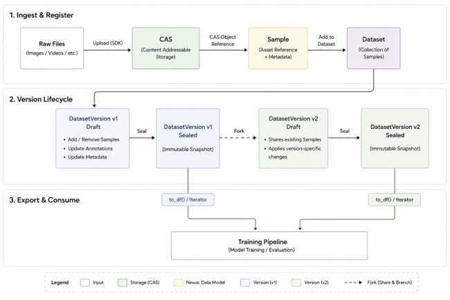

# Nexus User Guide
## 1. 소개
### 1.1 Nexus

Nexus는 ML 학습 데이터를 Sample, Dataset, DatasetVersion 단위로 관리하는 ML Dataset Catalog이다.  
원본 파일(이미지 등)은 콘텐츠 주소 기반 저장소인 **cas-server(CAS)**에 보관되며, Nexus에는 해당 파일에 대한 참조 정보와 Annotation, 메타데이터, Dataset 구조 및 버전 정보가 저장된다.  
이와 같은 구조를 통해 대용량 학습 데이터를 중복 없이 관리하면서, 데이터셋 버전별 재현성과 협업을 지원한다.

### 1.2 주요 특징
Nexus는 다음과 같은 특징을 가진다.
- 원본 파일은 CAS에서 관리된다.  
원본 파일은 CAS 엔드포인트를 통한 직접 업로드 또는 SDK 메서드를 이용한 업로드 방식으로 CAS에 저장되며, Nexus에는 CAS 객체를 참조하는 정보와 메타데이터만 저장된다.
- DatasetVersion 간 Sample을 공유한다.  
새로운 DatasetVersion은 기존 버전을 Fork하여 생성할 수 있으며, 변경되지 않은 Sample은 기존 버전과 공유된다. 따라서 데이터셋 전체를 복사하지 않고도 새로운 버전을 효율적으로 관리할 수 있다.
- Annotation은 DatasetVersion 단위로 관리된다.  
동일한 Sample이라도 DatasetVersion마다 서로 다른 Annotation을 가질 수 있으며, 한 버전에서의 수정은 다른 버전에 영향을 주지 않는다.
- Seal을 통해 Immutable 버전을 생성한다.  
DatasetVersion은 Seal하여 변경이 불가능한 스냅샷으로 고정할 수 있다. Seal된 버전은 학습 및 평가에 사용되는 기준 데이터셋으로 활용되며, 동일한 데이터를 언제든지 재현할 수 있다.
- Annotation은 CVAT에서 편집할 수 있다.  
Draft 버전의 Sample을 CVAT으로 내보내 사람이 편집하고, 그 결과를 다시 Draft로 반영할 수 있다. 이미지는 Nexus를 거치지 않고 CVAT이 CAS에서 직접 받는다. 서버에 CVAT 연동이 구성된 경우에만 사용할 수 있다.

### 1.3 전체 워크플로우


> 이 문서는 SDK 사용자를 위한 안내다. 서버 설치·설정·계정 관리·CVAT 연동 준비 등 운영자 작업은 [차트 README](../README.md)에 있다.

---

## 2. 시작하기
### 2.1 SDK 설치

```bash
pip install --extra-index-url https://int2nexus.github.io/cas-server/sdk/simple/ int2nexus-sdk

# 업데이트
pip install --upgrade --extra-index-url https://int2nexus.github.io/cas-server/sdk/simple/ int2nexus-sdk
#버전 확인
python -c "import importlib.metadata as m; print(m.version('int2nexus-sdk'))" 
```

이 문서는 서버 `0.1.18`(차트 `0.3.14`)과 SDK `0.1.17` 기준이다. SDK는 서버와 따로 발행되므로 위 명령으로 최신을 유지한다 — 문서의 기능이 없다는 에러가 나면 대개 SDK가 낮은 것이다. 버전별 변경은 [차트 CHANGELOG](../CHANGELOG.md)와 [SDK 변경 이력](https://int2nexus.github.io/cas-server/sdk/changelog.html)에 있다.

### 2.2 연결 설정

`nx.connect`는 로그인 후 JWT를 받아 클라이언트를 초기화한다. 계정이 없으면 등록을 먼저 실행한다. (사람이 없는 워크로드는 로그인 대신 로봇 토큰을 쓴다 — [2.3](#23-로봇-토큰으로-연결).)
```python
# (최초 1회) 테스트 계정 등록 - 이미 있으면 409, 그대로 진행. 403이면 가입이 닫힌 배포 — 관리자에게 계정을 요청한다
import requests

NEXUS_URL = "http://<HOST>:8090"
resp = requests.post(f"{NEXUS_URL}/api/v1/auth/register", json={
"email": "<EMAIL>", "password": "<PASSWORD>", "display_name": "<NAME>",
})
print(resp.status_code, "(409 = 이미 존재, 무시 가능)")
```

설정 값의 우선순위는 **인자 > 환경변수 > 설정 파일**이다. 코드에 명시한 값이 항상 이기고, CI는 환경변수로 로컬 설정 파일을 덮을 수 있다.

**(1) 설정 파일 — 권장**

`~/.int2nexus/settings.json`파일로 저장. `nx.connect()` 로 바로 연결. 스크립트에 자격증명이 남지 않는다.

```json
{
  "nexus_url": "http://<host>:8090",
  "email": "...",
  "password": "...",
  "cas_url": "http://<host>:8080",
  "cas_key_id": "...",
  "cas_secret": "...",
  "cas_region": "cas-default",
  "verify": true
}
```

```python
import nexus as nx

nx.connect()
```

**(2) 인자로 직접 넘기기**

```python
import nexus as nx

nx.connect(
    nexus_url="http://<host>:8090",
    email="...", password="...",
    cas_url="http://<host>:8080",
    cas_key_id="...", cas_secret="...",
)
```

**(3) 환경변수**

환경변수가 모두 있으면 `nx.connect()`만 호출하거나 첫 API 호출 시 자동 연결된다.

```python
import os

os.environ["NEXUS_URL"] = "http://<host>:8090" # nexus-server 주소
os.environ["NEXUS_EMAIL"] = "..."              # 로그인 자격 증명
os.environ["NEXUS_PASSWORD"] = "..."           
os.environ["CAS_URL"] = "http://<host>:8080"   # cas-server 주소 
os.environ["CAS_KEY_ID"] = "..."               # CAS SigV4 서비스 계정 자격증명
os.environ["CAS_SECRET"] = "..."  

nx.connect()
```

`cas_key_id`/`cas_secret`(또는 `CAS_KEY_ID`/`CAS_SECRET`)는 CAS 업로드 서명용 키. CAS가 인정하는(해당 버킷에 write 권한 있는) 키면 동작하며, nexus 서비스 키를 공유하거나 내부 정책에 따라 개인별로 발급받은 키 사용.

**둘을 주지 않으면** 경고 한 줄을 남긴 뒤 **CAS 요청이 서명 없이 나간다**(CAS가 익명 읽기를 받는 배포에서만 CAS를 쓸 수 있다). nexus는 CAS 자격증명을 발급하지 않으므로, CAS 자격증명은 둘 중 하나로 준다.

- **CAS 임시 자격증명(STS)** — `nx.connect(cas_sts=nx.CasSts(token_file=...))`(cas-server 이미지 `0.1.28`+, [2.4](#24-cas-임시-자격증명-sts)).
- **운영자가 발급한 키** — `cas_key_id`/`cas_secret` 인자, `CAS_KEY_ID`/`CAS_SECRET` 환경변수, 또는 설정 파일. CAS region 이 기본값(`cas-default`)이 아닌 배포는 `cas_region`(`CAS_REGION`)도 맞춰야 서명이 통과한다.


### 2.3 로봇 토큰으로 연결

적재 잡·스케줄러·CI는 로그인할 수 없다. 관리자가 만든 **로봇 계정**의 장수명 토큰을 그대로 제시한다.

```python
nx.connect(nexus_url=..., robot_token="nxr_...", cas_url=...)   # 또는 환경변수 NEXUS_ROBOT_TOKEN — cas_url(CAS_URL)은 여전히 필요
```

- **계정 1 : 토큰 N이다.** 새 토큰을 발급하고 `last_used_at`으로 배포를 확인한 뒤 옛 토큰을 폐기하면 중단 없이 회전한다.
- **로봇은 dataset·version·sample과 CVAT 세션, 저장된 explorer 필터(subset)를 지울 수 없다**(403). 적재·수정·seal·이름 변경·fork와 세션 생성·`close`·`import`는 된다.
- **`refresh`가 403이다.** 로봇 토큰으로 24시간 JWT를 받아 만료 강제를 우회하는 경로를 막는다.
- 폐기와 만료 단축은 캐시 수명(기본 5초)만큼 늦게 듣고, **정해진 만료 시각은 늦지 않는다.**

### 2.4 CAS 임시 자격증명 (STS)

cas 에 STS(`auth.oidc.issuers`)를 켠 배포는 장수명 CAS 키 대신 OIDC 토큰으로 임시 자격증명을 받는다. SDK 는 **명시 인자로만** 이 모드를 켜고 AWS 환경변수를 읽지 않는다.

```python
nx.connect(nexus_url="http://nexus-server", robot_token="nxr_...", cas_url="http://cas-server",
           cas_sts=nx.CasSts(token_file="/var/run/secrets/tokens/cas"))   # 또는 token_provider=함수
```

토큰의 남은 수명은 **900초 이상**이어야 한다(projected 토큰 `expirationSeconds` 7200 이상 권장, Keycloak 은 realm 토큰 수명을 올린다). 받은 임시 자격증명의 남은 수명이 600초 이하가 되면 새로 받고, 토큰 파일은 그때마다 다시 읽는다.

### 2.5 사내 프록시로 SSL 인증서 에러가 날 때

사내 보안 장비가 TLS를 검사하면 `nx.connect()`가 인증서 에러로 죽는다. 아래 중 하나를 사용한다.

```bash
export REQUESTS_CA_BUNDLE=/path/to/사내-루트-CA.pem
```

```python
nx.connect(verify="/path/to/사내-루트-CA.pem")   # 검증을 유지한 채 해결 (권장)
nx.connect(verify=False)                          # 최후의 수단
```

- 설정 파일의 `"verify"` 키에 적어두면 매번 넘기지 않아도 된다. 값은 `true`/`false` 또는 **CA 번들 경로**.
- `verify=False`는 그 연결의 **중간자 공격 탐지를 포기**하는 것이다. 접속 시 한 번 경고가 뜬다.

### 2.6 내 계정 관리

`nx.connect()`가 돌려주는 클라이언트로 본인 계정을 관리한다. 되돌릴 수 없는 작업이라 `nx.` 최상위 함수로는 노출하지 않는다.

```python
client = nx.connect()
client.change_password("현재비번", "새비번123")      # 현재 비밀번호를 재확인한다
result = client.delete_account("새비번123")          # 완전 삭제 — 되돌릴 수 없다
```

- **비밀번호 변경은 새 로그인부터 적용된다.** 이미 발급된 토큰은 만료까지(기본 24시간, 배포마다 `jwt.ttlHours`로 다를 수 있다 — [README 인증 설정](../README.md#인증-설정)) 그대로 유효하다. 이 클라이언트 인스턴스는 계속 써도 된다.
- 설정 파일(`~/.int2nexus/settings.json`)에 비밀번호를 적어두었다면 **그 파일도 함께 고쳐야 한다** — 안 그러면 다음 `nx.connect()`가 실패한다.
- **`delete_account`는 비활성화가 아니라 삭제다.** 이메일이 풀려 같은 주소로 다시 가입할 수 있다. 되돌릴 필요가 있다면 삭제 대신 관리자가 계정을 정지할 수 있다([README 계정과 권한 관리](../README.md#계정과-권한-관리)).
- **담당한 dataset이 남아 있어도 삭제된다.** 담당하던 dataset은 삭제되지 않고 **담당자만 해제**되며, 그 상태는 `GET /datasets?unowned=true`로 관측된다.
- 삭제 응답의 **`released_datasets`는 해제된 dataset 수다.**
- 비밀번호가 틀리면 403이다. superuser 계정은 본인도 삭제할 수 없고(403), 로봇·OIDC 토큰으로 온 요청도 403이다.
- 비밀번호를 잊어 로그인할 수 없는 계정은 본인이 처리할 수 없다 — 관리자가 `POST /api/v1/admin/users/password-reset`으로 임시 비밀번호를 발급한다([README 관리 API](../README.md#관리-api)).

## 3. 데이터 적재
### 3.1 전체 흐름 예제
적재부터 학습 소비까지의 흐름(3장, 5.1, 7장)을 먼저 간략히 보인다.
```python
import nexus as nx

nx.connect()

# 1. dataset 생성
ds = nx.Dataset.load_or_create("my-dataset", "v0")

# 2. 원본 파일 업로드
refs = nx.upload(["img1.png"], bucket="my-bucket", prefix="incabin")

# 3. 샘플 생성 + 등록
sample = nx.Sample(
    image=refs["img1.png"],
    annotation={"det": [{"id": "a", "label": "car"}]},   # meta를 생략하면 SDK가 filename·format_version을, ref에 크기가 있으면 width/height를 채운다
    split="train",
)
ds.add(sample)
results = ds.flush()

# 4. 확인
print(ds.list_samples())

# 5. (필요하면) annotation 수정
ds.patch_annotations(results[0].sample_id, {"det": [{"id": "a", "label": "truck"}]})

# 6. 확정
ds.seal()

# 7. 학습 데이터로 사용
df = ds.to_df()
```

### 3.2 Dataset 생성
이름으로 dataset을 찾거나 생성하고, 그 안에 지정한 version이 없으면 생성한다. 멱등 동작이며 version은 항상 명시해야 하는 필수값이다.  
생성 직후 버전은 draft 상태 — 샘플 추가/삭제, annotation 수정이 가능하다.
```python
import nexus as nx
from nexus.sample import CasRef

ds = nx.Dataset.load_or_create("my-dataset", "v0")
```

### 3.3 원본 파일 업로드

로컬 이미지를 CAS에 직접 올리고 각 파일을 가리키는 참조 `{CasRef}`를 받는다. 이후 이 참조로 샘플을 등록한다.
- 같은 파일을 다시 올려도 내용이 같으면 건너뛴다(멱등). 실패한 파일만 골라 재시도할 수 있다(같은 목록으로 재호출).  
- 같은 key에 **다른** 내용이 이미 있으면 기본은 에러(충돌)다. 의도적으로 교체하려면 `nx.upload(..., overwrite=True)`를 쓴다 — 이때 썸네일도 새 내용으로 함께 다시 만든다(안 그러면 옛 썸네일이 새 이미지에 그대로 남는다). 내용이 같으면 `overwrite` 여부와 무관하게 그대로 건너뛴다.
- 이미 CAS에 올라가 있는 파일이면 이 단계를 건너뛰고, 그 파일의 CAS URL을 바로 다음 단계(nx.Sample(image=...))에 명시하여 사용할 수 있다. 다만 그렇게 하면 이미지 크기를 알 수 없어 `meta.width`/`meta.height`가 비게 된다 — 아래 [`nx.probe`](#nxprobe--업로드-없이-이미지-크기만-채우기)로 채운다.

```python
import json
from pathlib import Path
from dataclasses import asdict

img_dir = Path(r"...\images")
IMG_EXTS = {".png", ".jpg", ".jpeg", ".webp", ".bmp"}
img_paths = sorted(str(p) for p in img_dir.iterdir()
                   if p.is_file() and p.suffix.lower() in IMG_EXTS)

# CAS key = 파일명 (prefix= 로 "prefix/파일명" 지정 가능)
refs = nx.upload(img_paths, bucket="my-bucket", workers=8)   

#대량 작업이면 refs를 JSON으로 저장해두면 재사용·재개에 좋다.
records = {path: asdict(ref) for path, ref in refs.items()}
Path("upload_refs.json").write_text(json.dumps(records, indent=2, ensure_ascii=False), encoding="utf-8")
```
`CasRef` = `bucket` / `key` / `hash_hex` / `size` / `content_type` (+ `width`/`height`). 이 값을 그대로 `nx.Sample(image=ref)`에 넘긴다.  

`nx.upload`는 로컬 파일을 CAS에 올릴 때 쓰는 편의 도구일 뿐이다. 다만, `nx.upload` 과정에서 UI 로딩 최적화용 썸네일(WebP 256px,thumb/<key>)을 함께 생성한다. 업로드를 건너뛰고 CAS URL로 바로 등록하면 썸네일이 없어 UI가 원본으로 폴백한다(동작은 정상, 로딩만 무거움). 필요시 `nx.upload`를 다시 돌려 없는 썸네일만 백필할 수 있다.

#### boto3 · `aws s3` 등으로 직접 올린 경우 — 썸네일 백필

`nx.upload`를 거치지 않고 CAS에 직접 올렸다면 썸네일 생성 단계가 없다. 이미 올라간 데이터에 대해서는 아래 스크립트를 한 번 돌리면 된다. **원본 로컬 파일이 없어도 된다** — CAS에서 받아 생성한다.

```bash
pip install boto3 pillow
curl -O https://raw.githubusercontent.com/int2nexus/cas-server/main/scripts/backfill_thumbnails.py

export CAS_URL=http://<CAS 주소>:8080
export CAS_KEY_ID=... CAS_SECRET=...

python backfill_thumbnails.py --bucket <버킷> --dry-run   # 읽기 전용, 대상만 확인
python backfill_thumbnails.py --bucket <버킷>              # 실행
```

멱등이라 중단 후 다시 돌려도 안전하다(이미 있는 썸네일은 건너뛴다). `--prefix images/`로 범위를 좁히고, 사내 TLS 검사 환경이면 `--ca-bundle /path/corp-ca.pem`을 붙인다.

**수백만 건 규모에서도 그대로 쓴다.** 목록을 모으지 않고 흘려보내며 처리하므로 메모리가 객체 수와 무관하다. 실패한 key 는 `backfill_thumbnails_errors.tsv`에 한 줄씩 남고(`--error-log`로 경로 변경), 매 실행 덮어쓰므로 **두 번 돌린 뒤에도 남아 있는 key 가 진짜 문제다**(손상 파일·권한 등). 아주 큰 원본은 `--max-bytes`(기본 200MB)로 걸러 다운로드조차 하지 않는다.

> 직접 업로드를 상시 경로로 쓴다면 **적재 후 이 스크립트를 돌리는 것을 절차에 포함**해야 한다. 빠뜨리면 UI에서 원본이 그대로 로드되어 그리드가 무거워진다.

#### `nx.probe` — 업로드 없이 이미지 크기만 채우기

업로드를 건너뛰고 CAS URL로 바로 등록하면 썸네일뿐 아니라 **이미지 크기도 빠진다.** CAS가 객체의 픽셀 크기를 알려주지 않기 때문이다(`HEAD`로 얻는 것은 hash·size·content_type뿐이다). `nx.probe`가 각 객체의 **앞부분 64KB만** 받아 이미지 헤더를 파싱해 크기를 채운다.

```python
from nexus.sample import CasRef

refs = [CasRef(bucket="my-bucket", key=f"images/{name}") for name in names]
refs = nx.probe(refs, workers=8)          # 앞부분만 range GET

ds.add([nx.Sample(r) for r in refs])
ds.flush()
```

입력은 `CasRef` 또는 `s3://`·`http(s)://` URL 문자열의 리스트다(`nx.Sample(image=)`와 같은 규칙). `nx.upload`가 돌려준 `{경로: CasRef}` dict를 그대로 넘겨도 된다(내부에서 값만 취한다). 반환은 **입력 순서를 보존한 리스트**이고 길이가 줄지 않는다 — 실패한 객체도 자리를 지키며 크기만 비어 있으므로, 호출부가 자기 파일명 목록과 zip해도 어긋나지 않는다. 이미 크기가 있는 ref는 네트워크를 타지 않아 같은 목록으로 재호출하면 실패분만 재시도된다. CAS가 Range 요청을 지원하지 않아도 동작한다(앞부분만 읽고 연결을 끊는다).

로컬 파일이 손에 있다면 네트워크를 탈 이유가 없다. 같은 파서를 직접 부르면 된다.

```python
info = nx.image_info(path.read_bytes())   # width/height/mime/channels, 헤더만 읽음 (실패 시 None)
ref = (CasRef(bucket="my-bucket", key=key, width=info.width, height=info.height)
       if info else CasRef(bucket="my-bucket", key=key))   # 모르면 키를 넣지 않는다
```

> 크기를 못 구하면 `meta`에 `width`/`height` 키를 **넣지 않는다**. `0`을 적으면 크기 facet의 range가 `min:0`으로 오염되고, CVAT이 그 값으로 정규화 좌표를 계산해 좌표가 망가진다. 키가 없으면 집계에서 조용히 빠지고, **CVAT 편집 세션 생성은 명확한 에러로 거부된다**([6.1](#61-시작-전-확인)).

#### 이미 등록된 샘플의 크기 백필 — `ds.backfill_dims`

`nx.probe`가 생기기 전에 등록된 샘플은 `meta.width`/`meta.height`가 `0`으로 들어가 있다. 그 `0`은 측정값이 아니라 SDK가 자리를 채우려고 넣은 값이고, **CVAT에서는 세션 생성은 통과한 뒤 export 단계에서 해당 인스턴스가 조용히 빠진다.** 썸네일 백필과 같은 성격의 일회성 정비다.

```python
ds = nx.Dataset.load_or_create("<dataset>", "<version>")

report = ds.backfill_dims(dry_run=True)   # 대상 규모와 실제 측정 가능 건수만 확인
report = ds.backfill_dims(workers=8)      # 적용
print(report)
# {'scanned': 12000, 'targeted': 840, 'measured': 838, 'unchanged': 0,
#  'applied': 838, 'corrected': 0, 'rejected': [...], 'changes': [...]}
```

버전의 샘플을 훑어 대상을 고르고, `nx.probe`로 크기를 재고, 서버에 청크로 적용한다.

- 대상은 `meta.width`/`height`가 **없거나, `null`이거나, 0 이하**인 샘플이다. 이미 값이 있으면 건드리지 않는다.
- `dry_run=True`도 **실제로 측정까지 한다.** 쓰기만 건너뛴다 — "몇 건을 정말 잴 수 있는가"가 적용 전에 알고 싶은 전부이기 때문이다.
- image asset이 없는 샘플은 대상(`targeted`)에서부터 빠지고, 헤더를 읽지 못한 샘플은 `measured`에서 빠진다.
- 서버는 **빈칸만 채우고 기록된 값은 축 단위로 거부한다.** 이미 크기가 있는 샘플을 보내면 `rejected`에 사유와 함께 돌아온다. `applied + len(rejected) == measured - unchanged`이므로 스크립트가 종료 코드를 정할 수 있다.
- 멱등이라 중단 후 다시 돌려도 안전하다(이미 채워진 것은 서버가 거부한다).
- **적재 당시의 선언값 자체가 틀린 경우는 `overwrite=True`로 고친다.** 그 값은 「기록됨」이라 위 채우기 모드로는 구조적으로 닿지 않는다. 이 모드는 전량을 다시 재고 **실측값이 기록값과 다른 것만** 보내며, `dry_run=True`가 개수가 아니라 변경 목록(`from` → `to`)을 준다 — 그 목록이 "probe가 엉뚱한 객체를 재고 있다"를 잡는 자리다. `patch_annotations`로 `meta`만 고치는 것은 권하지 않는다 — 그 경로의 `meta`는 병합이 아니라 통째 교체라 다른 `meta` 키가 사라지고, sealed 버전에서는 `409`다.
- sealed 버전의 샘플도 보정된다 — `samples.meta`는 버전 격리가 없는 살아 있는 값이고, 애초에 그 `0`은 측정된 값이 아니었다. 다만 seal은 그 시점 `meta` 사본을 스냅샷에 기록하므로, 고친 값은 API 조회에만 보이고 이미 seal된 버전의 `to_df()`에는 반영되지 않는다([architecture.md 10.3](architecture.md#103-version-불변성)).

### 3.4 샘플 생성과 등록

받은 ref로 `nx.Sample`을 만들어 dataset/version에 등록한다.  
저장해둔 refs를 다시 로드하는 패턴:

```python
from nexus.sample import CasRef

saved = json.loads(Path("upload_refs.json").read_text(encoding="utf-8"))
refs = {path: CasRef(**rec) for path, rec in saved.items()}

samples = [
    nx.Sample(
        image=ref,                   # CasRef (또는 http:// URL). 로컬 경로는 ValueError
        # annotation="ann.json",     # 선택: 이미지와 매핑되는 로컬 JSON 경로 / dict(inline GT) 
        # assets={"depth": depth_ref},  # 선택: image 외 추가 asset — {role: ref} 범용 dict
        # split="train", tags=[...], # 선택
    )
    for ref in refs.values()
]

ds.add(samples)                       # 등록 큐에 추가 - 단일 Sample 또는 리스트 모두
results = ds.flush(workers=4)         # 병렬 등록 → IngestResult 리스트

print("ok:", sum(r.ok for r in results), "/", len(results))
for r in (r for r in results if not r.ok):
    print("  FAIL:", r.error)
```

> **`flush(workers=)`의 상한은 한 사람이 아니라 동시에 적재하는 전원의 합에 걸린다.**
> 서버 기본값(`database.maxConnections=16`, `ingest.batchItemConcurrency=3`)에서 그 합이
> **4**다. 넘치면 서버가 `429` + `Retry-After`로 돌려주고 SDK가 물러났다 다시
> 온다(최대 8회, 약 90초). 그래서 대개 실패하지 않고 느려지기만 하지만, 그래도 포화가 이어지면 그 청크는 `429`로 실패한다. 처리량을 올리려면 서버의
> `database.maxConnections`를 함께 올려야 한다. `nx.upload(workers=)`는 CAS로 직접 가므로
> 이 상한과 무관하다.

- `image` - `nx.upload`가 돌려준 `CasRef`, 또는 그 이미지의 CAS URL을 직접 넣는다(`http://<cas>/<bucket>/<key>`).  
- `annotation`은 Sample 등록 시점에 같이 넣는 게 자연스럽다(나중에 따로 고치는 방법은 §5.1).  
생략하면 SDK가 최소 `meta`(filename·format_version, ref에 크기가 있으면 width/height)를 만들어 등록한다.
- `assets`는 image 외 추가 모달리티(depth map 등)를 담는 범용 dict(`{role: ref}`).  
`image`외 새 모달리티(thermal, lidar 등)가 필요하면 필드 추가 없이 이 dict에 role을 추가한다.

#### GT 파일만 있고 이미지는 이미 CAS에 있을 때

업로드를 이미 마쳤고 로컬에는 GT(JSON)만 남은 경우다. **GT의 `meta.filename`에 그 이미지의
CAS URL이 들어 있다면 이미지와 GT를 따로 짝지을 필요가 없다** — 파일명 규칙이나 확장자를
추정하지 않고 GT가 가리키는 주소를 그대로 쓴다.

```python
import json
from pathlib import Path

ann_dir = Path(r"...\annotations")

samples = []
for p in sorted(ann_dir.glob("*.json")):
    gt = json.loads(p.read_text(encoding="utf-8"))
    samples.append(nx.Sample(
        image=gt["meta"]["filename"],   # GT 안의 CAS URL을 그대로 쓴다
        annotation=gt,                   # 이미 읽었으므로 dict로 넘긴다(파일을 다시 읽지 않는다)
        # split="train", tags=[...],    # 선택
    ))

ds.add(samples)
results = ds.flush(workers=4)

print("ok:", sum(r.ok for r in results), "/", len(results))
for r in (r for r in results if not r.ok):
    print("  FAIL:", r.error)
```

**GT에 `meta`가 있으면 그 값이 그대로 쓰인다.** SDK는 `meta`가 있는 경우 어떤 필드도
수정하지 않는다. 따라서 GT가 `width`/`height`를 이미 담고 있으면 [`nx.probe`](#nxprobe--업로드-없이-이미지-크기만-채우기)로
크기를 채울 필요가 없다. `meta`가 **없을 때만** SDK가 최소 meta(`format_version`,
`filename`, 그리고 ref에 크기가 있으면 `width`/`height`)를 만들어 넣는다.

주의할 점 둘:

- **`meta`는 통째로 신뢰된다.** `filename`만 있고 `width`/`height`가 없는 부분 meta를 주면
  SDK가 나머지를 채워주지 않는다. 그 샘플은 크기 facet·히스토그램 집계에서 빠지고 CVAT
  편집 세션 생성이 거부된다. 크기가 없는 GT라면 [`nx.probe`](#nxprobe--업로드-없이-이미지-크기만-채우기)로
  ref를 채워 `image=`에 넘기거나, 등록 후 `ds.backfill_dims()`로 보정한다.
- **업로드를 건너뛰었으므로 썸네일이 없다.** UI는 원본으로 폴백하므로 동작은 정상이고
  로딩만 무겁다(§3.3 참조).

## 4. 조회와 검색
### 4.1 샘플 조회
```python
samples = ds.list_samples()                        # 이 버전의 샘플 목록
sample = ds.get_sample(samples[0]["sample_id"])     # 샘플 하나의 annotation을 포함한 전체 정보

# 조건에 맞는 샘플들의 annotation을 포함한 전체 정보
everything = ds.samples()                                   # 필터 없음 → 버전 전체 샘플(자동 페이지네이션)
cars = ds.samples(label="car")                              # label이 car인 instance가 있는 샘플(전체)
trucks = ds.samples(group_key="det", label="truck")         # det 그룹 안에서만
just_these = ds.samples(sample_ids=["s1", "s2", "s3"])       # 이 sample_id들만
by_split = ds.samples(split="val", tags=["night"])  
```
`samples(sample_ids=, group_key=, label=, confidence_min=, confidence_max=, track_id=, split=, tags=, exclude_tags=, meta=, include_annotations=True, limit=, after=)` 특정 조건 필터를 추가하여 조건에 맞는 샘플만 조회한다.  `limit`을 지정하지 않으면 커서를 자동으로 순회해 매칭 전체를 모아서 반환한다.  
매칭되는 샘플이 아주 많을 수 있는 대규모 dataset이면 `limit`없이 그냥 부를 경우 전체 데이터를 로드하느라 느려지거나 메모리를 많이 쓸 수 있다. `limit`을 명시하여 필요한 만큼만 가져오는 것을 권장한다. annotation이 필요 없는 대규모 스캔이라면 `include_annotations=False`로 경량 코어 필드만 받는 편이 훨씬 싸다.  

**`meta=` 필터는 번들 스키마에 선언되지 않은 키도 받는다.** 그 dataset에서 실제로 관측된 값의 타입을 보고 숫자는 범위, 문자열은 값 목록, 불리언은 참/거짓으로 다룬다(선언된 필드는 선언이 우선이다). 관측된 문자열은 날짜처럼 보여도 범위가 아니라 값 목록이다. 선언에도 관측 표에도 없는 이름은 계속 400이다(오타를 빈 결과로 삼키지 않기 위한 것이다). 다만 **meta 키 이름이 `[A-Za-z0-9_]`를 벗어나면(예: `capture-time`, `카메라`) 그 필드는 필터·facet 대상이 되지 않는다** — 값은 그대로 저장되고 `ds.get_sample()`·`ds.samples()` 응답에도 보이지만 걸러낼 수는 없고 `GET .../schema` 목록에도 나타나지 않으니, 필터로 쓸 키는 영문·숫자·밑줄로 짓는다.  

직접 페이지 단위로 로드 - `after`로 다음 페이지의 시작점(이전 호출 결과의 마지막 `sample_id`)을 지정:
```python
  cursor = None
  while True:
      page = ds.samples(label="car", limit=500, after=cursor)
      ...
      if len(page) < 500:
          break
      cursor = page[-1]["sample_id"]
```

### 4.2 태그 제외 필터, 결과 개수, 필터 스코프 일괄 태그

세 기능은 **같은 필터 객체**를 쓴다. 화면이나 스크립트가 필터를 하나만 들고 있으면 그대로 세 곳에 보낼 수 있다.

**태그 제외** — `exclude_tags`에 적은 태그를 하나라도 가진 샘플을 뺀다. `tags`(포함)와 함께 주면 AND다. 태그가 하나도 없는 샘플은 제외되지 않는다.

```python
ds.samples(tags=["train"], exclude_tags=["blurry"])   # train 이면서 blurry 가 아닌 것
ds.fork("v1", tags=["train"], exclude_tags=["blurry"])
```

**결과 개수** — 필터에 걸리는 샘플 수를 센다(`client.count_samples()`). 아래 예제의 `client`는 `nx.connect()`가 돌려주는 클라이언트다.

```python
client = nx.connect()
count, exact = client.count_samples(ds.dataset_id, ds.version, {"tags": ["train"]})
print(count, exact)    # 1204 True
```

기본은 10,000에서 세기를 멈추고 `exact: false`를 돌려준다 — 그때 실제 개수는 `count` **이상**이므로 화면에는 "10,000+"로 적으면 된다. 정확한 값이 필요하면 `exact=True`를 준다(비용이 결과 크기에 비례하므로 필요한 곳에만 쓴다).

**필터 스코프 일괄 태그** — 필터에 걸리는 **전부**의 태그를 한 번에 고친다. `client.add_tags_bulk(sample_ids, tags)`가 넘긴 id만 다루는 것과 다르고, 둘 다 남는다.

```python
r = client._post(f"/datasets/{ds.dataset_id}/versions/{ds.version}/samples/tags",
                 json={"tags": ["reviewed"],
                       "filter": {"tags": ["train"], "include_annotations": False}})
print(r.json())    # {"updated": 1204}
```

- **대상이 10,000건을 넘으면 `?confirm=<건수>`가 필수다.** 없으면 `409`이고, 값이 실제와 다르면 역시 `409`이며 **아무것도 바뀌지 않는다.** `409` 본문의 건수는 구조화된 필드가 아니라 메시지 문장 안에 있으므로, 파싱하지 말고 위 개수 조회를 다시 부르는 편이 안전하다.
- 응답은 갱신된 행 수만 준다. 대상이 수십만이면 샘플 목록 응답이 수백 MB가 되기 때문이다.
- **`DELETE`로 떼면 원래부터 그 태그를 갖고 있던 샘플에서도 지워진다** — 이번에 붙은 것과 구분하지 않는다. 일괄 부여는 새 태그 이름으로 하면 되돌리기가 안전하다.

### 4.3 태그 후보 목록

4.2의 `exclude_tags`를 화면에 붙이려면 **어떤 태그가 있는지** 먼저 알아야 한다. `id`·`label` 같은 문자열 필드는 facet으로 후보를 고를 수 있는데 샘플 태그만 그 수단이 없었다. 같은 자리에 얹었다.

SDK 메서드는 아직 없고 저수준으로 호출한다.

```python
r = client._get(f"/datasets/{ds.dataset_id}/versions/{ds.version}/facets", params={"field": "tags"})
print(r.json())    # {"kind": "enum", "field": "tags", "values": ["blurry", "night", "train"], "truncated": false}

# 타입어헤드 — 대소문자를 구분하지 않는 부분일치
client._get(f"/datasets/{ds.dataset_id}/versions/{ds.version}/facets",
            params={"field": "tags", "q": "trai"})
```

- **그 버전에 실제로 붙어 있는 태그만** 나온다. 삭제된 샘플의 태그는 빠지고, 다른 dataset·다른 버전의 태그는 섞이지 않는다.
- 값은 **500개에서 잘리고** 그때 `truncated`가 `true`다. 그 이상이면 `q`로 좁혀 받는다.
- `label` 후보와 달리 관측 사이드 테이블이 없어 **매 호출이 그 버전의 샘플을 훑는다.** 자동완성처럼 자주 부르는 자리라면 `q`를 함께 보낸다.
- 여기서 받은 값을 4.2의 `tags=`/`exclude_tags=`에 그대로 넣으면 된다.

### 4.4 필터 옵션별 개수

4.3의 후보 목록에 **지금 걸린 필터를 반영한 개수**를 붙인다. `Car (8,500)`의 그 숫자다.

```python
r = client._post(f"/datasets/{ds.dataset_id}/versions/{ds.version}/facets/counts",
                 params={"field": "det_gt.label"},
                 json={"tags": ["train"]})
print(r.json())
# {"field":"det_gt.label","computed":true,"truncated":false,
#  "counts":[{"value":"car","count":8500},{"value":"pedestrian","count":3120}]}
```

- **단위는 샘플이다.** `Car (8,500)`은 박스 8,500개가 아니라 Car가 든 8,500**장**이다 — 누르면 나올 결과 수를 예고하는 숫자이기 때문이다. 같은 자리의 `GET .../histogram`은 인스턴스 수를 주고 필터도 받지 않으므로 **두 숫자가 다른 것이 정상이다.**
- **그 필드 자신의 필터만 뺀다.** `label=car`를 고른 채 label 목록을 펴면 car 말고 전부 0이 되어 목록이 쓸모없어지기 때문이다. 다른 필드의 필터는 반영한다.
- **`computed: false`를 「0건」으로 그리면 안 된다.** 제한 시간(3초) 안에 못 셌다는 뜻이라 숫자 없이 목록만 그린다. `true`일 때만 목록에 없는 값이 0건이다.
- 개수가 붙는 field는 다섯이다 — `tags`·`meta.<enum|bool|string>`·`group_key`·`<group>.label`·`<group>.component.type`. 나머지는 400이다(range·datetime은 histogram이 이미 분포를 준다).
- 목록(`GET .../facets`)과 나뉘어 있으므로 사이드바는 개수를 기다리지 않는다.

### 4.5 임의 위치로 건너뛰기 — `offset`

화면 하단 위치 바를 임의 지점으로 끌 때 쓴다. `.../samples/explorer` 바디에 `offset`(앞 N개 건너뛰기)을 넣는다. 총 개수는 `.../samples/explorer/count`다.

정렬이 `sample_id` 하나뿐이고 그 값이 시간순 UUID 기본키라 **같은 필터·같은 `offset`은 언제나 같은 자리**를 가리킨다.

- `offset`과 `cursor`를 함께 주면 **400**이다. 한쪽을 조용히 무시하면 화면이 엉뚱한 자리를 가리키는데 증상만으로는 어느 쪽이 무시됐는지 알 수 없다.
- **깊은 `offset`은 비싸다** — 건너뛸 행을 DB가 세어 나간다. 위치로 점프한 뒤의 연속 스크롤은 `cursor`로 이어간다.

### 4.6 데이터셋 목록 조회
```python
nx.list_datasets()                              # 전체 목록
nx.list_datasets(q="incabin")                    # name/description/tags 통합 검색(부분일치)
nx.list_datasets(tags=["person-detection"])      # 태그로 필터(하나라도 포함)
nx.list_datasets(favorite=True)                  # 내 즐겨찾기만
nx.list_datasets(sort="name", order="asc")       # 정렬
```
- `q`는 `name/description/tags` 중 하나라도 부분일치하는 데이터셋을 반환한다. `name=/description=`은 개별 필드 검색
- 즐겨찾기는 `ds.favorite() / ds.unfavorite()`(멱등)로 켜고 끄고, favorite=True로 목록을 필터링한다.
- 서버는 한 응답에 기본 100개까지만 싣는다. `nx.list_datasets()`는 커서를 자동으로 순회해 전체를 모은다. 한 페이지만 받으려면 `limit=`을 준다(그때는 자동 순회하지 않는다).
- 담당자로 좁히려면 `nx.list_datasets(mine=True)`(내가 담당), `unowned=True`(담당자 없음). 둘 다 **기본 뷰용 필터이지 권한이 아니다** — 걸지 않으면 전부 보인다. 함께 주면 400이다.
- `GET /datasets/{id}/versions`와 `.../subsets`에도 같은 상한이 있고, SDK의 `client.list_versions()`·`client.list_subsets()`도 같은 방식으로 자동 순회한다.

### 4.7 즐겨찾기 그룹

즐겨찾기는 유저별 불리언(`ds.favorite()` / `ds.unfavorite()`)이었는데 그룹(폴더)과 순서가 붙었다. 전부 유저 스코프이고 SDK 메서드는 아직 없다.

```
POST   /api/v1/datasets/favorites/groups              {"name": "촬영-2026"}
GET    /api/v1/datasets/favorites/groups              사이드바 트리 전체
PATCH  /api/v1/datasets/favorites/groups/{group_id}   {"name": "..."}
DELETE /api/v1/datasets/favorites/groups/{group_id}
PUT    /api/v1/datasets/favorites/layout              그룹 순서·소속·그룹 내 순서
```

`GET /datasets` 응답에 `favorite_group_id`와 `favorite_position`이 함께 온다(즐겨찾기가 아니면 둘 다 `null`).

**`created_by_kind`도 함께 온다.** 만든 계정이 사람인지 로봇인지를 `human` / `robot`으로 주고, 만든 사람 기록이 없으면 `null`이다. 목록(`GET /datasets`)·단건(`GET /datasets/{dataset_id}`)·생성(`POST /datasets`)·수정(`PATCH /datasets/{dataset_id}`)·태그 추가·태그 삭제 응답 여섯에 모두 실린다.

`created_by`는 계정 ID(정수)뿐이고 그것을 이름으로 푸는 경로는 관리자 전용(`GET /api/v1/admin/users`)이라, 일반 사용자에게는 이 필드가 「누가 만들었나」에 답할 수 있는 유일한 값이다. **이름과 이메일은 주지 않는다** — 종만 준다. `null`의 뜻은 하나이고(만든 사람 기록 없음), `datasets.created_by`가 계정 삭제 시 `NULL`이 되므로 값이 있으면 종은 항상 풀린다.

- **레이아웃은 한 요청이 셋을 다 정한다.** 배열 순서가 곧 순서다. 멱등이라 두 탭이 각각 옮겨도 마지막 쓰기가 정해진다.
- **전체를 보내야 한다.** 즐겨찾기한 dataset이 하나라도 빠지거나 중복되면 400이고 본문에 그 목록이 담긴다. 다른 탭이 그 사이 즐겨찾기를 추가했으면 400을 받고 다시 받아 보내면 된다.
- 그룹을 지우면 안의 즐겨찾기는 **미분류로 빠진다**(사라지지 않는다). 새 즐겨찾기는 미분류 맨 뒤에 붙는다.
- 남의 `group_id`를 본문에 적으면 400, 남의 그룹을 직접 조작하면 404다.

## 5. annotation 편집
### 5.1 dict API (통째 교체)

이미 등록된 샘플에 annotation만 따로 붙이거나 교체한다(재적재 없이).  
이미지 파일명(stem)으로 annotation 파일을 매핑하는 패턴:

```python
ann_dir = Path(r"...\annotations")    # 파일명 stem이 이미지와 1:1

patches = {}
for s in ds.list_samples():
    stem = Path(s["assets"]["image"]["cas_url"]).stem
    p = ann_dir / f"{stem}.json"
    if p.exists():
        patches[s["sample_id"]] = json.loads(p.read_text(encoding="utf-8"))

pres = ds.patch_annotations(patches, workers=8)   # 배치(병렬) → IngestResult 리스트
print("patched:", sum(r.ok for r in pres), "/", len(pres))
```

```python
ds.patch_annotations(sample_id, {"det": [{"id": "a", "label": "truck"}]})   # 하나씩
```
- draft 버전에서만 가능(sealed면 409). 이전 patch를 완전 교체하는 방식(누적 아님).
- 교체 단위는 group_key 단위가 아닌 샘플 전체(이 버전 한정). 기존 그룹을 유지하려면 바꾸지 않는 그룹도 `annotation_data`에 같이 넣어야 한다. 그룹 단위로만 바꾸려면 아래 [부분 저장](#52-객체-api-부분-저장)을 쓴다.
- **그룹 키를 하나도 보내지 않으면(`meta`만, 또는 `{}`) 인스턴스를 건드리지 않는다** — `meta`만 바뀐다. 키를 빼는 것이 그 그룹을 지운다는 뜻이 아니다. 그룹을 비우려면 그 키를 빈 배열로 보낸다(`{"det": []}`).
- **보낸 그룹이 전부 비는데 그 샘플에 공유 원본(적재한 GT)이 있으면 `409`다** — 이 버전에서 원본을 가린 채 비워 둘 방법이 없기 때문이다. 이 버전에서 그 샘플을 비우려면 버전에서 unlink한다.
- `save_annotation`/`patch_annotations`에 그룹 키가 없는 본문(`meta`만, 또는 `{}`)을 넘기면 SDK가 `RuntimeWarning`을 낸다(아무것도 지워지지 않으므로). `-W error`로 도는 스크립트는 여기서 멈출 수 있다. 그룹을 비우려면 그 키를 빈 배열로 보낸다(`{"det": []}`).

한 그룹의 일부만 고치고 싶을 때 안전한 방법은 전체를 가져와서 필요한 부분만 바꾼 뒤 통째로 다시 보내는 것이다. 
  ```python
  full = ds.get_sample(sample_id)                          # 이 버전의 annotation 전체
  CORE = ("sample_id", "split", "tags", "created_at", "image_url", "thumbnail_url")
  annotation_data = {k: v for k, v in full.items() if k not in CORE}
                                                           # {"meta": ..., "det": [...], "seatbelt": [...]}

  for inst in annotation_data["det"]:                      # det 그룹 안 인스턴스 하나만 라벨 수정
      if inst["id"] == "a":
          inst["label"] = "truck"

  ds.patch_annotations(sample_id, annotation_data)         # seatbelt 등 나머지 그룹은 그대로 유지됨
  ```

**코어 필드를 하나라도 빠뜨리면 서버가 그것을 annotation 그룹으로 보고 버린다** — 응답의 `skipped`가 0이 아니게 되고 SDK가 경고를 낸다. 1건만 고칠 때는 아래 `get_annotation`/`save_annotation`이 더 안전하다.

**annotation 왕복 전용 메서드**: 위 패턴처럼 `get_sample()` 응답에서 `sample_id`/`split`/`tags`/`created_at`/`image_url`/`thumbnail_url` 같은 코어 필드를 직접 걸러내지 않아도, `get_annotation`/`save_annotation`이 이 버전의 annotation만 그대로 주고받는다.

```python
ann = ds.get_annotation(sample_id)                        # 이 버전의 annotation 전체 — {"meta": ..., "det": [...], ...}

for inst in ann["det"]:
    if inst["id"] == "a":
        inst["label"] = "truck"

rep = ds.save_annotation(sample_id, ann)                  # 그대로 다시 저장
# rep == {"instances": 12, "skipped": 0,
#         "skipped_reasons": {"missing_label": 0, "not_an_object": 0, "group_not_an_array": 0}}
```
- `save_annotation`은 내부적으로 `patch_annotations`와 동일하게 동작한다 — **이 버전의 인스턴스를 병합이 아니라 통째로 교체**한다. 받은 것 중 일부 그룹만 빼고 보내면 그 그룹은 사라진다(위 패턴대로 건드리지 않는 그룹도 함께 넣어 보낼 것). 위의 빈 그룹·`409` 규칙도 똑같이 적용된다.
- `meta`는 버전이 아니라 샘플에 붙는다 — **모든 버전이 같은 `meta`를 공유**하므로, `get_annotation`으로 받아 그대로 `save_annotation`에 되돌리는 왕복만 해도 `meta`가 다시 쓰인다(다른 버전에서 이미 `meta`를 바꿔 뒀다면 그 값을 덮어쓰지 않도록 왕복 전에 확인할 것). 바꾼 키만 보내려면 아래 부분 저장을 쓴다.
- `save_annotation`은 **서버가 버린 인스턴스 수를 담은 보고서를 반환한다.** 서버는 형식이 어긋난 원소(`label` 필드가 없는 원소, object가 아닌 원소, 값이 배열이 아닌 그룹)를 버리는데, 교체는 병합이 아니므로 **버려진 만큼 기존 인스턴스가 지워진다.** `skipped`가 0이 아니면 SDK가 `RuntimeWarning`도 함께 낸다 — 반환값을 보지 않는 스크립트에서도 유실이 드러나야 하기 때문이다. `patch_annotations`(단일·배치)도 같은 경고를 낸다.

### 5.2 객체 API (부분 저장)

위의 `get_annotation`/`save_annotation`/`patch_annotations`는 annotation을 **dict** 그대로 주고받는다. 같은 annotation을 **타입 객체**로 받아 고치고, 저장할 때 **바뀐 그룹과 바뀐 `meta` 키만** 보내는 경로가 함께 있다.

**annotation JSON의 모양.** 한 샘플의 annotation은 `meta`와 그룹들로 된 객체 하나다.

```json
{
  "meta": {"filename": "https://.../img1.png", "width": 1920, "height": 1080},
  "seatbelt_gt": [
    {"id": "a1", "label": "person", "track_id": 3, "occluded": true,
     "bounding_box": {"type": "bounding_box", "rect": [0.1, 0.2, 0.3, 0.4]},
     "keypoint_2d":  {"type": "keypoint_2d", "num_keypoints": 2,
                      "x": [0.1, 0.2], "y": [0.3, 0.4], "visibility": [2, 1]}}
  ],
  "SBD_HumanBbox_Detections": [
    {"id": "d1", "label": "person", "confidence": 0.98,
     "bounding_box": {"type": "bounding_box", "rect": [0.1, 0.2, 0.3, 0.4]}}
  ]
}
```

- `meta`가 아닌 top-level 키가 **그룹**이고, 그룹 값은 행(인스턴스)의 배열이다.
- 행 안에서 `id`·`label`·`track_id`·`confidence`는 인스턴스 공통 키다. **값이 객체인 키는 component**이고 그 키 이름이 component 이름이다(보통 `type`과 같지만 달라도 된다). 그 밖의 값(위의 `occluded`)은 검사하지 않고 그대로 보존한다.

**객체 구조.** `ds.load_sample(sample_id)`가 위 JSON을 다음 객체로 바꿔 준다.

```
AnnotatedSample              s = ds.load_sample(sample_id)
├── meta : Meta              s.meta["width"]   (s["meta"] 와 같다)
└── groups : {이름: 그룹}      s["seatbelt_gt"]
     ├── LabelGroup          선언 "group"     — 한 인스턴스에 component 여럿
     ├── LabelContainer      선언 "container" — 행마다 component 하나, 모두 같은 타입
     └── RawGroup            선언하지 않은 그룹 — 원본 그대로(.raw), 검증·편집 대상 아님
          └── Instance       id, label, track_id, confidence (+ 보존용 extras)
               └── components : {이름: Label}    inst.get_component("bounding_box")
```

**그룹 종류는 선언한다.** 행의 모양으로 추론하지 않는다 — component가 하나뿐인 병합 그룹도 있어서 모양만으로는 둘을 가를 수 없다.

```python
ds = nx.Dataset.load_or_create("seatbelt", version="v1",
                               group_kinds={"seatbelt_gt": "group",
                                            "SBD_HumanBbox_Detections": "container"})
ds.declare_group_kinds({"extra_gt": "group"})     # 나중에 더할 수도 있다(누적)
```

- 값은 `"group"`/`"container"`뿐이다(그 밖은 `ValueError`).
- **선언은 서버에 저장되지 않고 그 `Dataset` 핸들에 있다.** 그 핸들에서 만든 `fork()`·`clone()`·서브셋 `to_version()`의 새 핸들에는 선언이 복사되어 이어진다. `load_or_create`로 새로 연 핸들에는 다시 선언한다.
- 선언하지 않은 그룹은 `RawGroup`으로 와서 손대지 않고 그대로 왕복한다. 객체로 다룰 그룹만 선언하면 된다.

**component 클래스(9종).** `nx.<클래스>`로 쓴다. 등록되지 않은 `type`은 `nx.Label`로 와서 dict 그대로 보존된다(`.to_dict()`).

| 클래스 | `type` | 고칠 수 있는 속성 | 읽기 전용 | `save()` 때 검사 |
|---|---|---|---|---|
| `Detection` | `bounding_box` | `rect`, `label`, `confidence` | `rotation` | `rect` 숫자 4개, `label` 문자열·`confidence` 숫자(있으면) |
| `Classification` | `classification` | `label` | `confidence` | `label` 비어 있지 않은 문자열 |
| `Keypoint2D` | `keypoint_2d` | `x`, `y`, `visibility` | `num_keypoints`, `label`, `confidence` | `x`·`y` 숫자 목록의 길이가 같아야 한다. `num_keypoints`는 있으면 정수이고 그 길이와 같아야 하며, `visibility`는 있으면 정수 목록이고 길이가 같아야 한다 |
| `Keypoint3D` | `keypoint_3d` | `x`, `y`, `z`, `visibility` | `num_keypoints`, `label`, `confidence` | `Keypoint2D`와 같고 `z`도 |
| `ScalarValue` | `value` | `value` | | `value` 숫자 |
| `VectorValue` | `values` | `values` | | `values` 숫자 목록, `dim` 정수(있으면) |
| `Cuboid3D` | `cuboid_3d` | | `center`, `dimensions`, `rotation` | `center`·`dimensions` 숫자 3개씩, `rotation`은 있으면 숫자 9개 |
| `Polygon` | `polygon` | `points` | | 평탄한 숫자 목록, 3점 이상 |
| `Polyline` | `polyline` | `points`, `closed` | | 평탄한 숫자 목록, 2점 이상 |

**새로 만들기.**

```python
det = nx.Detection(rect=[0.1, 0.2, 0.3, 0.4], label="person", confidence=0.9)
kp  = nx.Keypoint2D(x=[0.1, 0.2], y=[0.3, 0.4], visibility=[2, 1])   # num_keypoints=2 자동
inst = nx.Instance(id=None, label="person", components={"bounding_box": det})
s["seatbelt_gt"].add(inst)
```

- 키워드로 만들면 `type`은 클래스가 채우고, 클래스가 모르는 필드(`rct=` 같은 오타)는 그 자리에서 `TypeError`다. 값이 `None`인 키워드는 빼고 만든다. 표에 없는 필드를 담아야 하면 wire dict를 그대로 넘긴다 — `nx.Detection({"type": "bounding_box", "rect": [...], "extra": 1})`.
- `Instance(id, label, components, track_id=None, confidence=None, extras=None)` — id가 없거나(`None`) 빈 문자열이면 UUID v4(`8-4-4-4-12`)를 붙인다. 서버는 id 없이 적재된 행을 빈 문자열로 돌려주므로 그런 행도 불러오면 id가 채워지고, 그 그룹을 고쳐 저장할 때 서버에 기록된다. 행의 그 밖의 키(위의 `occluded`)는 `inst.extras`에 보존된다. 이미 있는 id는 형식을 검사하지 않고, component 단위 id는 없다.
- 그룹: `grp[i]`, `len(grp)`, `grp.instances`(목록), `grp.add(inst)`, `grp.remove(inst)`. `LabelContainer.labels`는 각 행의 component 목록이다.
- 인스턴스: `inst.get_component(이름)` / `set_component(이름, label)` / `remove_component(이름)` — 이름은 component 키다.
- `meta`: `s.meta[k] = v`, `del s.meta[k]`(또는 `s.meta[k] = None` — 저장 때 그 키를 지운다), `s["meta"] = {...}`(통째로 바꾼다 — 사라진 키는 저장 때 삭제로 나간다).

**검증은 `save()` 때 한 번 한다.** 로드·생성·속성 대입은 검증하지 않으므로 기존 데이터가 그대로 열린다. 검사는 **타입과 구조만** 본다 — 위 표의 검사(모든 component 는 wire `type`이 클래스와 같아야 하고, `Polygon`/`Polyline`의 `points`는 짝수 길이)와 인스턴스의 `label`(필수, 문자열)·`confidence` 숫자(있으면)·`track_id` 정수(있으면), 그룹 행에 `Instance`만, component 자리에 `Label`만(그룹 중첩 금지), container의 행당 component 1개·같은 타입, 그룹 안 instance id 유일(그룹이 다르면 같은 id는 정상), `meta`가 객체인지. 좌표가 0~1을 넘거나 visibility가 0~3 밖이어도 통과한다. **바뀐 그룹만 검사하므로** 손대지 않은 그룹의 옛 데이터가 저장을 막지 않는다. 실패하면 `nx.NexusValidationError`(`status_code`는 `None`)이고 서버로 아무것도 나가지 않는다.

**`save()`가 보내는 것.**

```python
s = ds.load_sample(sample_id)
s["seatbelt_gt"][0].get_component("bounding_box").rect = [0.1, 0.1, 0.4, 0.8]
s.meta["width"] = 1280
rep = s.save()      # PATCH — seatbelt_gt 그룹 통째 + meta 의 width 키만
```

- 불러온 시점과 비교해 **바뀐 그룹은 통째로, `meta`는 바뀐 키만** `PATCH .../annotations`로 보낸다. 바뀐 것이 없으면 요청을 보내지 않는다. `s.groups`에서 없앤 그룹은 빈 배열(비우기)로 나간다.
- 서버는 보낸 그룹만 교체하고 나머지 그룹은 그대로 둔다. 그래서 양쪽 모두 `save()`로 저장하면 두 곳에서 같은 샘플의 **다른** 그룹을 동시에 고쳐도 서로 지우지 않는다(같은 그룹이면 나중 저장이 이긴다). 한쪽이 `save_annotation`/`patch_annotations`·CVAT `pull()`이면 그 저장은 통째 교체라 다른 그룹까지 덮는다.
- 반환값은 `save_annotation`과 같은 보고서(`instances`/`skipped`/`skipped_reasons`)다.
- 그룹 하나를 비우는 것(`clear_field`)은 된다. 저장 결과 그 샘플의 인스턴스가 하나도 남지 않고 공유 원본이 있을 때만 위의 `409`다.

**FiftyOne 식 필드 함수.** 필드는 그룹 이름 또는 `"meta"`다. 모두 제자리 수정이고 저장은 `save()`로 한다.

| 함수 | 동작 |
|---|---|
| `s.get_field(f)` / `s[f]` | 필드 값. 없으면 `get_field`는 `AttributeError`(있는 필드 목록 포함) |
| `s.set_field(f, v, create=True)` / `s[f] = v` | 그룹 객체·행(dict) 목록·`Meta`/dict를 넣는다. 행 목록은 선언된 종류로 감싼다. `create=False`면 없는 필드는 `AttributeError`(오타로 필드가 새로 생기지 않게) |
| `s.clear_field(f)` | `None`이 아니라 빈 컬렉션으로 되돌린다. `"meta"`는 저장된 키를 전부 지운다 |
| `s.add_labels(labels, label_field=)` | `Instance` 하나·목록·`{필드: ...}`를 붙인다. 같은 id가 있으면 하나도 붙이지 않고 `ValueError` |
| `s.merge(other, fields=, omit_fields=, merge_lists=True, overwrite=True)` | 다른 샘플(또는 dict)을 합친다. 그룹은 `Instance.id` 단위(같은 id는 `overwrite`일 때만 교체, 새 id는 추가), `meta`는 키 단위. `merge_lists=False`이거나 선언하지 않은 그룹(`RawGroup`)이면 그룹을 통째 교체한다(`overwrite=False`면 기존 필드를 그대로 둔다). 실패하면 아무것도 바꾸지 않는다 |
| `s.copy(fields=, omit_fields=)` | 저장되지 않은 깊은 복사본(`save()`는 실패한다) |

**dict API와 객체 API 중 어느 것을 쓰나.**

- 대량으로 annotation을 통째 교체하거나(`patch_annotations(..., workers=)`) 적재할 때, 그룹 종류를 선언하고 싶지 않을 때는 **dict API**.
- 샘플을 하나씩 열어 고칠 때, 여러 사람·작업이 같은 샘플의 서로 다른 그룹을 고칠 때, 서버로 보내기 전에 형식을 검사받고 싶을 때는 **객체 API**.

### 5.3 골격 정의 심기 — `set_keypoint_info`

CVAT skeleton의 관절 **이름**과 **연결선**은 `meta.keypoint_info`에서 온다. 컴포넌트 키로 색인하며 FiftyOne `fo.KeypointSkeleton`과 같은 모양이다.

```python
ds.set_keypoint_info({
    "BKP_Landmark_Whole_Keypoints": {
        "labels": ["hip", "right_hip", "right_knee", ...],
        "edges": [[3, 2, 1, 0, 4, 5, 6], [0, 7, 8, 9, 10]],
    },
})
# {'updated': 12043, 'skipped_non_object_meta': 0}
```

- **`edges`의 원소는 쌍이 아니라 경로다.** `[3, 2, 1, 0]`은 3-2·2-1·1-0을 잇는 사슬 하나다. 생략하면 연결선 없이 점만 그려진다.
- **인스턴스를 건드리지 않는다.** `get_annotation()` → 고침 → `save_annotation()` 왕복으로도 같은 결과가 나오지만, 그쪽은 샘플마다 그 버전의 인스턴스를 통째로 다시 쓴다.
- **병합이지 교체가 아니다.** 적어 보낸 컴포넌트 키만 덮고 `meta`의 다른 필드(`width`/`height` 등)는 보존한다.
- **버전은 대상을 고르는 데만 쓰인다.** `samples.meta`는 버전 격리가 없어 쓴 값은 그 샘플을 담은 모든 버전이 함께 본다. 같은 이유로 sealed 버전에서도 된다(다만 이미 seal된 버전의 스냅샷에는 반영되지 않는다).
- 옛 배열 모양(`{"<키>": ["hip", ...]}`), 빈 `labels`, **관절 수 밖을 가리키는 `edges` 인덱스**는 400이다. 대상이 10,000건을 넘으면 `confirm=True`(개수를 먼저 센다) 또는 정확한 정수가 필요하다.
- 이미 적재된 샘플은 옛 모양 그대로 읽히므로 급하지 않다. 심으면 연결선이 생긴다. 이미 열려 있는 CVAT 세션은 영향받지 않는다.

## 6. CVAT으로 annotation 편집

Draft 버전의 샘플을 **CVAT으로 보내 사람이 편집**하고, 그 결과를 다시 Draft에 반영한다.
이미지는 Nexus를 거치지 않는다 - CVAT이 CAS에서 직접 받는다.

서버에 CVAT 연동이 구성되어 있어야 한다. 구성되지 않은 서버에서는 `NexusError(status_code=503)`이 발생한다.

### 6.1 시작 전 확인

| 항목 | 확인하지 않으면 |
|---|---|
| 대상 버전이 **draft** | sealed면 `NexusError(409)` |
| 내 역할이 **`editor` 이상** | `NexusError(403)` - 세션 생성은 쓰기다 |
| 서버에 CVAT 연동 구성 | `NexusError(503)` |
| CVAT이 CAS 이미지를 받을 수 있는 네트워크 | 세션이 `failed`가 되고 사유가 예외에 실린다 |
| 그 샘플을 잡고 있는 다른 세션 없음 | `NexusError(409)` - 어느 세션이 잡고 있는지 메시지에 담긴다 |

**세션 생성·`pull`·`close`는 `editor` 이상이면 할 수 있다**(목록·조회는 로그인만 되면 된다). 담당자가 아니어도 되고, 세션을 만든 사람이 아니어도 된다.

**예외는 삭제 하나다.** `.delete()`는 **사람** `editor` 이상이어야 하고 로봇 계정은 403이다 — 회수하지 않은 편집이 함께 사라지는데 그것은 nexus 밖의 상태라 Seal도 백업도 지켜 주지 않는다. `.close()`는 로봇도 부를 수 있어 잠금이 영구히 남지는 않는다.

### 6.2 세션 생성

```python
ds = nx.Dataset.load_or_create("my-dataset", version="v0")     # draft여야 한다
ids = [r["sample_id"] for r in ds.list_samples(max_samples=50)]

ses = ds.create_annotation_session(ids)     # open 될 때까지 기다렸다가 반환
print(ses.url)                              # 작업자에게 넘길 CVAT 주소
print(ses.session_id)                       # 나중에 이어받을 때 필요
```

**생성은 비동기다.** CVAT이 이미지를 모두 내려받아야 열리므로 수백 장이면 몇 분 걸린다.
바로 받아두고 나중에 기다릴 수도 있다.

```python
ses = ds.create_annotation_session(ids, wait=False)   # status == "creating"
ses.wait_open(timeout=1800)                           # 큰 세션은 넉넉히
```

데이터에 아직 없는 라벨로 새로 그리게 하려면 함께 만들어 준다.

```python
ds.create_annotation_session(ids, extra_labels=[
    {"group": "det", "label": "Face", "components": ["bounding_box"]}])
```

### 6.3 고칠 대상만 골라서 세션 만들기

세션은 `sample_ids` 목록을 받으므로 어떤 조건으로 고르든 그 결과를 그대로 넘기면 된다. 가장 흔한 것은 "특정 그룹의 특정 라벨이 붙은 샘플만 다시 손보기"다.

```python
# 'road_obj_ma' 그룹에 label이 'sedan'인 인스턴스가 있는 샘플
rows = ds.samples(group_key="road_obj_ma", label="sedan")
ids = [r["sample_id"] for r in rows]

ses = ds.create_annotation_session(ids)
print(len(ids), "개 대상 →", ses.url)
```

`group_key`/`label`/`confidence_min`/`confidence_max`/`track_id`는 **같은 인스턴스 하나**가 모두 만족해야 하는 조건이다.

```python
ds.samples(group_key="road_obj_ma", label="sedan", confidence_max=0.5)   # 신뢰도 낮은 것만
ds.samples(group_key="road_obj_ma", track_id=102)                        # 특정 track만
```

`split`/`tags`/`meta`는 인스턴스가 아니라 **샘플 자체의 속성**으로 따로 걸린다.

```python
ds.samples(group_key="road_obj_ma", label="sedan", split="train", tags=["night"])
```

세션 상한(기본 2000)을 넘으면 나눠서 만든다.

```python
for i in range(0, len(ids), 500):
    ses = ds.create_annotation_session(ids[i:i + 500], wait=False)   # 기다리지 않고 연달아
```

> 대상을 좁히면 CVAT에 보내는 이미지가 줄어 준비도 빨라진다. 다만 **한 샘플의 편집형 컴포넌트는 전부 나간다** — `label="sedan"`으로 골라도 그 샘플의 다른 인스턴스와 차선 등이 함께 보인다(그리는 화면에서 맥락이 필요하기 때문). 특정 그룹만 보이게 하려면 `groups=["road_obj_ma"]`를 함께 준다.

### 6.4 편집 결과 반영

작업자가 CVAT에서 편집한 뒤 결과를 Draft로 당겨온다.

```python
summary = ses.pull()
print(summary)
```

| 키 | 뜻 |
|---|---|
| `updated_samples` | annotation이 실제로 바뀐 샘플 수 |
| `created_instances` | CVAT에서 새로 그려 생긴 인스턴스 |
| `removed_instances` | CVAT에서 지워져 사라진 인스턴스 |
| `updated_components` | 좌표 등이 바뀐 컴포넌트 |
| `deleted_components` | 지워진 컴포넌트 |
| `warnings` | 반영되지 않은 것들의 사유 |

> **CVAT에서 반드시 `Save`(Ctrl+S)를 눌러야 한다.** 편집만 하고 저장하지 않으면 서버에 올라가지 않아 `pull()`이 전부 0을 돌려준다.

- `pull()`은 **여러 번 호출해도 안전하다.** 작업 도중에 중간중간 불러도 되고, 편집이 없으면 전부 0이다.
- `pull()`은 샘플의 `meta`를 쓰지 않는다 — CVAT은 `meta`를 편집하지 않으므로, 그 사이 다른 곳에서 고친 `meta`를 옛 값으로 되돌리지 않는다.
- **한 프레임의 도형을 전부 지웠는데 그 샘플에 공유 원본(적재한 GT)이 있으면 그 샘플은 반영되지 않는다**(`warnings`에 사유가 온다). 이 버전에서 원본을 가린 채 비워 둘 방법이 없기 때문이다([5.1](#51-dict-api-통째-교체)의 `409`). 이때 반영 기준시각이 멈춰 `close()`가 `force` 없이 막힌다 — 도형을 다시 그리거나, 그 샘플을 버전에서 unlink하거나, 편집을 버리고 `close(force=True)`로 닫는다.
- `warnings`를 버리지 말 것 - "CVAT에서 지웠는데 annotation에 남아 있다"의 이유가 대개 여기 있다. 일부 샘플 반영 실패도 예외가 아니라 이 목록으로 온다.

### 6.5 종료 - `close`와 `delete`는 다르다

```python
ses.close()                 # 샘플 잠금만 풀고 CVAT project는 남긴다
ses.close(force=True)       # 미반영 편집을 버리고 닫는다 (그냥 close()는 409)
ses.delete()                # CVAT project까지 완전 삭제 - 되돌릴 수 없다
```

| | close | delete |
|---|---|---|
| 샘플 잠금 | 해제 | 해제 |
| CVAT project | **보존** | **삭제**(이미지 사본·미반영 편집까지) |
| 권한 | `editor` 이상 (로봇도 된다) | **사람** `editor` 이상 — 로봇 계정은 403 ([6.1](#61-시작-전-확인)) |
| CVAT 연결 | 없어도 동작 | 없어도 동작(project 삭제만 건너뜀) |

`close()`는 아직 당겨오지 않은 편집이 있으면 `NexusError(409)`로 막는다. 먼저 `pull()`을 부르거나, 그 작업을 버릴 생각이면 `force=True`를 준다. CVAT을 조회할 수 없으면 "미반영 여부를 모름"으로 보고 막지 않는다 — CVAT이 죽었을 때 세션을 못 닫으면 샘플이 영구히 잠기기 때문이다.

### 6.6 진행 중인 세션 찾기 / 이어받기

세션은 파이썬 프로세스와 무관하게 서버에 남아 있다. 스크립트를 껐다 켜도 이어받을 수 있다.

```python
for s in nx.annotation_sessions():                  # 전역, 기본은 진행 중인 것만
    print(s.session_id, s.status, s.dataset_name, s.version, s.url)

ses = nx.annotation_session("019fd94f-...")         # id로 다시 잡기
nx.annotation_sessions(status="all", mine=True)     # 이력 포함 / 내가 만든 것만
ds.annotation_sessions()                            # 이 dataset·version의 것만
```

목록은 한 번에 최대 50건만 돌려준다(`limit=`으로 200까지). 자동으로 다음 페이지를 받지 않으므로 세션이 많으면 `status=`·`dataset_id=`로 좁힌다.

목록으로 만든 객체는 `has_unimported_changes`가 항상 `None`이다(세션마다 CVAT 조회가 필요해서). 필요하면 `s.refresh()` 후 읽는다.
**`None`은 '없음'이 아니라 '모름'이다.**

### 6.7 알아둘 것

- CVAT으로 나가는 컴포넌트는 `bounding_box`/`polygon`/`polyline`/`keypoint_2d` **4종뿐**이다. 3D(`cuboid_3d` 등)·classification·scalar는 편집 대상이 아니며 **그대로 보존**된다.
- 같은 버전 안에서 한 샘플은 하나의 활성 세션에만 속할 수 있다. 겹치면 세션 생성이 거부되고, 해당 세션을 `close()`하면 풀린다. 단 아직 준비 중(`creating`)인 세션과의 겹침은 잡히지 않으므로, `wait=False`로 연달아 만들 때는 대상이 겹치지 않게 한다(겹치면 나중에 반영한 쪽이 앞의 결과를 덮는다).
- sealed 버전에는 세션을 만들 수 없다.
- 세션 삭제는 CVAT project를 통째로 지우므로 **회수하지 않은 편집도 함께 사라진다.**

### 6.8 전체 예제

```python
import nexus as nx
nx.connect()

ds = nx.Dataset.load_or_create("my-dataset", version="v0")
ids = [r["sample_id"] for r in ds.list_samples(max_samples=20)]

# 편집 전 annotation을 남겨둔다 - 나중에 무엇이 바뀌었는지 대조할 근거
before = {sid: ds.get_sample(sid) for sid in ids}

ses = ds.create_annotation_session(ids)
print("CVAT에서 편집하세요:", ses.url)

# --- 작업자가 CVAT UI에서 편집하고 반드시 [Save] ---

summary = ses.pull()
print(summary)

for sid in ids:
    if ds.get_sample(sid) != before[sid]:
        print("변경됨:", sid)

ses.close()
```

## 7. 버전 관리
### 7.1 Draft 버전
처음 버전 생성 시 Draft 상태이며 자유롭게 수정 가능한 작업 중 상태이다. 
이 상태에서 할 수 있는 일:
- 샘플 추가/등록, Annotation 추가, 버전 삭제
- 같은 Dataset의 다른 버전에서 샘플 재사용(재적재 없이 참조만 연결)
```python
ds.link_samples([sid1, sid2])          # 이미 존재하는 sample_id를 이 버전에 연결
ds.unlink_samples([sid1, sid2])        # 연결 해제(샘플 자체·다른 버전은 유지)
```
- 다른 Dataset의 샘플 재사용(Sample은 Dataset 범위 객체라 직접 링크가 아닌 복사)
```python
ds.import_samples(source_dataset_id, "v0", [sid1, sid2])
```
복사된 Sample은 이후 원본과 독립적으로 관리된다. `ds.samples()`로 조회한 결과를 그대로 옮기는 패턴:
```python
source = nx.Dataset.load_or_create("source-dataset", "v0")
people = source.samples(label="Person")           # 조건에 맞는 샘플 검색(전체, 자동 페이지네이션)

target = nx.Dataset.load_or_create("target-dataset", "v0")
target.import_samples(
    source.dataset_id, source.version,
    [s["sample_id"] for s in people],              # samples()의 dict에서 sample_id만 뽑는다
)
```

### 7.2 seal — 버전 잠금
검수가 끝난 draft 버전을 봉인해 불변 상태로 전환한다(draft → sealed, 단방향 - 되돌릴 수 없음). seal 시 annotation을 NDJSON 스냅샷으로 CAS에 박제하고 manifest hash를 기록한다.

```python
ds.seal()                       # 이미 sealed면 서버 409(NexusError) 전파
ds.seal(if_sealed="ignore")     # 이미 sealed면 현재 상태 그대로 반환(멱등 — 재실행 편의)
```
- seal 이후로는 해당 버전에서 샘플 추가/삭제/annotation 추가 및 버전 삭제 동작이 전부 막히고(409 — 버전 삭제의 응답 코드와 관리자 HTTP 예외는 §8.3), to_df()로 학습 소비가 가능해진다.
- 수정하고 싶으면 새 버전으로 `fork`(§7.5) 해서 새로운 draft 버전을 만든다.

### 7.3 Sealed 버전
Seal 하면 그 시점 상태로 불변 스냅샷이 된다. 이후:
- 샘플 추가/삭제, Annotation 수정, 버전 삭제 불가(409)
  - **버전 삭제 예외**: 관리자만 HTTP로 `?confirm=<버전>` 과 `?confirm_dataset_name=<데이터셋명>` 을 함께 주면 지울 수 있다(되돌릴 수 없음, §8.3 삭제 정책 참조). SDK로는 지울 수 없다.
- `to_df()`로 소비할 수 있다.
- 수정이 필요할 경우 `fork`해서 새 Draft 버전을 생성하여 작업한다(§7.5).

### 7.4 DataFrame 변환
`ds.to_df()`는 sealed 버전의 GT annotation 스냅샷(NDJSON)을 pandas DataFrame으로 로드한다.  
각 행 = 한 샘플 = `{sample_id, meta, <group_key>:[instances...]}`.  
seal 시 이 스냅샷은 여러 NDJSON 샤드로 나뉘어 CAS에 저장되고, nexus는 그 샤드들의 위치를 가리키는 manifest만 갖고 있다.  
`to_df()`는 nexus 서버에 manifest만 한 번 조회한 뒤, 실제 annotation 데이터(샤드 NDJSON)는 CAS에서 직접 다운로드해 DataFrame으로 조립한다 - 대량의 annotation을 읽어도 nexus 서버에 부하가 몰리지 않는다.

```python
df = ds.to_df()                              # 모든 group_key
df = ds.to_df(groups=["seatbelt", "bkp_gt"]) # 지정 그룹만
ds.to_df(path="gt.jsonl")                    # 파일로도 저장(+ df 반환) — csv/json/jsonl/parquet
for chunk in ds.to_df(chunksize=1000):       # 대규모 — 샤드 단위 스트리밍 이터레이터
    ...

import requests

for _, row in df.iterrows():
    image_bytes = requests.get(row["meta"]["filename"]).content   # 이미지는 URL로 받아옴(서명 없는 GET)
    instances = row.get("det", [])
    train(image_bytes, instances)
```
- `meta.filename`의 URL은 서명 없이 받는다. CAS가 익명 읽기를 허용하지 않는 배포에서는 `403`이다 — 그때는 CAS 자격증명으로 서명해(S3 호환 SigV4) 받는다.

DataFrame에는 annotation과 이미지 경로(meta.filename)만 담기고, 이미지 바이트 자체는 안 담긴다 - 필요하면 그 경로에서 따로 받는다.  
대용량 데이터의 경우 ds.to_df(chunksize=1000)으로 한 번에 다 메모리에 올리지 않고 나눠 처리할 수 있다.

### 7.5 Fork
기존 버전을 기반으로 새로운 작업용 버전을 만든다.
```python
ds_v1 = nx.Dataset.load_or_create("my-dataset", "v1", fork_from="v0")   # 전량 fork
```

> `sealed v0` --(fork_from)--> `draft v1`

fork된 버전은 원본의 샘플 구성(+ Annotation)을 그대로 이어받지만, 이후 샘플 추가/제거나 Annotation 수정은 새 버전에서 독립적으로 이루어진다(원본에 영향 없음).  
특정 샘플만 골라서 fork하고 싶으면 sample_ids=[...]를 같이 넘기거나, 조건으로 바로 고르고 싶으면 ds.fork()를 사용해 매칭되는 샘플만 담은 새 버전을 만든다:
```python
cars_v1 = ds.fork("v1", group_key="det", label="car")   # label=car인 샘플만 담은 새 버전
```
필터가 지정되지 않은 경우 위의 전량 fork와 동일하게 동작한다.

### 7.6 Clone
fork가 같은 Dataset 안에서 새 버전을 만드는 것이라면, clone은 완전히 다른 Dataset으로 통째로 복제한다.
```python
new_ds = ds.clone("my-dataset-copy", "v0")
```
- **서버의 비동기 job으로 복제한다.** SDK가 `POST /datasets/{id}/versions/{version}/clone-jobs`로 시작하고 `GET /clone-jobs/{job_id}`로 완료까지 폴링하며(진행률 표시), 복사와 실패 시 롤백을 서버가 담당한다 — 대규모 Dataset도 클라이언트가 import를 수천 번 왕복하지 않는다.
- 원본의 tags/description을 복사해 새 dataset을 만들고, 항상 **Draft**로 시작한다(복제 직후 바로 이어서 patch/추가 작업이 가능하다). Asset은 참조만 재사용해 CAS 재업로드가 없다.
- 실패하면 서버가 만들던 대상을 롤백한다. 단 복사 중에 누가 대상을 seal했거나 버전을 붙였으면 롤백하지 않고 사유를 job의 `error`에 남긴다.
- 동시 복제가 전역 상한(3)을 넘으면 서버가 `429`를 주고 SDK가 물러났다 자동으로 재시도한다. 끝내 넘으면 `NexusError(status_code=429)`다.
- **대상 이름의 dataset이 이미 있으면 `409`다.** 기존 dataset에 버전을 더하려면 그 핸들에서 `import_samples`를 쓴다.
- `clone(..., timeout=초)`를 주면 그 안에 끝나지 않을 때 기다리기를 그만두고 job id를 담은 `NexusError`를 던진다. job은 취소되지 않고 서버에서 계속 돈다.

## 8. 데이터셋 관리
### 8.1 정보 수정
```python
ds.update(name="my-dataset-renamed")             
ds.update(description="새 설명")                  
ds.update(name="new-name", description="새 설명") 
```
- 제공한 필드만 수정된다(둘 다 생략하면 아무 것도 안 함).  
이름을 바꾸면 이 `ds` 핸들의 내부 이름도 자동으로 같이 갱신된다.
- 다른 dataset이 이미 쓰고 있는 이름으로는 바꿀 수 없다(충돌 시 에러).
- `editor` 이상이면 다른 사람이 담당인 dataset도 이름/설명을 바꿀 수 있다. `viewer`는 403이다.

### 8.2 담당자 이전

`owner_user_id`는 **담당자**이며, **인가에 전혀 관여하지 않는다**. 적재·annotation 수정·seal·이름 변경·삭제 전부 `editor` 이상이면 담당자가 아니어도 할 수 있다. 담당자는 목록 필터(`mine`·`unowned`)와 인수 대기 관리에 쓰이는 값이고, 담당자를 넘기는 것은 **"이 dataset을 다시 넘길 수 있는 사람"**을 넘기는 일이다.

```python
ds = nx.Dataset.load_or_create("my-dataset", "v0")

updated = ds.transfer_owner("새주인@example.com")
print(updated["owner_user_id"])                # 새 담당자의 user_id
```

저수준은 `client.transfer_dataset_owner(dataset_id, email)`이고, SDK 없이 부를 때는 이렇다.

```bash
curl -X PUT "$BASE/api/v1/datasets/$DATASET_ID/owner" \
  -H "Authorization: Bearer $TOKEN" -H "Content-Type: application/json" \
  -d '{"email":"새주인@example.com"}'
```

- **현재 담당자만 넘길 수 있다**(아니면 403). 받는 사람은 이미 가입된 계정이어야 한다(아니면 404).
- **자기 자신에게 넘기면 400이다.** 아무 일도 일어나지 않은 것을 200으로 돌려주면 넘긴 것으로 읽히기 때문이다.
- **담당은 dataset 단위다** — 어느 버전에서 부르든 그 dataset의 모든 버전이 함께 넘어간다.
- **담당자가 없는 dataset은 이 경로로 가져올 수 없다**(403). 그런 dataset의 인수는 관리자의 `PUT /api/v1/admin/datasets/{dataset_id}/owner`로 한다([README 계정과 권한 관리](../README.md#계정과-권한-관리)).
- **이미 떠난 사람의 담당분은 관리자가 일괄로 넘긴다** — `POST /api/v1/admin/datasets/transfer-owner`(본문 `from_email`·`to_email`). 자가 이관은 현재 담당자만 호출할 수 있는데 정리는 대개 그 사람이 떠난 뒤에 하기 때문이다.
- **계정 삭제 전에 정리할 필요는 없다.** 담당하던 dataset은 담당자만 해제되고 남는다. 담당자가 없어도 `editor` 이상이면 그대로 쓰고 지울 수 있다. 넘겨 두는 이유는 권한이 아니라 「이 dataset을 누가 맡고 있는가」를 목록에서 알아보기 위해서다.

내가 담당인 dataset은 `GET /datasets?mine=true`로, 담당자가 없는 것은 `?unowned=true`로 조회한다. 둘 다 **기본 뷰용 필터이지 권한이 아니다** — 걸지 않으면 전부 보인다.

### 8.3 삭제 정책
Dataset 삭제는 버전 단위로 수행한다. `ds.delete()`로 버전을 삭제하고, 남은 버전이 하나도 없으면 Dataset도 자동으로 삭제된다. 이때 Dataset에 속한 잔여 Sample도 모두 정리되며, CAS로 Asset 삭제 요청을 보낼지는 아래 `delete_cas`가 정한다.
삭제는 **`editor` 이상의 사람 계정**이면 된다(로봇은 403). 담당자와 무관하게 남의 dataset의 버전·샘플도 지울 수 있다(마지막 버전을 지우면 dataset도 함께 사라진다). `viewer`는 자기가 담당인 dataset도 지울 수 없다. 샘플 하나를 지우는 `DELETE /samples/{sample_id}`는 그 샘플이 sealed 버전에 하나라도 속해 있으면 `409`다(draft 버전에서만 빼려면 unlink). sealed 버전은 기본적으로 삭제할 수 없다 — `confirm`을 맞게 준 비-admin은 `409`, `confirm`이 없거나 틀리면 역할과 무관하게 `400`이다. 그 버전이 Dataset의 마지막 버전이어도 마찬가지다. **단 관리자(`role=admin` 또는 설정 superuser, 사람 계정)는 HTTP로 `DELETE /datasets/{id}/versions/{v}?confirm=<버전>&confirm_dataset_name=<데이터셋명>` 처럼 두 확인값을 정확히 함께 주면 sealed 버전도 지울 수 있다**(되돌릴 수 없음). SDK(`ds.delete`/`client.delete_version`)는 `confirm_dataset_name`을 보내지 않으므로 SDK로는 sealed 버전을 지울 수 없다 — 비-admin은 `409`, admin은 `400`(데이터셋명 확인 실패).

**CAS 원본 삭제(`delete_cas`)는 층마다 기본값이 다르다.**

- `ds.delete(...)`(SDK 고수준): `delete_cas`를 생략하면 **한 번 물어본다** — 대화형(터미널·노트북)이면 `삭제=y / 보존=N` 프롬프트가 뜨고, 입력이 불가능한 비대화형(CI·파이프)에서는 **보존(False)**으로 진행한다. 묻지 않게 하려면 `delete_cas=False`(보존) 또는 `delete_cas=True`(삭제)를 명시한다. 
- **HTTP로 직접 호출할 때:** `?delete_cas=`를 생략하면 **CAS 객체를 지우지 않는다.** `DELETE /datasets/{id}/versions/{v}`와 `DELETE /samples/{sample_id}` 둘 다 해당한다. 지우려면 `?delete_cas=true`를 명시해야 한다.
- **SDK 저수준 `client.delete_version(...)`:** 기본값이 **`delete_cas=False`(보존)**다. 지우려면 `delete_cas=True`를 명시한다.

**남아 있는** sealed 버전이 참조하는 객체는 `delete_cas` 값과 무관하게 **항상 보존**된다. 관리자가 sealed 버전을 지우면 그 버전만 붙잡던 객체는 `delete_cas=true`일 때 GC 대상이 된다.

`confirm`에는 **삭제할 버전 문자열**을 준다(`True`면 현재 버전). 서버가 경로의 버전과 정확히 비교해 어긋나면 400이다 — dataset 이름이 아니다.

```python
ds.delete(confirm="v0")                   # delete_cas 생략 → 대화형으로 한 번 물어본다
ds.delete(confirm="v0", delete_cas=False) # 묻지 않고 카탈로그만 삭제, CAS 원본 유지
ds.delete(confirm="v0", delete_cas=True)  # CAS로 삭제 요청까지 보냄
```

## 9. 에러 처리

서버·CAS와 관련된 SDK 예외는 `NexusError`(및 하위 클래스 `NexusAuthError`/`NexusCasError`/`NexusIngestError`/`NexusBatchError`/`NexusValidationError`)를 상속한다. 인자 오류는 `ValueError`로 난다(예: 매칭 샘플이 0개인 `fork()`, 비대화형에서 `confirm` 없는 `delete()`). `NexusValidationError`는 객체 모델의 `save()` 검증 실패이고 서버 요청 전에 나므로 `status_code`가 `None`이다.

```python
from nexus import NexusError

try:
    ds.delete(confirm=True)
except NexusError as e:
    if e.status_code == 409:
        print("sealed 버전이라 삭제 못 함:", e.server_message)
    elif e.status_code == 400:
        print("확인값 불일치(admin 이 SDK 로 sealed 버전을 지우려 한 경우 등):", e.server_message)
    elif e.status_code == 403:
        print("권한 없음:", e.server_message)
    else:
        raise
```

- `e.status_code`(`int | None`)와 `e.server_message`(`str | None`)로 서버가 보낸 실제 에러 사유를 프로그램적으로 분기할 수 있다. `str(e)`에도 같은 내용이 포함되지만(사람이 읽는 용도), 상태코드로 분기하려면 이 두 속성을 쓴다.
- `flush`/`patch_annotations`의 배치 호출은 건당 결과를 `IngestResult(ok, sample, sample_id, error, status_code)`로 모아서 반환한다 — `strict=True`면 실패가 하나라도 있을 때 `NexusBatchError(failures=[...])`를 던진다.

### 9.1 401과 403을 구분한다

| 코드 | 뜻 | 대응 |
|---|---|---|
| `401` | 토큰이 없거나 만료됐다 | email/password로 연결했으면 **SDK가 자동으로 다시 로그인하고 재시도한다** — 보통 이 예외를 볼 일이 없다. 로봇 토큰은 다시 로그인하지 않는다. 그래도 401이 올라오면 비밀번호가 바뀌었거나, 계정이 삭제됐거나, 로봇 토큰이 폐기·만료된 것이다 |
| `403` | 로그인은 됐지만 권한이 모자라다 | 본문으로 갈린다 — 아래 표 참조 |


**조회를 포함한 모든 요청에 토큰이 필요하다.** 쓰기는 역할이 가른다 — 적재(`flush`), annotation 수정, 샘플 추가, seal, 이름 변경, 삭제는 **`editor` 이상이면 다른 사람이 담당인 dataset에도** 된다. **다만 삭제는 역할 위에 종을 하나 더 본다**: `viewer`가 못 지우는 것에 더해 **로봇 계정도 지울 수 없다**([2.3](#23-로봇-토큰으로-연결)).

`403` 본문은 둘로 갈린다.

| 본문 `error` | 뜻 |
|---|---|
| `forbidden` | 역할이 모자라거나(`viewer`가 쓰기 시도), 계정이 정지됐거나, **로봇 토큰으로 삭제를, 로봇·OIDC 토큰으로 `refresh`를 시도했다** |
| `pending_approval` | 승인 게이트가 켜진 배포에서 아직 승인되지 않은 계정이다 |

**정상 동작 중에 갑자기 403이 날 수 있다.** 관리자가 역할을 낮추거나 계정을 정지하면 이미 발급된 토큰도 캐시 수명(기본 5초) 안에 막히기 때문이다. 오래 도는 적재 스크립트라면 이 경우를 잡아 중단하는 편이 낫다 — SDK는 401만 재시도하고 403은 그대로 올린다.

`flush`와 `patch_annotations` 배치는 권한 때문에 거부된 건이 있으면 조용히 넘기지 않고 예외를 던진다. 남의 dataset에 적재를 시도하다 일부만 들어가는 상황을 막기 위해서다.

## 10. 전체 API 레퍼런스
### 최상위 함수
|||
|---|---|
|`nx.connect(nexus_url=, email=, password=, robot_token=, cas_url=, cas_key_id=, cas_secret=, save_cas_credentials=False, cas_sts=, oidc=)`|서버 연결. `robot_token=`이면 로그인하지 않는다. `save_cas_credentials`는 아무 일도 하지 않는다(시그니처 호환용 — `True`로 주면 경고한다). `cas_sts=nx.CasSts(...)`이면 CAS 임시 자격증명(STS) 모드. `oidc=nx.OidcAuth(token_file=)`/`(token_provider=)`이면 외부 IdP(OIDC) 토큰으로 nexus에 인증 — `email`/`password`·`robot_token`과 함께 못 쓴다|
|`nx.list_datasets(q=, name=, description=, tags=, sort=, order=, favorite=, mine=, unowned=, limit=, cursor=)`|dataset 목록 검색. `limit`을 주지 않으면 커서를 자동 순회해 전체를 모은다([4.6](#46-데이터셋-목록-조회))|
|`nx.upload(paths, bucket, prefix="", workers=8, overwrite=False)` → {경로: CasRef}|파일 업로드. `overwrite=True`면 같은 key에 다른 내용이 있어도 에러 대신 덮어씀|
|`nx.probe(refs, workers=8, strict=False, max_header_bytes=65536)` → [CasRef]|업로드 없이 CAS 객체의 이미지 크기만 채움(앞부분만 읽음, 순서 보존)|
|`nx.image_info(data)` → ImageInfo(width, height, mime, channels)|로컬 bytes에서 헤더만 읽어 크기 판독|
|`nx.Sample(image=, annotation=, assets=, split=, tags=)`|샘플 정의|
|`nx.CasRef(bucket, key, hash_hex=, size=, content_type=, width=, height=)`|파일 참조|
|`nx.annotation_sessions(status=, dataset_id=, mine=, limit=)`|CVAT 편집 세션 목록(전역, 기본 진행 중인 것만). 한 번에 최대 50건(`limit=` 최대 200)이고 자동 페이지 순회는 하지 않는다|
|`nx.annotation_session(session_id)`|세션 id로 다시 잡기|

### Dataset
|||
|---|---|
|`Dataset.load_or_create(name, version, tags=, description=, fork_from=, sample_ids=, group_kinds=)`|dataset/버전 생성 또는 조회. `group_kinds`는 객체 모델의 그룹 종류 선언|
|`.dataset_id` / `.version`|이 핸들이 가리키는 dataset UUID · 버전 문자열(저수준 호출에 그대로 쓴다)|
|`.add(sample)` / `.flush()`|	샘플 등록|
|`.list_samples()` / `.get_sample(id)`|	조회|
|`.samples(sample_ids=, group_key=, label=, confidence_min=, confidence_max=, track_id=, split=, tags=, exclude_tags=, meta=, include_annotations=True, limit=, after=)`|	조건 조회(기본 전체, limit=주면 한 페이지). `exclude_tags`는 그 태그를 하나라도 가진 샘플을 뺀다. `include_annotations=False`면 annotation 없는 경량 코어만|
|`.patch_annotations(sample_id, data)`|	annotation 수정(그 버전의 인스턴스를 통째로 교체)|
|`.load_sample(sample_id)` → `.save()`|	annotation을 타입 객체로 받아 바뀐 그룹·`meta` 키만 저장([5.2](#52-객체-api-부분-저장))|
|`.declare_group_kinds({그룹: "group"\|"container"})`|	`load_sample`이 타입 객체로 다룰 그룹 선언(누적, 서버에 저장되지 않는다 — fork·clone·`to_version` 핸들에는 복사되어 이어진다)|
|`.get_annotation(sample_id)` / `.save_annotation(sample_id, ann)`|	annotation 왕복 — 받은 dict를 고쳐 그대로 저장([5.1](#51-dict-api-통째-교체))|
|`.transfer_owner(email)`|	담당자 이전. 현재 담당자만 호출할 수 있다([8.2](#82-담당자-이전))|
|`.backfill_dims(workers=8, chunk_size=500, overwrite=False, dry_run=False)` → dict|	`meta.width/height`를 실측값으로 보정. 기본은 **빈칸만** 채우고, `overwrite=True`면 **기록된 값도 교체한다**(적재 당시 선언값 자체가 틀린 경우). 그 모드는 `dry_run=True`가 개수가 아니라 변경 목록(`from` → `to`)을 준다|
|`.set_keypoint_info(info, filter=None, confirm=None)` → dict|	CVAT skeleton의 관절 이름·연결선을 심는다([5.3](#53-골격-정의-심기--set_keypoint_info)). 인스턴스를 건드리지 않는다|
|`.sample_history(sample_id)` / `.diff(against=)`|	이력 / 비교|
|`.link_samples(ids)` / `.unlink_samples(ids)` / `.import_samples(src_dataset, src_version, ids)`|	샘플 재사용|
|`.fork(new_version, sample_ids=, group_key=, label=, tags=, exclude_tags=, ...)`|	필터링된 fork(같은 dataset)|
|`.clone(new_name, new_version, timeout=None)`|	통째 복제(서버 job, [7.6](#76-clone))|
|`.update(name=, description=)`|	이름/설명 수정|
|`.seal(if_sealed="error")`|	버전 확정|
|`.to_df(groups=, path=, format=, chunksize=)`|	DataFrame 변환|
|`.delete(confirm=, delete_cas=)`|	버전 삭제. `confirm`은 버전 문자열(또는 `True`). `delete_cas` 미지정 시 대화형으로 한 번 묻고, 비대화형이면 CAS 원본을 유지한다([8.3](#83-삭제-정책))|
|`.favorite()` / `.unfavorite()`|	즐겨찾기. 그룹·순서는 [4.7](#47-즐겨찾기-그룹) 참조|
|`.create_subset(name, filter)` / `.list_subsets()`|	저장된 explorer 필터(뷰). `Subset`을 돌려준다|
|`.create_annotation_session(sample_ids, groups=, extra_labels=, wait=True, timeout=600)`|	CVAT 편집 세션 생성|
|`.annotation_sessions(status=)`|	이 dataset·version의 세션 목록(최대 50건)|

### Subset
|||
|---|---|
|`.samples(include_annotations=, page_size=, max_samples=)`|필터를 resolve해 샘플 조회(explorer와 같은 형식)|
|`.update(name=, filter=)` / `.delete()`|이름·필터 수정 / 삭제|
|`.to_version(version)` → Dataset|이 필터에 걸린 샘플로 새 버전을 만든다|
|`.to_df(groups=)`|DataFrame 변환|

### AnnotationSession
|||
|---|---|
|`.status` / `.url` / `.session_id`|	상태 · CVAT 주소 · 식별자|
|`.dataset_name` / `.version` / `.sample_count`|	목록에서도 채워지는 표시용 값|
|`.warnings` / `.error`|	준비 중 스킵 사유 / `failed` 사유|
|`.has_unimported_changes`|	미반영 편집 여부(**`None` = 모름**)|
|`.wait_open(timeout=600, interval=3)`|	`open`이 될 때까지 대기|
|`.refresh()`|	서버에서 다시 읽어 상태 갱신|
|`.pull()`|	CVAT 결과를 draft에 반영(멱등) → 요약 dict|
|`.close(force=False)`|	작업 종료(CVAT project 보존)|
|`.delete()`|	세션 + CVAT project 완전 삭제(**사람** `editor` 이상 — 로봇 계정은 `403`)|

### 그 외
|||
|---|---|
|`client.add_tags_bulk(sample_ids, tags)` / `.remove_tags_bulk(...)`|태그 일괄 처리|
|`client.count_samples(dataset_id, version, filter=None, exact=False)` → (개수, 정확한가)|필터에 걸리는 샘플 수만 조회(목록을 받지 않는다). 기본은 10,000에서 멈추고 `exact=True`가 전수|
|`client.change_password(current, new)`|본인 비밀번호 변경(현재 비밀번호 재확인)|
|`client.delete_account(password)` → dict|본인 계정 **완전 삭제** — 되돌릴 수 없다. 담당하던 dataset은 담당자만 해제되고 남는다([8.2](#82-담당자-이전))|
|`NexusError`, `NexusAuthError`, `NexusCasError`, `NexusIngestError`, `NexusBatchError`, `NexusValidationError`|	예외 타입(`.status_code`, `.server_message`). `NexusValidationError`는 객체 모델 `save()` 검증 실패(`status_code` 없음)|
|`IngestResult(ok, sample, sample_id, error, status_code)`|	배치 처리 건별 결과|
